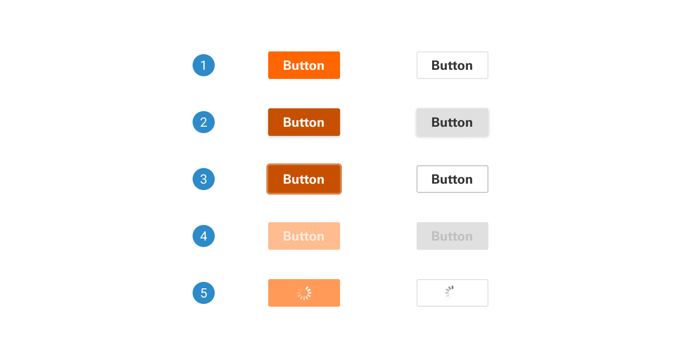
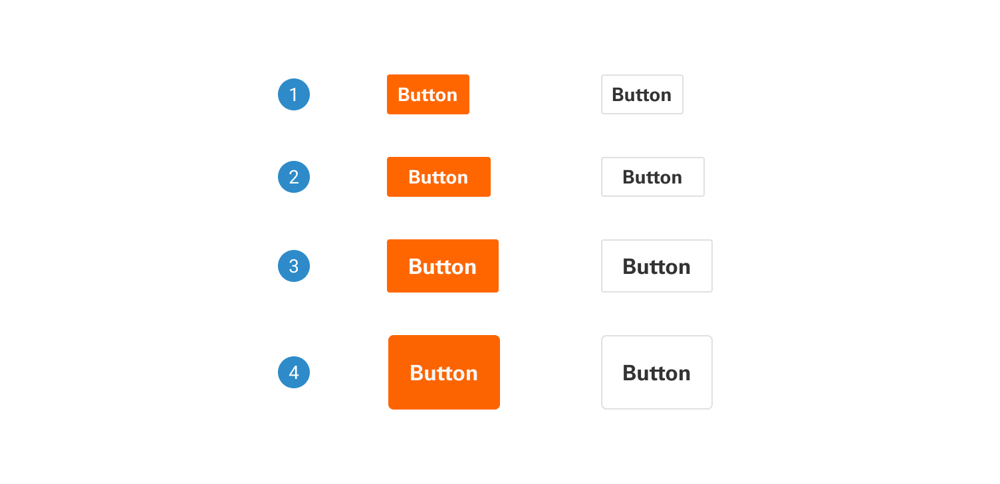

# Button

A button triggers an event or action, letting users know what will happen next.

 

## Variants

1. <b>Primary:</b> Limit the use of one primary button in a layout for the most important action. If there are more than two buttons with equal priority, ensure all buttons have neutral backgrounds.
2. <b>Secondary:</b> For secondary actions on each page, secondary buttons can only be used in conjunction with a primary button.

 

## States

1. <b>Default:</b> In its default state, the button displays standard content and styling, offering a baseline representation of the component.
2. <b>Hover:</b> In the hover state, the button dynamically responds to user interaction with a slight elevation and color change, creating an engaging and interactive experience.
3. <b>Focus:</b> In the focused state, the button promptly responds to user interaction by displaying a prominent orange outline when users click or press on it.
4. <b>Disabled:</b> In the disabled state, the button appears non-interactive, indicated by a subdued light orange/gray color.
5. <b>Loading</b> In the loading state, the button displays a spinner or progress indicator with a subtle color change (light orange) to signify ongoing processing, temporarily making it non-interactive.

 

## Sizes

1. <b>Small Button:</b> Designed for compact interfaces, the small button offers a minimalistic, space-saving appearance. Its reduced size maintains functionality while seamlessly integrating into confined layouts.
2. <b>Regular-sized Button:</b> Serving as the standard option for most applications, the regular-sized button strikes a balance between visibility and conserving screen real estate. It is the go-to choice for common interactions.
3. <b>Large Button:</b> Providing a more prominent and attention-grabbing presence, the large button is ideal for highlighting important actions, such as a primary call-to-action. It offers enhanced usability for users who may have difficulty with smaller touch targets.
4. <b>Extra-large Button:</b> As an even more significant option, the extra-large button serves as a commanding visual element. It's perfect for drawing immediate attention to critical actions or for touch-friendly interfaces where accessibility is a top priority.

 

## Anatomy

1. <b>Button with Left Icon:</b> Features an icon or symbol positioned on the left side of the button's text label. This design is often used to emphasize the action or function associated with the button, providing users with a visual cue before they read the label. It enhances recognition and usability, making it clear what the button does based on the accompanying icon.
2. <b>Button with Right Icon:</b> Places the icon or symbol on the right side of the button's text label. This layout is commonly employed to reinforce the button's action after users have read the label. It serves as a supplementary visual indicator to support the text and helps in conveying the specific function or intent of the button more effectively.

___
