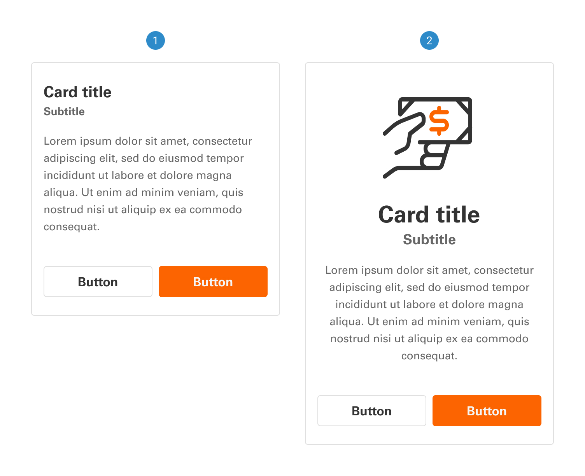
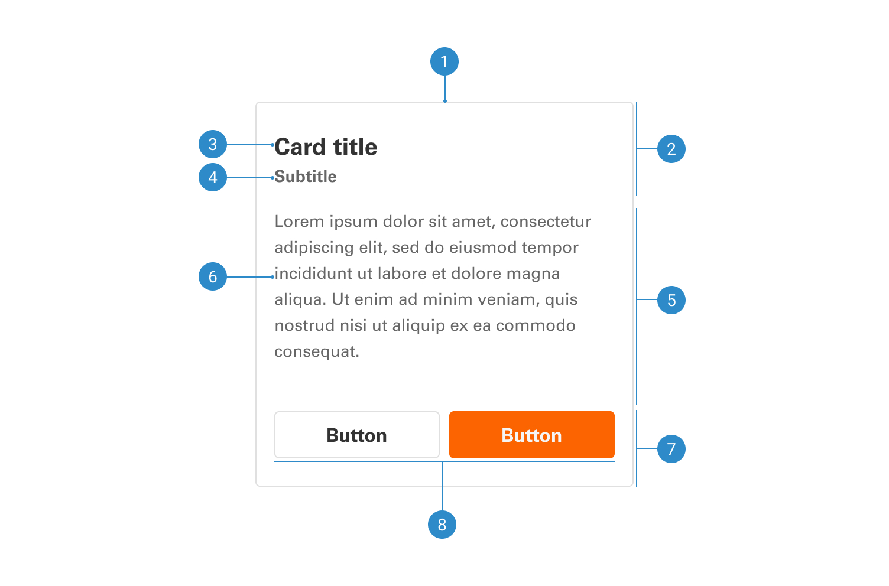

# Card

Cards should enable effortless scanning for relevant and actionable details, with the arrangement of elements, including text and images, clearly conveying their respective importance within the hierarchy.

 

## Variants

1. <b>Left-aligned</b>
2. <b>Center-aligned</b>
3. <b>Skeleton</b>

 

## Anatomy

1. <b>Container</b>
2. <b>Header</b>
3. <b>Title</b>
4. <b>Subtitle</b>
5. <b>Body</b>
6. <b>Body text</b>
7. <b>Footer</b>
8. <b>Buttons</b>
