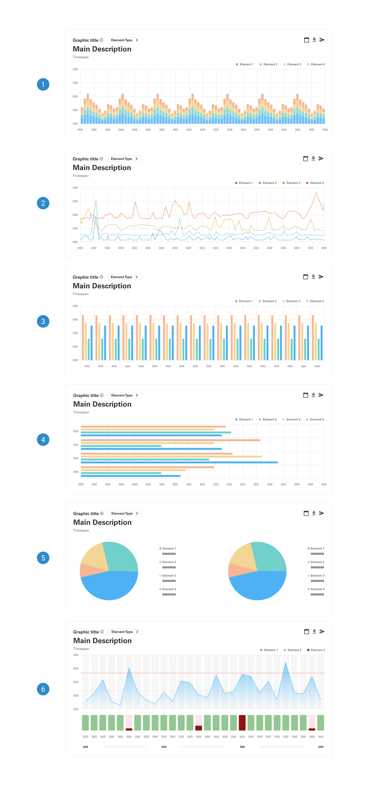
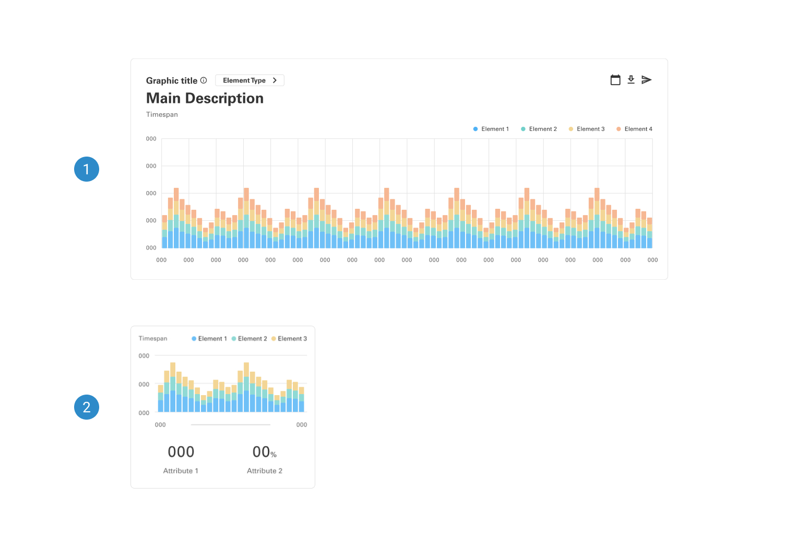
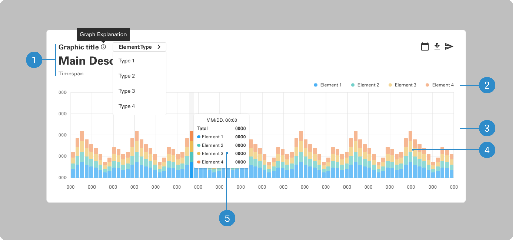

# Charts

Charts should enable quick comprehension of data insights by strategically arranging visual elements to emphasize critical information. The visual hierarchy within the chart ensures effortless identification of key data points, facilitating informed decision-making based on the displayed data's significance and relevance.

 

## Variants

1. <b>Area Chart:</b> An area chart visually represents quantitative data over time, emphasizing the cumulative nature of values.
2. <b>Line Chart:</b> A line chart displays data points connected by straight lines, offering a clear representation of trends or patterns.
3. <b>Bar Chart (Vertical):</b> A vertical bar chart illustrates data using vertical bars, where each bar's height corresponds to the value it represents.
4. <b>Bar Chart (Horizontal):</b> A horizontal bar chart conveys data through horizontal bars, facilitating easy comparison of values across categories.
5. <b>Pie Chart:</b> A pie chart represents data in a circular graph, dividing it into slices to showcase the proportional contribution of each category.
6. <b>Combined Chart:</b> A combined chart integrates multiple chart types, enabling the simultaneous representation of different data sets to provide a comprehensive view of relationships and trends.

 

## Sizes

1. <b>Large</b> 
2. <b>Small</b> 

 

## Anatomy

1. <b>Header</b>
2. <b>Legend</b>
3. <b>Plot Area</b>
4. <b>Plotted Data</b>
5. <b>Tooltip and Scrubber</b>

