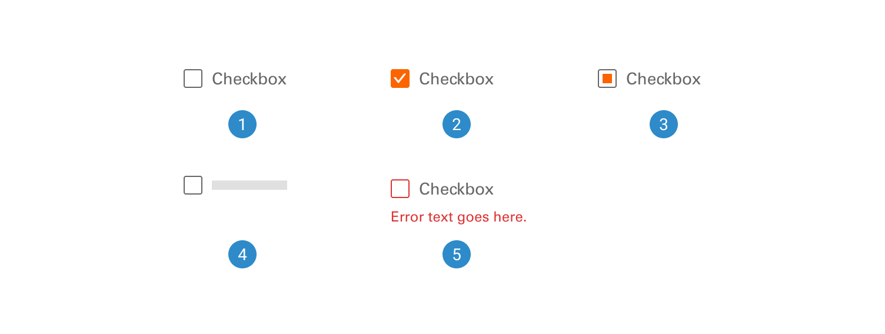
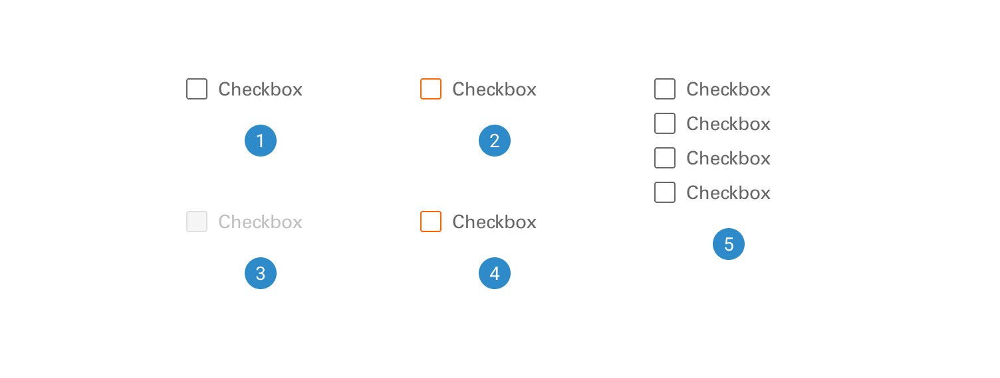
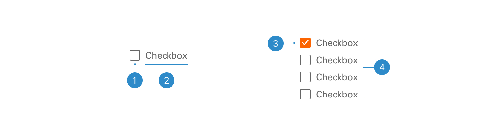

# Checkbox

The checkbox is a user interface element that enables users to select or deselect options by clicking or tapping a small box.

 

## Variants

1. <b>Inactive:</b> The 'Inactive' status of the checkbox design component indicates a non-selectable state, where the checkbox appears muted or disabled.
2. <b>Active:</b> The 'Active' status of the checkbox design component signifies a selectable state where the checkbox is highlighted or visually distinct, indicating that the option is currently active and can be selected by the user.
3. <b>Indeterminate:</b> The 'Indeterminate' status of the checkbox design component conveys a state where it is partially selected or in a transitional phase.
4. <b>Skeleton:</b> The 'Skeleton' status of the checkbox design component is a wireframe or placeholder representation. It serves as a design blueprint during loading or in situations where content is not yet available.
5. <b>Error:</b> The 'Error' status of the checkbox design component indicates an issue or invalid selection, often accompanied by a visual cue such as a warning icon or color change.

 

## States

1. <b>Default</b>
2. <b>Hover</b>
3. <b>Focus</b>
4. <b>Disabled</b>
5. <b>Group</b>

 

## Anatomy

1. <b>Checkbox Icon:</b> The core element, a small square or rectangle that users can interact with to select or deselect an option.
2. <b>Text Label:</b> An optional accompanying text label that describes the option, enhancing clarity and user understanding.
3. <b>Visual Indicators:</b> Distinct visual cues, such as a checkmark inside the checkbox when selected, indicating the state of the checkbox.
4. <b>Grouping Mechanism:</b> When checkboxes are used in groups, there is a mechanism to ensure they work together and allow for multiple selections, promoting a cohesive user experience.
