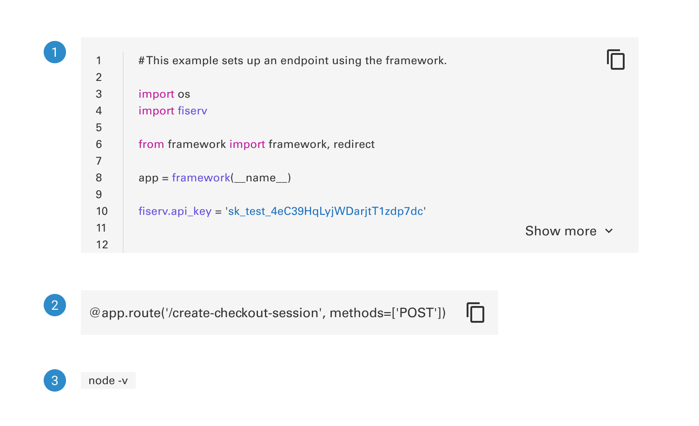
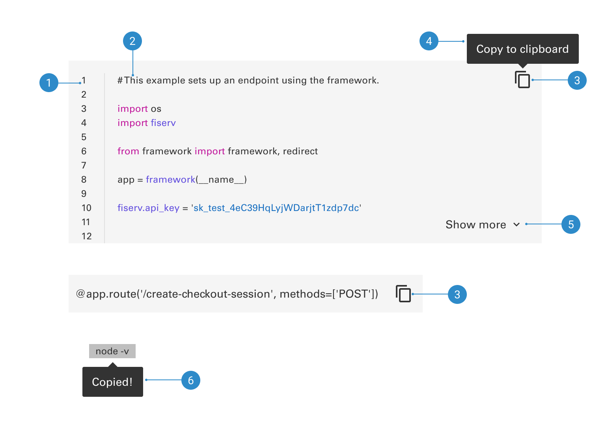

# Code Snippet

Code snippets are strings or small blocks of reusable code that can be inserted into an application’s code base and then customized to meet the application’s specific requirements. The Developer Studio by Fiserv API Sandbox provides an environment to test Fiserv’s APIs, ensuring a successful integration and production launch.

## Variants

1. <b>Multi line</b>
2. <b>Single line</b>
3. <b>Inline</b>

 

## Anatomy

1. <b>Line numbers</b>
2. <b>Snippet text</b>
3. <b>Copy button</b>
4. <b>Copy to clipboard tooltip</b>
5. <b>Show more button</b>
6. <b>Copied tooltip</b>
