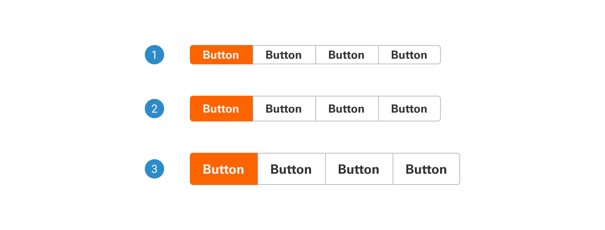

# Content Switcher

The content switcher allows users to toggle between multiple sections or content blocks, displaying one at a time. It provides a space-efficient way to present diverse information.

 

## Variants

1. <b>Small:</b>
2. <b>Regular:</b>
3. <b>Large:</b>

 

## States

1. <b>Default:</b>
2. <b>Hover:</b>
3. <b>Active:</b>
4. <b>Disabled:</b>

 

## Anatomy

1. <b>Selected button</b>
2. <b>Unselected button</b>
3. <b>Content switcher component</b>
