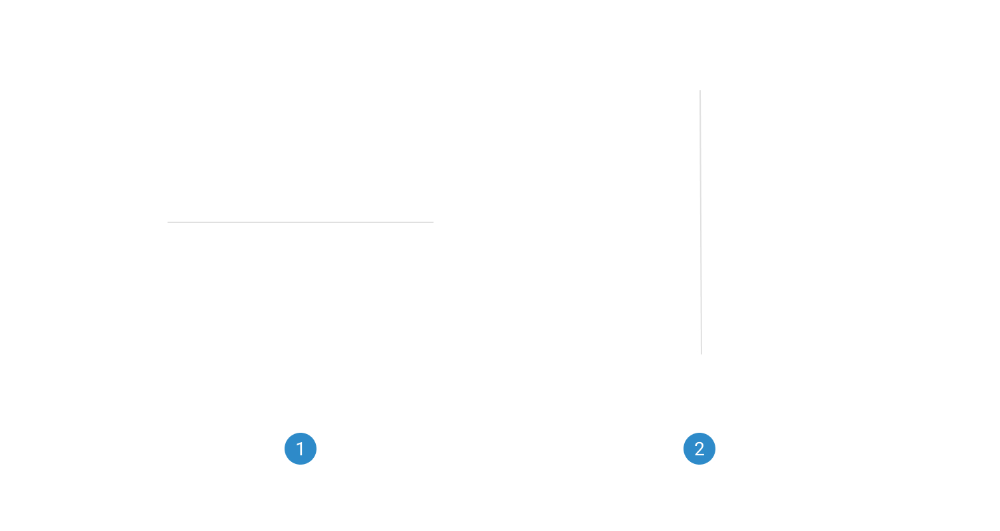

# Divider

A divider is a horizontal or vertical line or visual element used to separate and organize content, enhancing clarity and visual structure.

 

## Variants

1. <b>Horizontal:</b> The horizontal style divider design component is a horizontal line or visual element used to separate and organize content on a product page.
2. <b>Vertical:</b> The vertical style divider design component is a vertical line or visual element used to separate and structure content on a product page.

 

## States

1. <b>Primary:</b> The primary type divider design component is a prominent separator element used to create clear divisions and hierarchy within the content on a product page.
2. <b>Secondary:</b> The secondary type divider design component is a subtler visual element used to separate and structure content on a product page.
