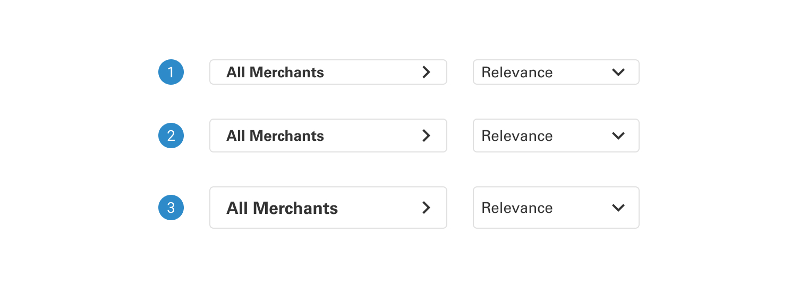
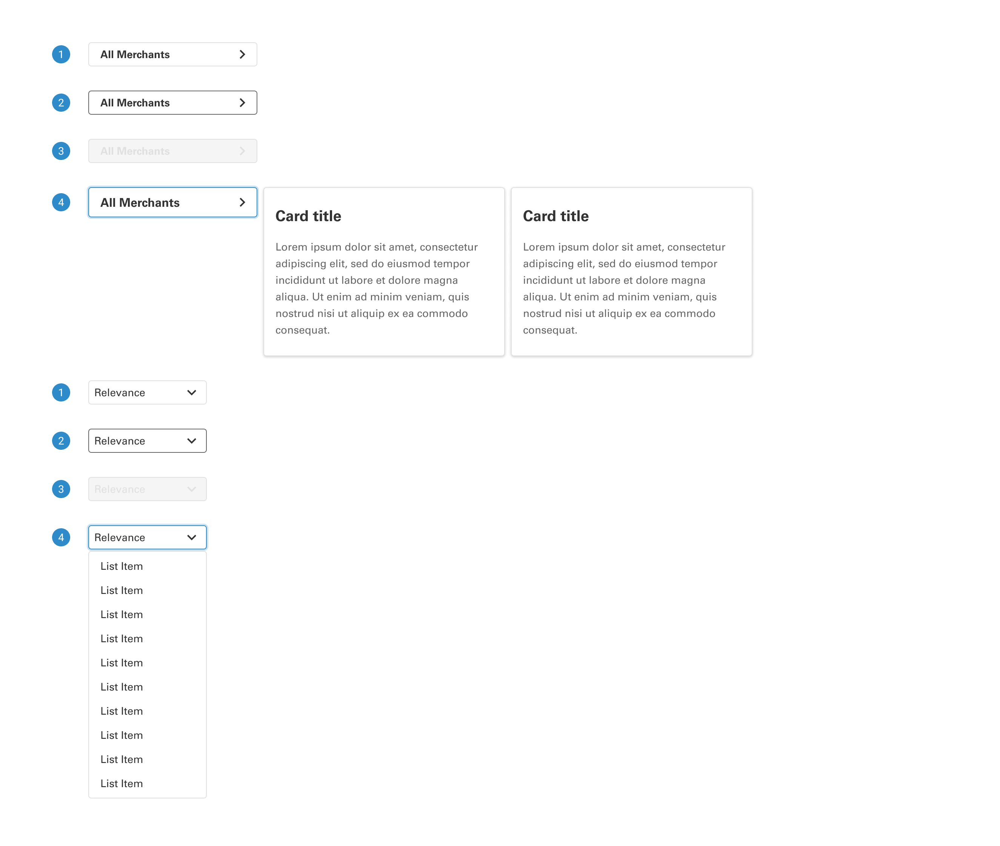
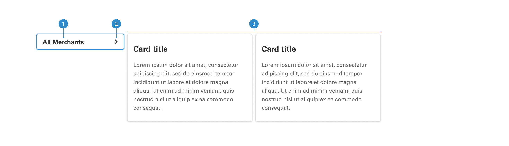

# Dropdown

A dropdown is designed for presenting a roster of options within a transient interface. It offers users the ability to choose from various alternatives, providing a less conspicuous and space-efficient solution.

 

## Variants

1. <b>Card:</b> The card dropdown enables descriptive selections, providing valuable information to the user during the decision-making process.
2. <b>List:</b> The list dropdown presents a neatly organized and space-efficient array of selections for users to choose from.
3. <b>Skeleton:</b> The dropdown skeleton variant offers a visually indicative yet placeholder representation, allowing users to anticipate the dropdown's presence and functionality in the user interface.
4. <b>Size:</b> Different dropdown sizes provide versatile options for tailoring the presentation of selectable choices, accommodating diverse design preferences and content needs.

 

## Sizes

1. <b>Small</b>
2. <b>Regular</b> 
3. <b>Large</b>

 

## States

1. <b>Default:</b> In its default state, the dropdown displays standard content and styling, offering a baseline representation of the component.
2. <b>Hover:</b> In the hover state, the dropdown responds to user interaction by adding a border, while the items within the dropdown take on a subtle gray background when hovered over.
3. <b>Active:</b> In the active state, the dropdown exhibits a distinct blue border and subtle elevation, providing a clear visual cue to signify user interaction.
4. <b>Disabled:</b> In the disabled state, the dropdown adopts a muted gray color scheme, clearly indicating its non-interactivity, with the items contained within also displayed in gray text.

 

## Anatomy

The anatomy of a dropdown comprises key components, including a trigger element, a dropdown menu, and selectable options, designed to facilitate user interaction and selection within a user interface.

1. The dropdown label text serves as a concise descriptor, guiding users to the purpose or content of the dropdown menu.
2. The arrow within the dropdown, serving as the trigger element, functions as a visual cue to indicate the presence of additional options, prompting users to interact with the dropdown menu.
3. The items in a dropdown menu encompass various selectable options, offering users a menu of choices to pick from based on their preferences or needs.
