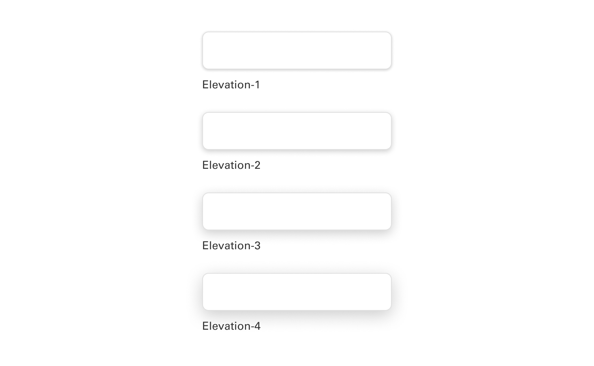
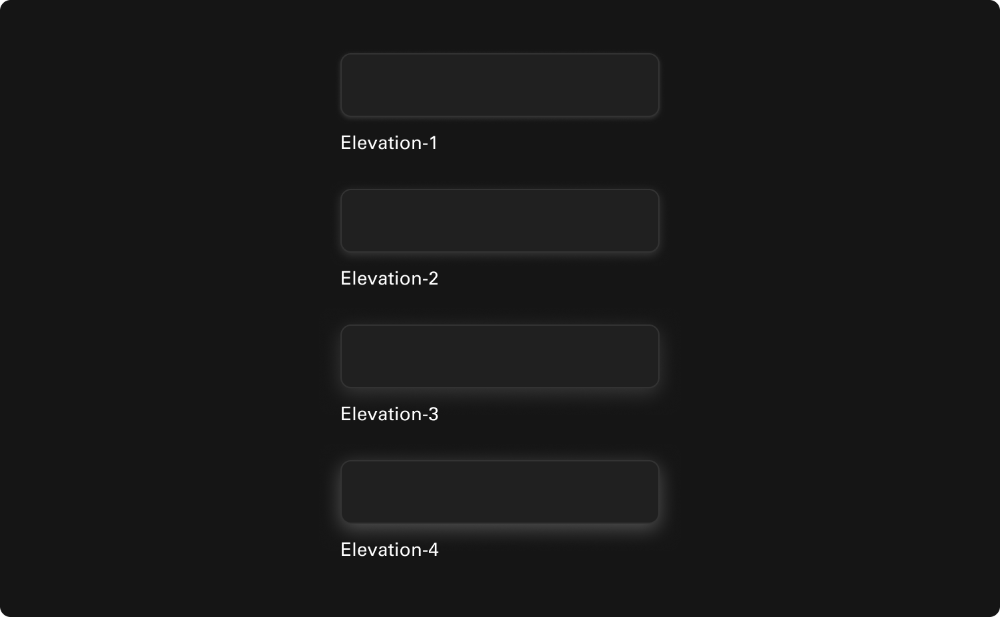

# Foundations

## Elevation

Elevation utilizes shadows and blurs to create a layered effect, giving users a visual cue that an object or experience is 'elevated' in priority or hierarchy.

 

### For light mode

Our brand colors are widely used across the site on various components, headline text, buttons, and text links.

 

### For dark mode

For accessibility, we employ a secondary palette for text on darker backgrounds.

 

### Specifications

| STYLE NAME | COLOR (LIGHT MODE)| COLOR (DARK MODE) | X | Y | BLUR | ALPHA |
| -------- | -------- | -------- | -------- | -------- | -------- | -------- |
| Elevation-0   | N/A   | N/A   | N/A   | N/A   | N/A   | N/A   |
| Elevation-1  | 0E0E0E  | BFBFBF  | 0  | 1  | 4  | 0.20  |
| Elevation-2  | 0E0E0E  | BFBFBF  | 0  | 2  | 8  | 0.20  |
| Elevation-3  | 0E0E0E  | BFBFBF  | 0  | 3  | 16  | 0.20  |
| Elevation-4  | 0E0E0E  | BFBFBF  | 0  | 4  | 16  | 0.35  |
___
