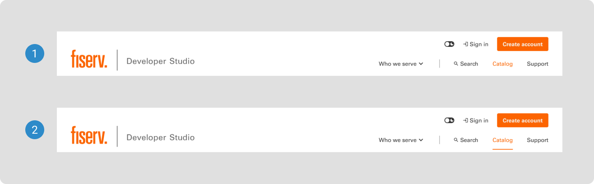
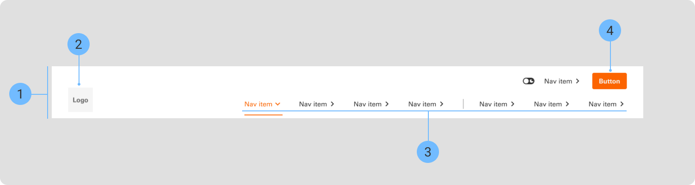

# Global Navigation

Users rely on the global header to navigate and orient themselves in your UI. This pattern outlines some of the qualities that make a global header consistent, familiar, and usable.

 

## Variants

1. <b>General</b> - Desktop double lines
2. <b>General</b> - Desktop single line
3. <b>Developer Studio</b> - Desktop
4. <b>General</b> - Mobile
5. <b>Skeleton</b> - Desktop double lines
6. <b>Skeleton</b> - Desktop single line

 

## States

1. <b>Hover</b>
2. <b>Active</b>

 

## Anatomy

1. <b>Container</b>
2. <b>Logo</b>
3. <b>Navigation links</b>
4. <b>Button</b>
