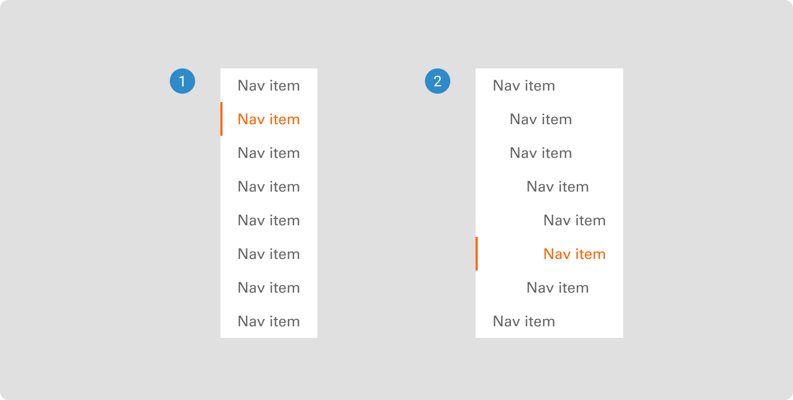

# In-page Navigation

The in-page navigation component presents a list view of pages or markdowns, facilitating user-friendly navigation through page content within the user interface.

 

## Variants

1. <b>Simple:</b> The simple in-page navigation variant lists page sections in a straightforward format for user-friendly content navigation.
2. <b>Grouped:</b> The grouped in-page navigation variant allows users to expand section groups with a click for organized content navigation.

 

## States

1. <b>Default:</b> The default state of in-page navigation shows all options without any initial selections.
2. <b>Hover:</b> In the hover state of in-page navigation, text changes to an orange color when users interact, enhancing the visual feedback.
3. <b>Active:</b> In the active state of in-page navigation, text becomes orange with a line indicator highlighting the selected page section.

 

## Anatomy

The anatomy of an in-page navigation component includes elements such as links, buttons, menus, and icons that facilitate seamless user movement within a website or application.

1. Item text in in-page navigation labels individual pages or menu options, aiding users in easily identifying and selecting their desired content.
2. The indicator on the side navigation confirms the user's current page or selection, providing a visual cue for active navigation.