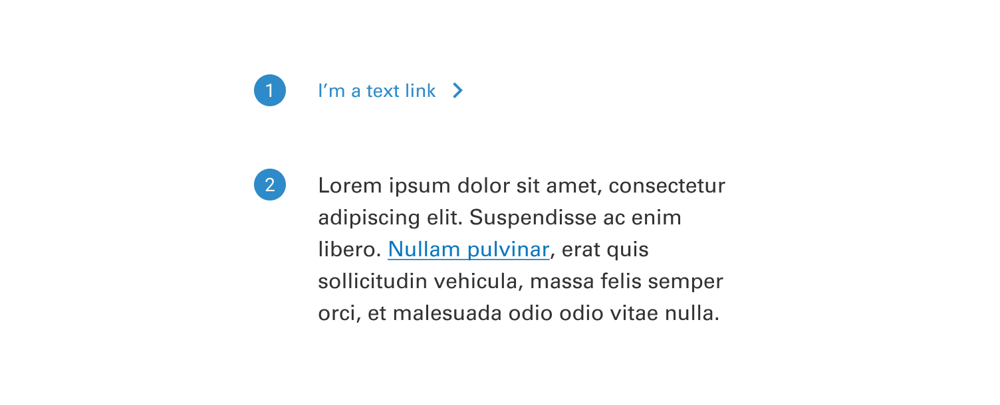

# Link

A link is a clickable element in a user interface that appears as text, usually underlined and colored differently from regular text, indicating that it can be selected to navigate to another webpage, section, or resource.

 

## Variants

1. <b>Standalone:</b> These links are the default link variant. They are used on their own or directly following content and they do not use underlines. They can be paired with an icon.
2. <b>Inline:</b> Inline links are used within a sentence or paragraph and are styled with an underline. They should not be paired with an icon.

 

## States

1. <b>Default</b>
2. <b>Hover</b>
3. <b>Active</b>

 

## Anatomy

1. <b>Label:</b> Communicates what is being linked to.
2. <b>Icon(optional):</b> Indicates what the action is.