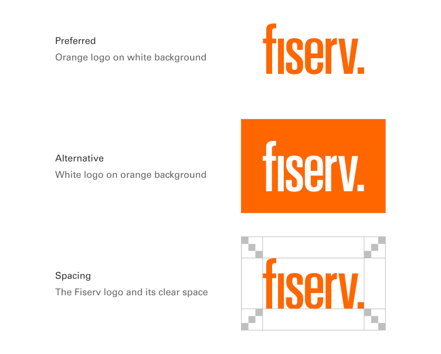

# Foundations

## Logo

Fiserv logo represents an enhanced market approach and a transformation in financial-services technology.

 

### Fiserv logo

<b>Logo colors:</b>Two versions of the Fiserv logo have been created to accommodate digital applications. The signature in Fiserv Orange should be used whenever possible. A white version of the logo has been created for use on orange backgrounds when necessary.

 

<b>Clear Space:</b>Clear space is the live area surrounding our logo that must remain free of anything else. It is equal to three times the height of the Proof Point and is built into each master artwork file of the logo.

 

<b>Linking:</b>Common web practice links the main logo of a site to the homepage, providing visitors with an easy and consistent return home. When using the Fiserv logo, it should be linked to Fiserv.com.

 

___
