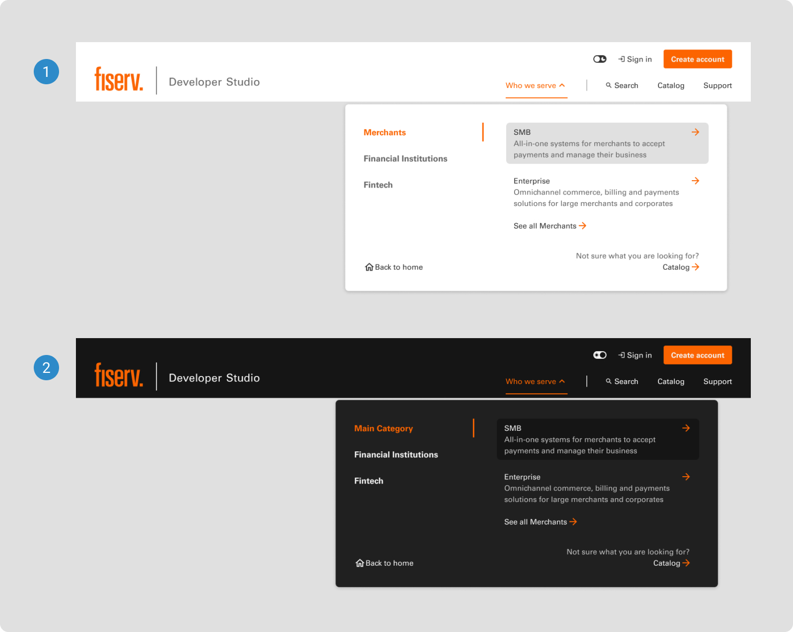

# Mega Menu

A mega menu is an expanded and feature-rich navigation menu, commonly found on websites or applications. It provides a larger and more comprehensive selection of navigation options than standard menus, presenting users with a wide array of categories, subcategories, and links.

 

## Themes

1. <b>Light</b>
2. <b>Dark</b>

 

## Anatomy

1. <b>Main navigation</b>
2. <b>Secondary navigation</b>
3. <b>Link</b>
4. <b>Link</b>
