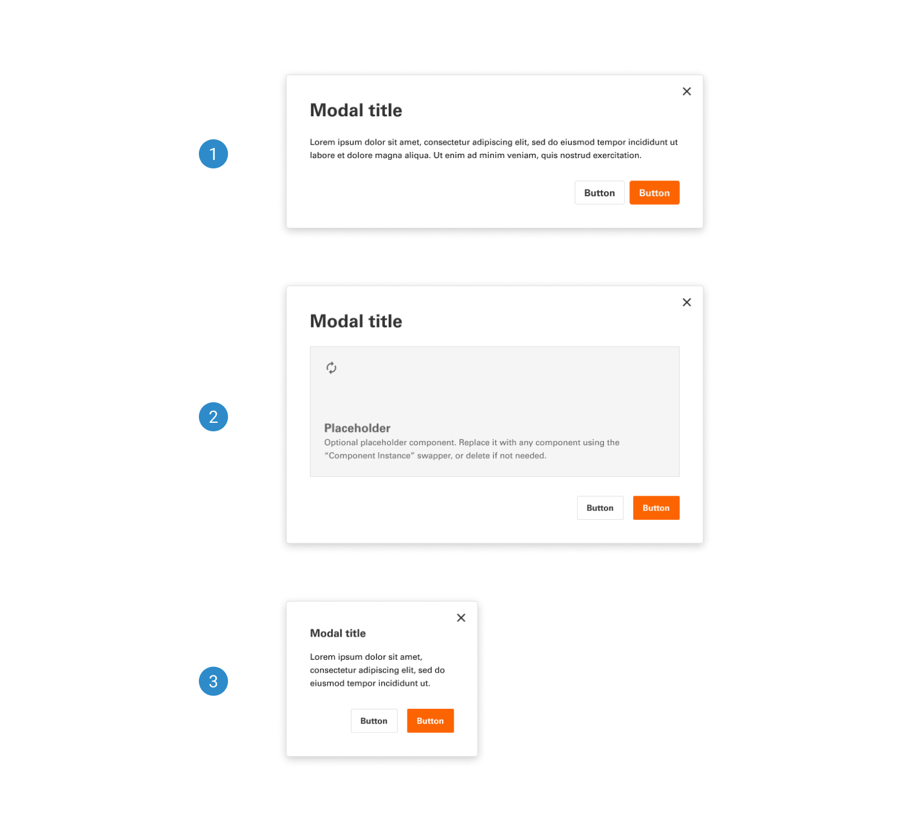
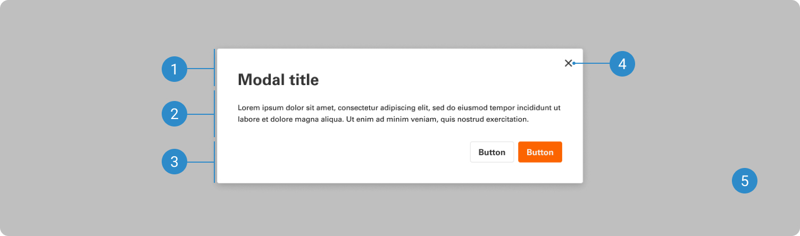

# Modal

A modal is a dialog that intentionally interrupts a user’s page experience. It’s often used for conveying critical information or for actions that require review or completion before returning to the task flow or page.

 

## Variants

1. <b>Regular:</b> Used to display a basic modal with the header, body, and call-to-action buttons (CTAs).
2. <b>Regular with content container:</b> The same as a Regular Modal. Designers can use this to indicate that there will be customized content in the body section.
3. <b>Mobile:</b> Regular modal designed for mobile.
4. <b>Skeleton:</b> A Skeleton is a low-fidelity visual placeholder that represents the loading of interface elements before they are displayed on the page. It is also great for designers to use for ideation in their designs.

 

## Anatomy

Modals can include critical or warning information requiring a response. However, they're also designed to support efficient task completion without losing the context of the underlying page. Users won't be able to interact with the page until the dialog is closed.

1. Header: Contains the modal title, optional label, and the close icon.
2. Body: Contains the information and/or controls needed to complete the modal’s task. It can include message text and components.
3. Footer: Contains the main actions needed to complete or cancel the dialog task. Button groupings change based on the modal variant.
