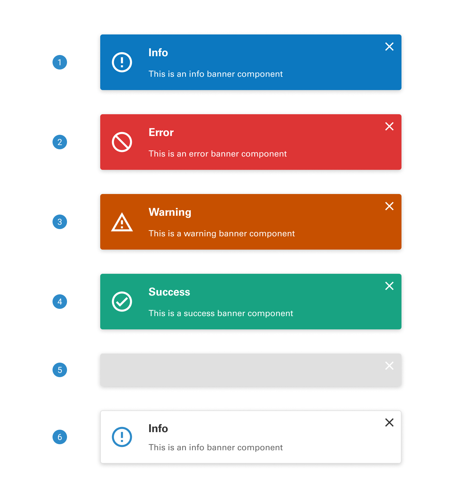
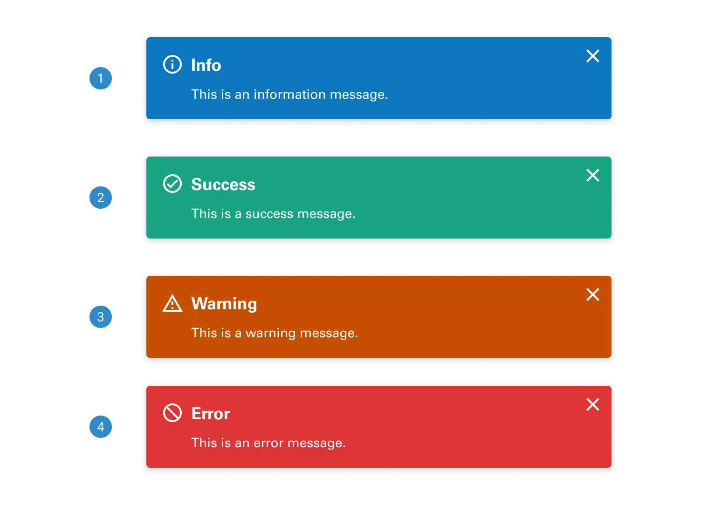
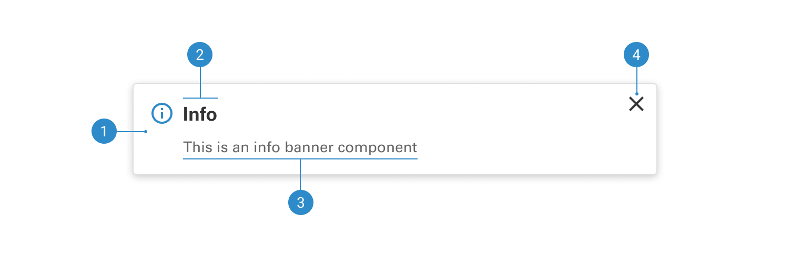

# Notification

Notification provides a versatile and user-friendly way to communicate important information, updates, and alerts to users. Whether it's notifying users of successful actions, important messages, or errors, this component ensures clear and effective communication while enhancing the overall user experience.

 

## Variants

1. <b>Color background</b>
2. <b>Plain background</b>
3. <b>Skeleton</b>

 

## States

1. <b>Info:</b> Provides users with relevant and helpful information, typically non-urgent in nature, to enhance their understanding and experience within an application or system.
2. <b>Success:</b> Confirms the successful completion of an action or task within an application or system, providing users with positive feedback and reassurance about their interactions.
3. <b>Warning:</b> Alerts users to a potential issue or impending action that requires their attention, serving as a preemptive measure to prevent errors or misunderstandings.
4. <b>Error:</b> Informs users about a problem or issue that has occurred within an application or system, helping them recognize and address errors promptly for a smoother user experience.

 

## Anatomy

1. <b>Icon</b>
2. <b>Title</b>
3. <b>Supporting text</b>
4. <b>Close button</b>
