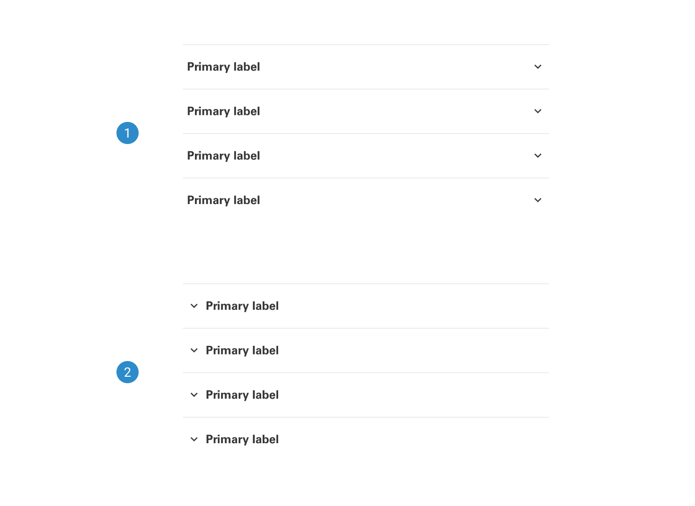
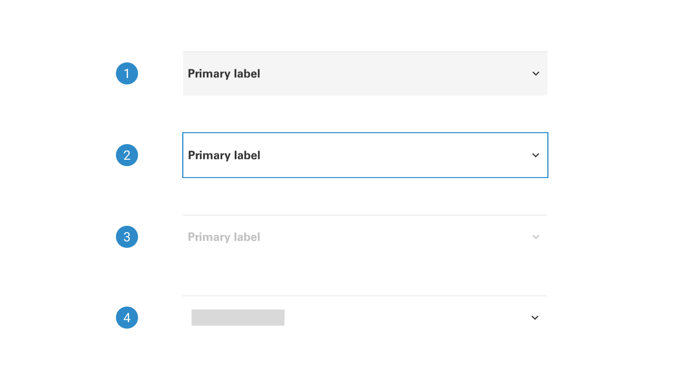

# Notification

Notifications provide a versatile and user-friendly way to communicate important information, updates, and alerts to users. Whether it's notifying users of successful actions, important messages, or errors, this component ensures clear and effective communication while enhancing the overall user experience.

## Variants

1. <b>Info:</b> Info notification is used to provide users with relevant and helpful information, typically non-urgent in nature, to enhance their understanding and experience within an application or system.
2. <b>Error:</b> Error notification informs users about a problem or issue that has occurred within an application or system, helping them recognize and address errors promptly for a smoother user experience.
3. <b>Warning:</b> Warning notification alerts users to a potential issue or impending action that requires their attention, serving as a preemptive measure to prevent errors or misunderstandings.
4. <b>Success:</b> Success notification confirms the successful completion of an action or task within an application or system, providing users with positive feedback and reassurance about their interactions.
3. <b>Skeleton:</b> Skeleton notification is a placeholder or an empty structure within a user interface that indicates the position and layout where a notification will appear.
4. <b>Style:</b> The style of a notification, whether it features a white background or a colored background, determines its visual presentation. This choice enhances readability and ensures alignment with the overall design aesthetics of the application or system.

## States

1. <b>Default:</b> In its default state, the card displays standard content and styling, providing a baseline representation of the component.
2. <b>Hover:</b> In the hover state, the card dynamically responds to user interaction by slightly elevating, creating an engaging and interactive experience.
3. <b>Active:</b> In the active state, the card promptly responds to user interaction by displaying a prominent orange bar at the top when users click or press on it.
3. <b>Disabled:</b> In the disabled state, the card and its components appear non-interactive, indicated by a subdued gray color.

## Anatomy

The anatomy of a notification component includes essential elements such as message content, visual style, iconography, and optional actions. These elements are designed to effectively convey information while maintaining a cohesive and user-friendly appearance within the user interface.

1. Icons within the notification serve as visual indicators, enhancing the message's context and aiding users in quickly identifying the type or nature of the notification.
2. The headline acts as a concise and attention-grabbing title, summarizing the main message and providing users with a quick overview of the notification's content.
3. Supporting text in the notification component provides additional context and details, offering users a deeper understanding of the notification's purpose or actions they can take in response.

___
