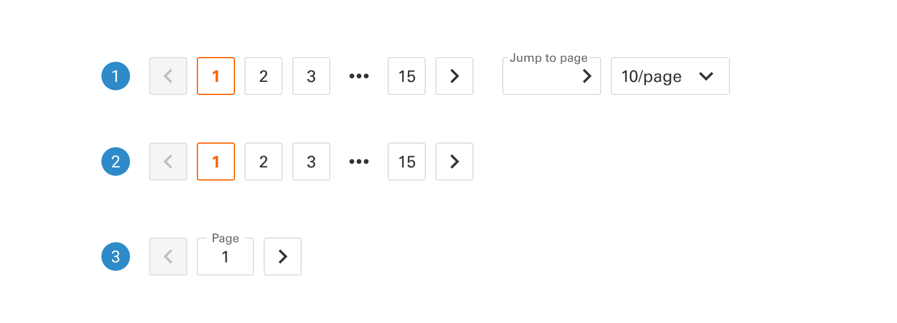
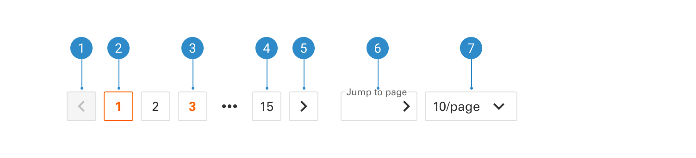

# Pagination

A footer design component in a design system for a product page is a section located at the bottom of the page, offering important information, links, and navigation options.

 

## Variants

1. <b>Large</b>
2. <b>Default</b>
3. <b>BSmall</b>

 

## Anatomy

1. <b>Previous page button</b>
2. <b>Current page</b>
3. <b>Page hover</b>
4. <b>Last page</b>
5. <b>Next page button</b>
6. <b>Jump to page button</b>
7. <b>Result per page</b>
