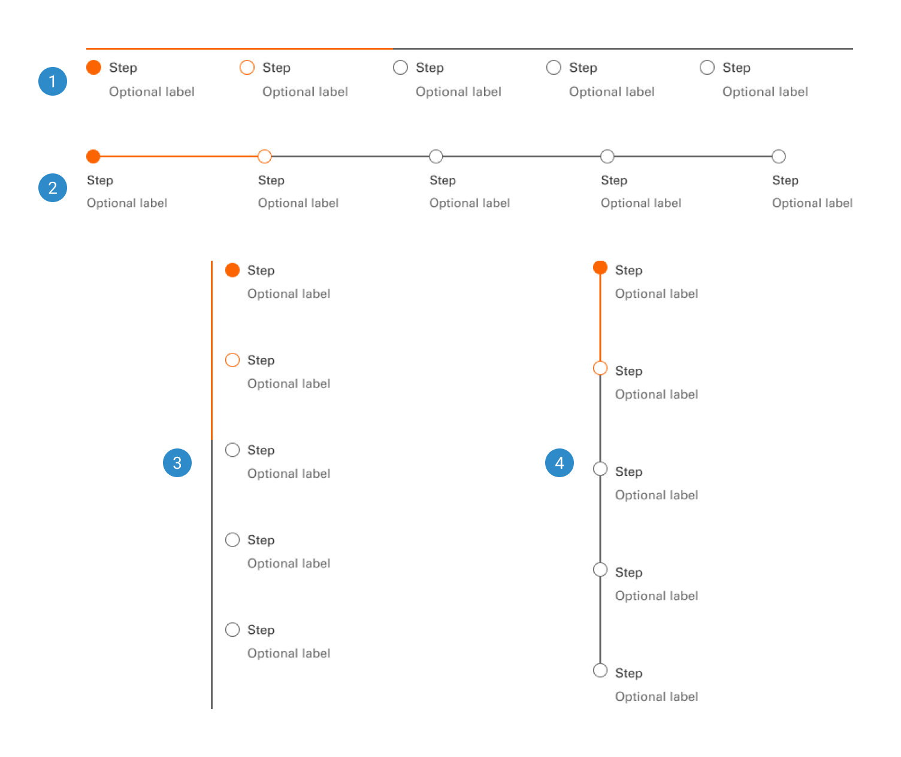
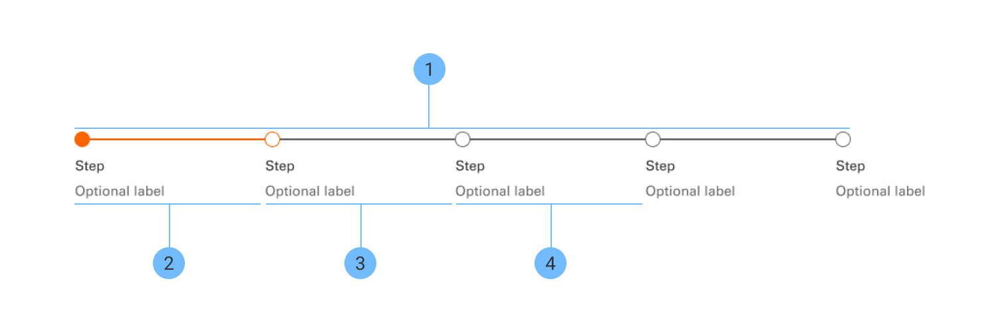

# Progress Indicator

A progress indicator is a visual element that displays the status or completion of tasks. It ensures consistency in appearance and behavior while providing users with clear feedback on ongoing processes.

 

## Variants

1. <b>Horizontal 1</b>
2. <b>Horizontal 2</b>
3. <b>Vertical 1</b>
4. <b>Vertical 2</b>

 

## Anotomy

1. <b>Track</b>
2. <b>Completed</b>
3. <b>Current</b>
4. <b>Incomplete</b>
