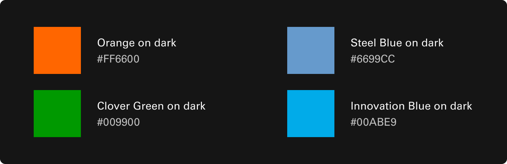

# Progress Indicator

A progress indicator is a visual element that displays the status or completion of tasks. It ensures consistency in appearance and behavior while providing users with clear feedback on ongoing processes.

 

## Variants

1. Horizontal 1
2. Horizontal 2
3. Vertical 1
4. Vertical 2

 

## Anotomy

1. Track
2. Completed
3. Current
4. Incomplete
