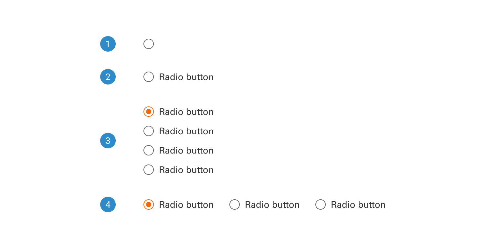
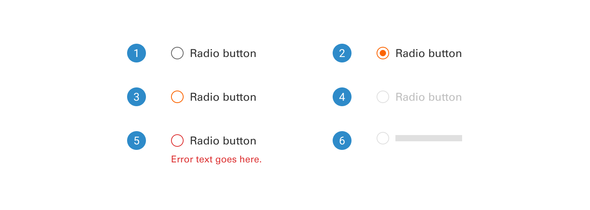
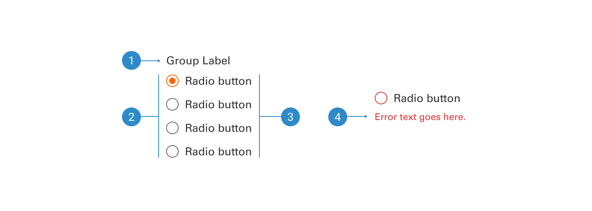

# Radio

Radio buttons are a form element that permits users to choose a single option from a predefined set of choices.

 

## Variants

1. <b>Without label:</b> Label-less radio buttons offer users a set of visual options, allowing a single selection without accompanying text labels.
2. <b>With label:</b> This radio button includes a label to indicate the corresponding option.
3. <b>Vertical radio buttons:</b> Vertically stacked radio buttons are part of a group of two or more options.
4. <b>Horizontal radio buttons:</b> Horizontally inlined radio buttons are part of a group of two or more options.

 

## States

1. <b>Unselected</b>
2. <b>Selected</b>
3. <b>Focused</b>
4. <b>Disabled</b>
5. <b>Error</b>
6. <b>Skeleton</b>

 

## Anatomy

1. <b>Group label</b>
2. <b>Radio button</b>
3. <b>Label</b>
4. <b>Error message</b>
