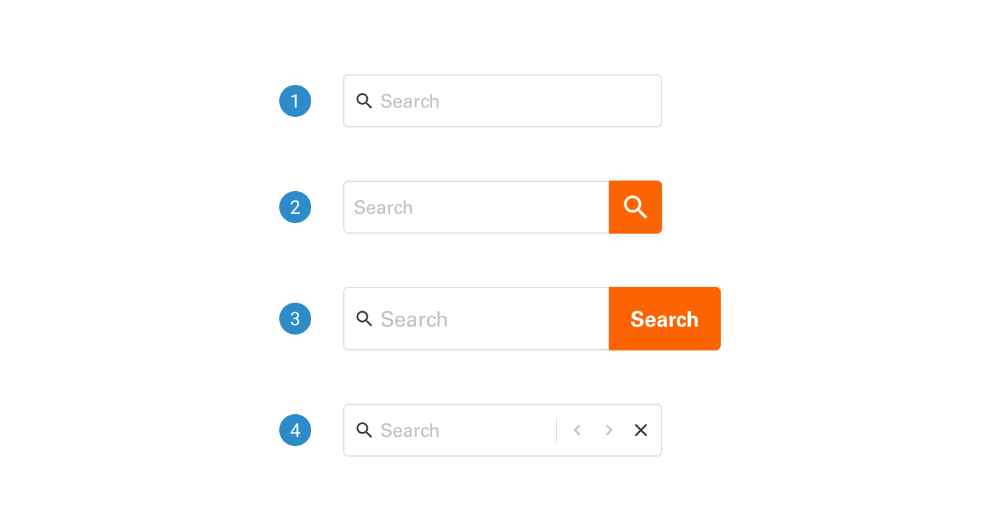
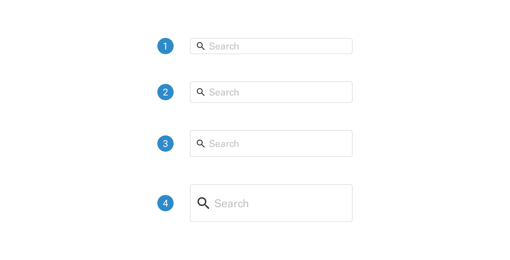
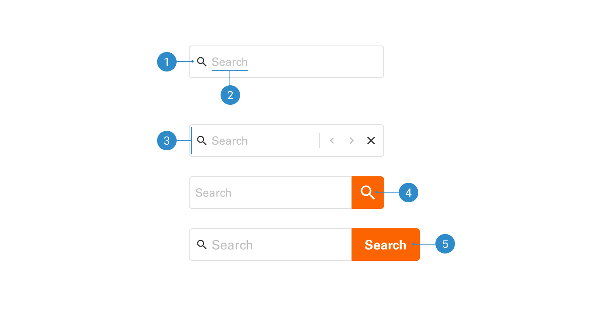

# Search

Search enables users to enter a word or phrase to find relevant content or destinations without manual navigation. It simplifies tasks by clearly presenting pertinent results, making these processes more accessible and efficient.

 

## Variants

1. <b>Search with no button:</b> Clicking the Enter key after typing the keywords is required for search with no button.
2. <b>Search with icon button:</b> This is one of the search confirmation options. Clicking the icon button will initiate the process of returning search results.
3. <b>Search with text button:</b> This is one of the search confirmation options. Clicking the text button will initiate the process of returning search results.
4. <b>Lookup:</b> Lookup works by examining the text of a single page to precisely locate the position of a specific word.

 

## Sizes

1. <b>Small</b> 
2. <b>Regular</b> 
3. <b>Large</b> 
4. <b>Extra Large</b>

 

## Anatomy

1. <b>Search icon:</b> Represents a search field. The magnifying glass icon universally signifies a search feature.
2. <b>Placeholder text:</b> Provides a brief hint describing the expected value in a search field.
3. <b>Search field:</b> The area where users input their search queries.
4. <b>Previous and next icon buttons:</b> Allow users to navigate backward and forward through their entered keywords.
5. <b>Search button with icon</b>
6. <b>Search button with text</b>