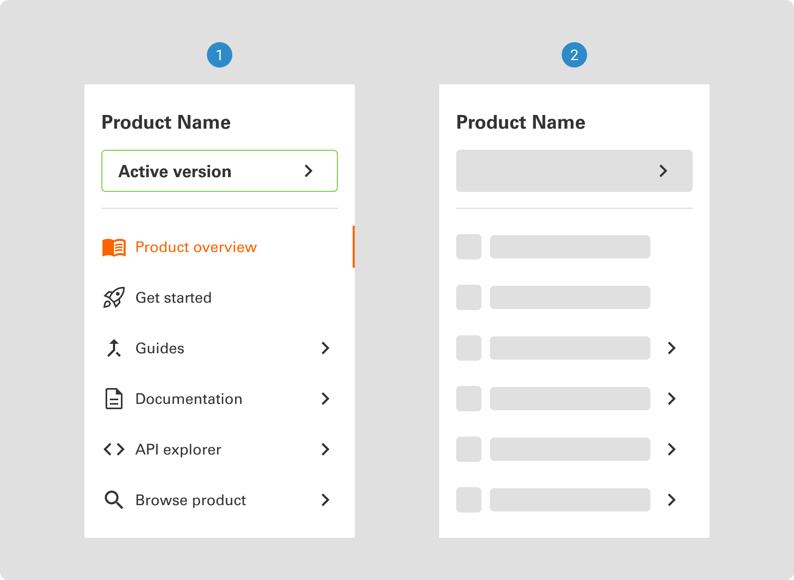
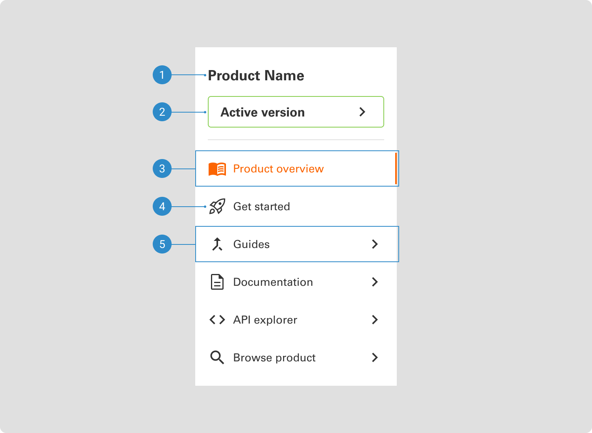

# Side Navigation

The side navigation component is a foundational element that facilitates efficient and organized navigation. Typically presented as a vertical menu aligned along the side of the interface, it serves as a hub for accessing different sections, pages, or features.

 

## Variants

1. Full
2. Skeleton

 

## Anatomy

1. Product name
2. Version dropdown
3. Selected navigation item
4. Page navigation item
5. Group navigation item - Secondary and tertiary navigation are underneath
