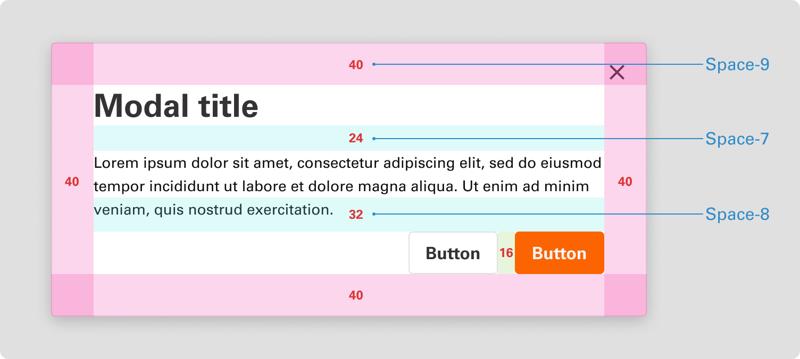

# Spacing

Point Design System uses an 8-point grid system for sizing, spacing, and laying out components relative to one another. This means that any padding, margin, button height, etc., is always a multiple of 8 pixels.

 

## 8pt grid system

We use a systematic approach to determine the spacing, ensuring a consistent visual experience across our products. Point follows the 8pt grid system.

 

## Space tokens

The 8px base unit forms the basis of our space token system, serving as the base unit Space-4. This scale comprises a limited set of space values used to lay out UI elements consistently.

Each space token should replace raw pixel or REM values when adding space between components or objects on a page. Detailed usage examples are provided below.

| TOKEN NAME | PIXEL | REM | EXAMPLE |
| -------- | -------- | -------- | -------- |
| Space-0   | 0   | 0   |    |
| Space-1   | 1   | 0.0625   |  |
| Space-2   | 2  | 0.125  |  |
| Space-3   | 4  | 0.25  |   |
| Space-4   | 8 (Base size) | 0.5  |  |
| Space-5   | 12  | 0.75  |  |
| Space-6   | 16  | 1  |  |
| Space-7   | 24  | 1.5  |   |
| Space-8   | 32 | 2  |   |
| Space-9   | 40  | 2.5  |   |
| Space-10   | 48  | 3  |  |
| Space-11   | 64  | 4  |  |
| Space-12   | 80 | 5  |  |
| Space-13   | 96  | 6  |  |
| Space-14   | 112  | 7  |  |
| Space-15   | 128 | 8  |  |
| Space-16   | 160  | 10  |  |

 

## Applying spacing

Our grayscale palette is applied to backgrounds, body copy, dividers, and disabled states.

