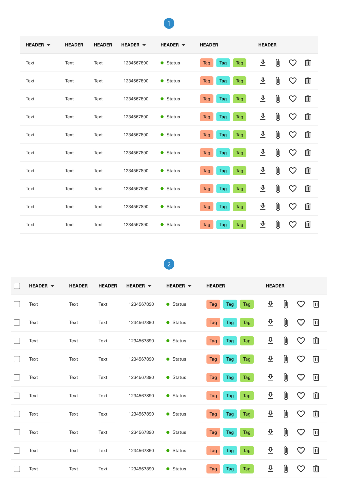
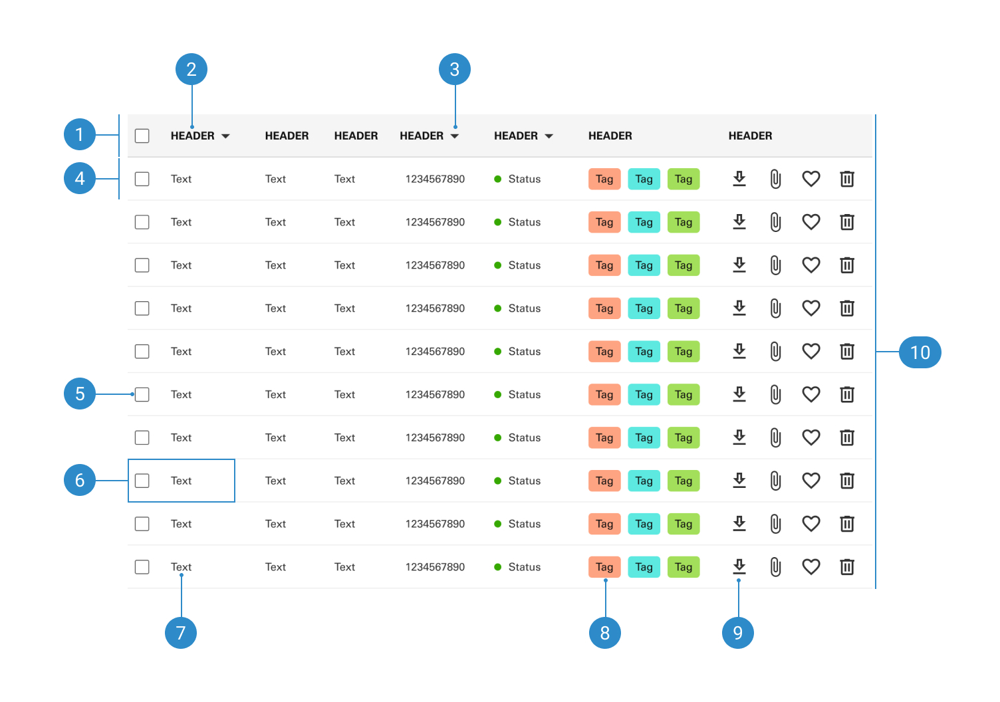

# Table

Table component serves as a fundamental element for displaying structured data in a tabular format within web or mobile applications. It provides a standardized framework for presenting information, defining guidelines for features like column alignment, and sorting.

 

## Variants

1. <b>Default</b>
2. <b>Selectable</b>

 

## Anatomy

1. <b>Header row</b>
2. <b>Header text</b>
3. <b>Sort function</b>
4. <b>Body row</b>
5. <b>Checkbox</b>
6. <b>Cell</b>
7. <b>Body text</b>
8. <b>Tag</b>
9. <b>Icon button</b>
10. <b>Container</b>
