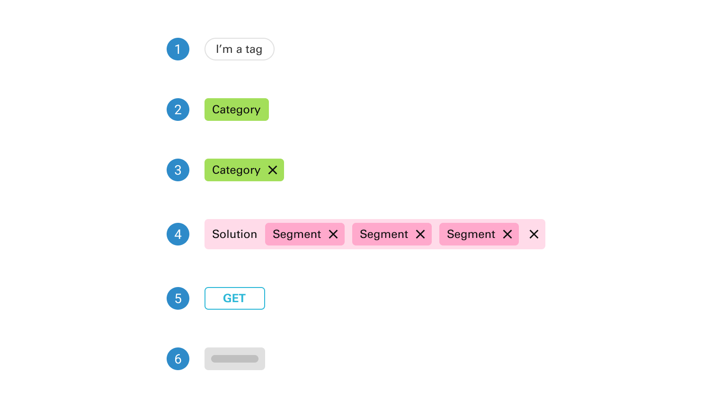
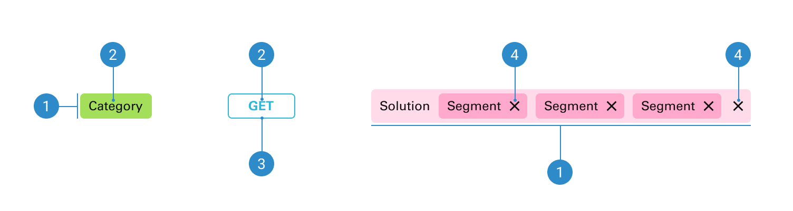

# Tag

A tag is a versatile user interface element used for categorizing and labeling content, enhancing organization and user interaction by visually grouping related items together.

 

## Variants

1. <b>Pil tag</b>
2. <b>Basic tag</b>
3. <b>Basic tag with dismiss icon</b>
4. <b>Basic tag with nested elements</b>
5. <b>Label tag</b>
6. <b>Skeleton</b>

 

## States

1. <b>Default</b>
2. <b>Hover</b>

 

## Anatomy

1. <b>Tag container</b>
2. <b>Label</b>
3. <b>Border</b>
4. <b>Dismiss icon</b>
