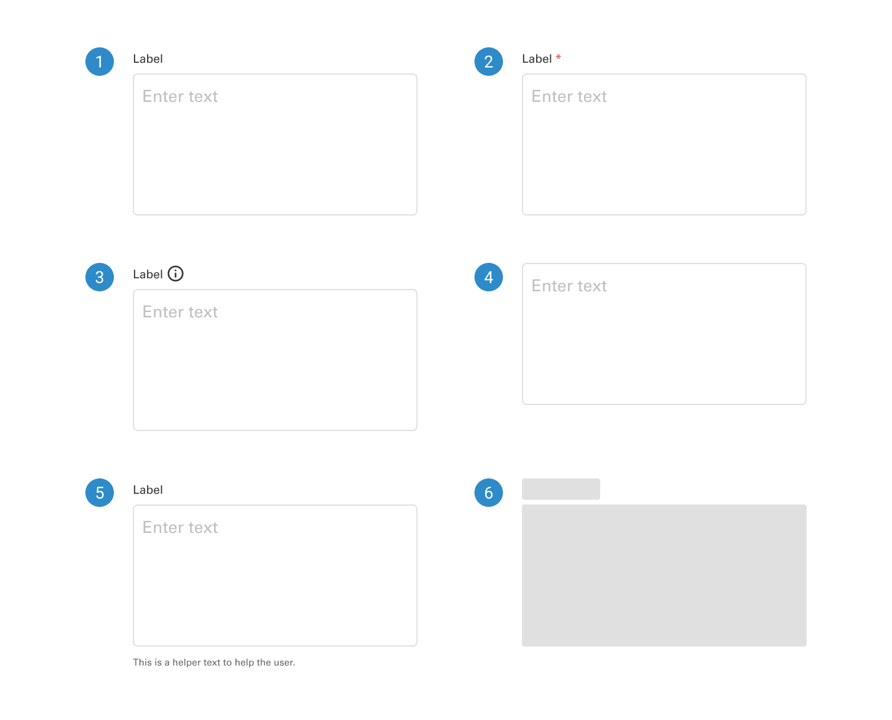
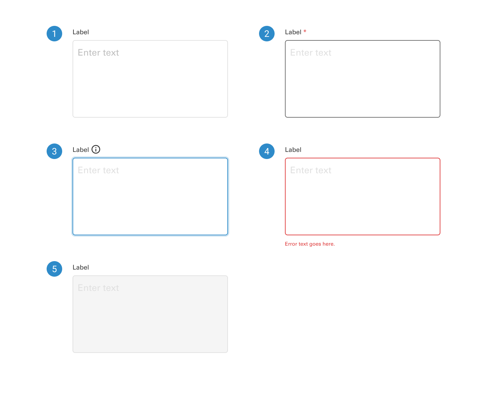
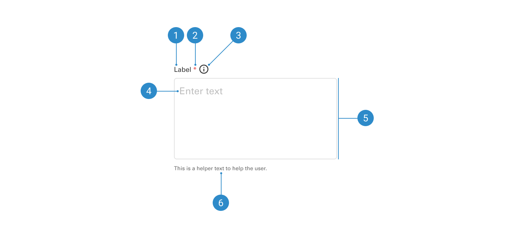

# Text Area

A text area is a UI element designed for entering and editing longer passages of text in forms or applications. It provides a resizable, multiline input field.

 

## Variants

1. <b>Text area with label</b>
2. <b>Text area with required field</b>
3. <b>Text area with information icon</b>
4. <b>Text area without label</b>
5. <b>Text area with helper or error</b>
6. <b>Skeleton</b>

 

## States

1. <b>Default</b>
2. <b>Hover</b>
3. <b>Focused</b>
4. <b>Error</b>
5. <b>Disabled</b>

 

## Anatomy

1. <b>Label</b>
2. <b>Required field icon</b>
3. <b>Information icon</b>
4. <b>Placeholder text</b>
5. <b>Input field</b>
6. <b>Helper text</b>
