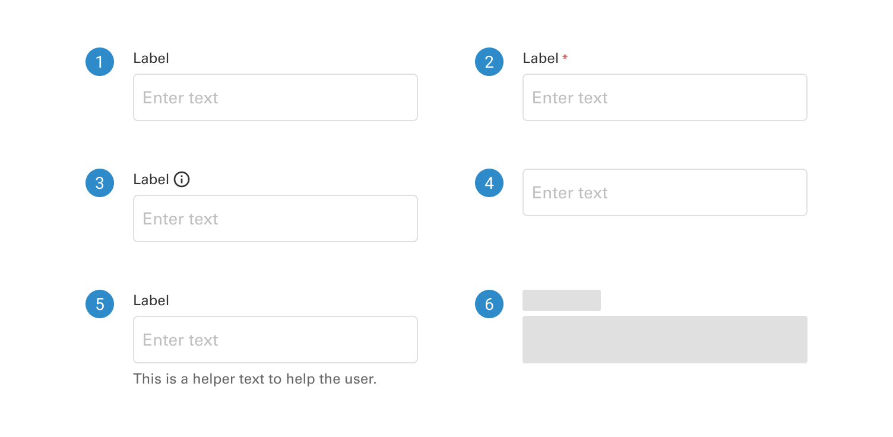
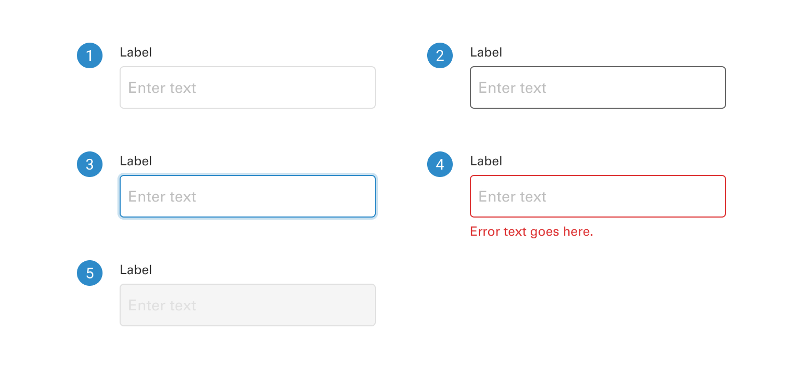
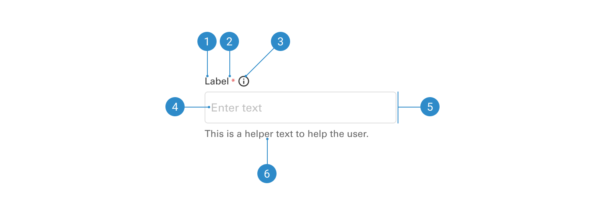

# Text Input

A text input is a user interface element that furnishes a single-line input field for users to enter and edit text. Frequently employed in forms and applications, it is ideal for tasks requiring users to input relatively short pieces of text, such as names, email addresses, or search queries.

 

## Variants

1. <b>Text input with label</b>
2. <b>Text input with required field</b>
3. <b>Text input with information icon</b>
4. <b>Text input without label</b>
5. <b>Text input with helper or error</b>
6. <b>Skeleton</b>

 

## States

1. <b>Default</b>
2. <b>Hover</b>
3. <b>Focused</b>
4. <b>Error</b>
5. <b>Disabled</b>

 

## Anatomy

1. <b>Label</b>
2. <b>Required field icon</b>
3. <b>Information icon</b>
4. <b>Placeholder text</b>
5. <b>Input field</b>
6. <b>Helper text</b>
