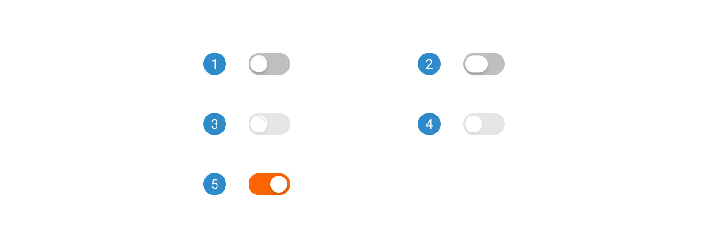

# Toggle

A toggle is a user interface control that enables users to switch between two states or options with a simple action, such as clicking or tapping. It usually consists of a button or switch that represents the two available choices.

 

## Variants

1. <b>Basic</b>
2. <b>Basic with label</b>

 

## States

1. <b>Default</b>
2. <b>Hover</b>
3. <b>On</b>
4. <b>Disabled</b>

 

## Anatomy

1. <b>Switch toggle</b>
2. <b>Label</b>
