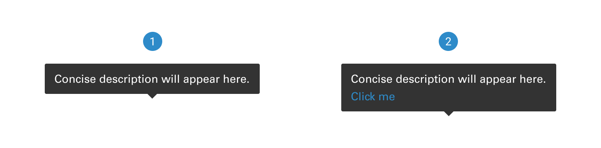
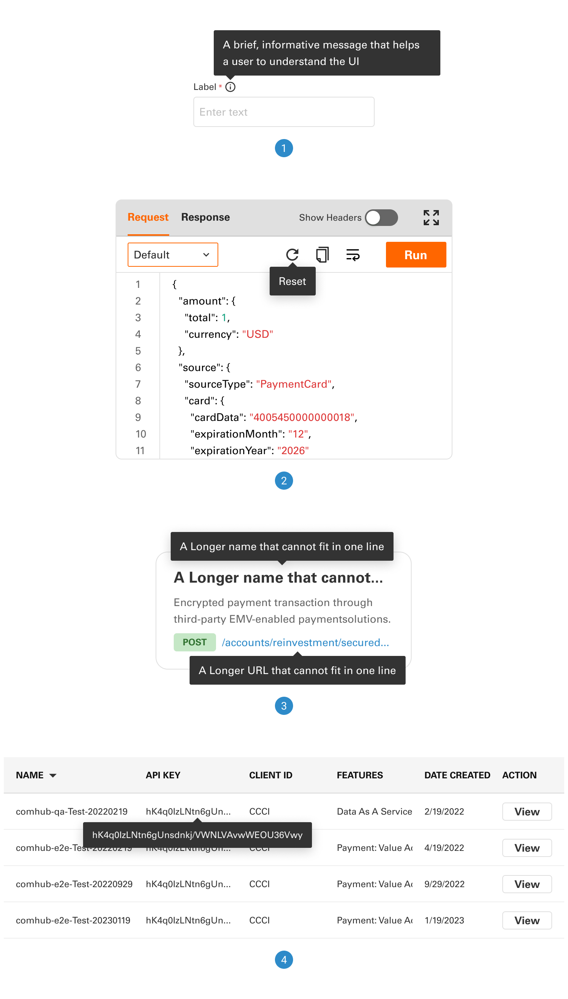
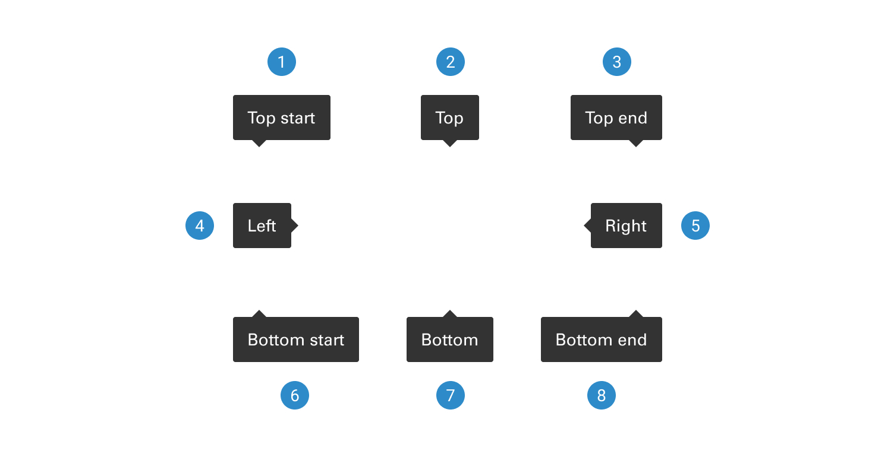
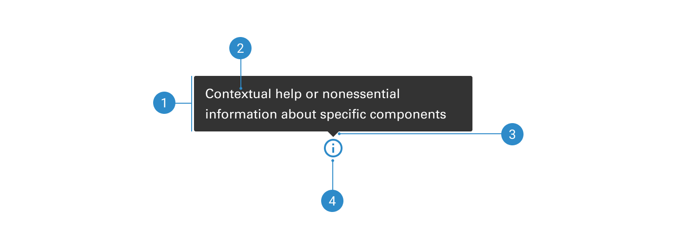

# Tooltip

Tooltips are containers that temporarily display short, contextual text, typically activated when a user hovers over an icon or another trigger.

 

## Variants

1. <b>Standard tooltip</b> - Provides nonessential, supplemental information to assist a user in decision-making. It is optional to interpret and will not prevent a user from completing a task or workflow.
2. <b>Tooltip with CTA</b> - Provides additional information with the CTA (Call to Action) to encourage users to take action.

 

## Usage

1. <b>Form fields</b>
2. <b>Icon button</b>
3. <b>Truncated text in card</b>
4. <b>Truncated text in table</b>

 

## Placement

1. <b>Top start</b>
2. <b>Top</b>
3. <b>Top end</b>
4. <b>Left</b>
5. <b>Right</b>
6. <b>Bottom start</b>
7. <b>Bottom</b>
8. <b>Bottom end</b>

 

## Anatomy

1. <b>Container</b>
2. <b>Label</b>
3. <b>Caret tip</b>
4. <b>UI trigger button</b>
