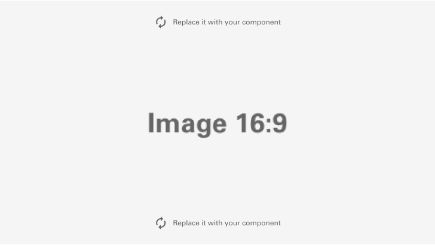

# Getting Started

 

# Foundations

## Typography

Typography is a deliberate system of letters, numbers, and characters. Good typography ensures legibility, clean aesthetics, and a well-defined information hierarchy.
 

## Design Ethos

The Pointe Design System by Fiserv reflects the unique needs and priorities of designing for a complex, business-focused environment. Flash puts the user first, utilizing rigorous research into users’ needs and desires. It is laser-focused on real people.

 

### User-Centered Efficiency

The Pointe Design System by Fiserv is rooted in user-centric principles, with a focus on efficiency and productivity. We aim to create interfaces that streamline processes, minimize friction, and empower users to accomplish their tasks with ease.

### Clarity and consistency

Clarity and consistency are paramount in our design system. We prioritize clean, straightforward design elements and maintain a consistent look and feel throughout the enterprise solution. This ensures that users can quickly adapt to different parts of the system and easily understand how to interact with it.

### Data-Driven Design

In the enterprise context, data is crucial. Our design ethos values data-driven decision-making, ensuring that our interfaces present information in a meaningful and actionable way. We leverage analytics to continuously enhance the user experience.

### Scalability

Recognizing the complexity of enterprise solutions, our design system is built for scalability. It offers a flexible framework that can accommodate a wide range of features, modules, and data sets while maintaining a cohesive user experience.

### Accessibility for All

Accessibility is a non-negotiable aspect of our design ethos. We are committed to making our enterprise solution inclusive and accessible to all users, regardless of their abilities or disabilities.

### Collaboration and Feedback

We encourage collaboration among designers, developers, and stakeholders. User feedback and iterative design processes are fundamental to our approach, enabling us to continuously refine and enhance the design system.

 

## Getting access to Figma

### Get the libraries

The Pointe Design System by Fiserv is intended for internal use only and includes all the resources you need to get started. Once you sign in, you should be automatically added to the Fiserv Figma organization. There's no need to join or request access to any specific team to access the libraries.

#### 1. Open Figma

You will be added to the Fiserv Figma organization automatically upon signing in. There's no need to join or request access to any specific team to access the libraries.

#### 2. Turn on the Pointe Design System

Inside of a design file, click the Figma icon in the top left of the toolbar. Open the menu and select Libraries from the list.

Then in the Libraries modal that appears, type in "Digital Transformation Design System" and click "Add to file" button.

___

 
