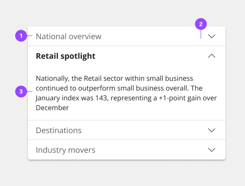
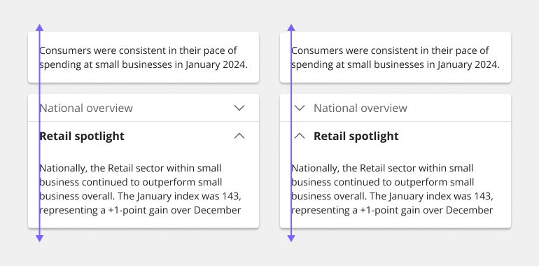
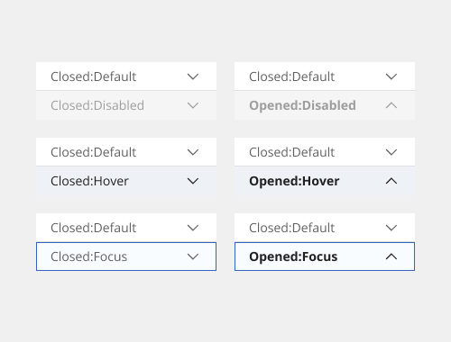
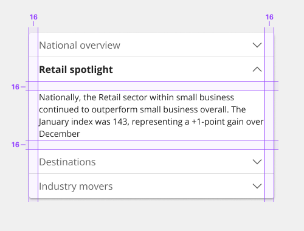
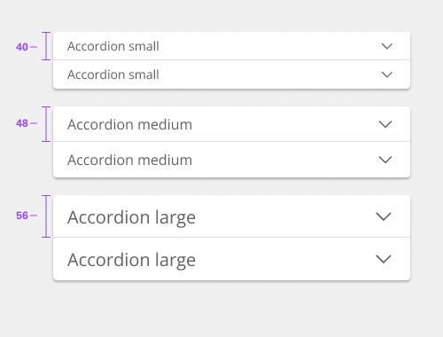
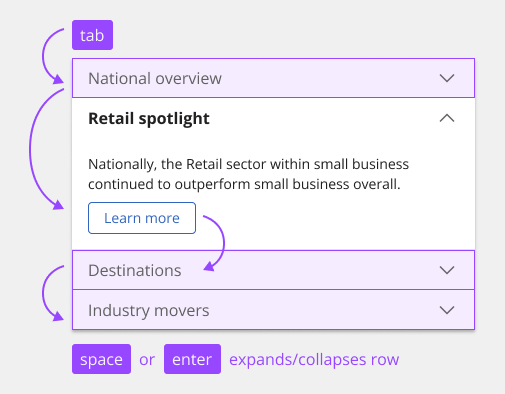
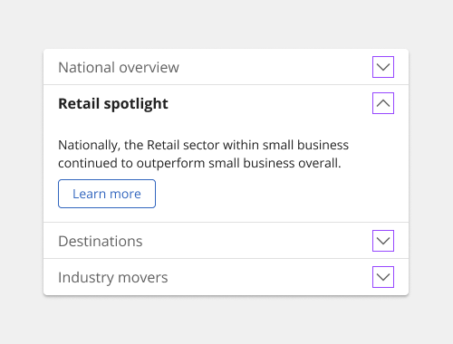

# Accordion

The accordion component delivers large amounts of content in a small space through progressive disclosure. The header title gives the user a high-level overview of the content allowing the user to decide which sections to read.

Accordions can make information processing and discovering more effective. However, it does hide content from users and it’s important to account for a user not noticing or reading all the included content. If a user is likely to read all of the content, then don’t use an accordion as it adds the burden of an extra click; instead use a full scrolling page with normal headers.

## Usage

### When to use

- To organize related information.
- To shorten pages and reduce scrolling when content is not crucial to read in full.
- When space is at a premium and long content cannot be displayed all at once, like on a mobile interface or in a side panel.

### Anatomy

1. **Header** - contains the section title and is control for revealing the panel.
2. **Icon** - indicates if the panel is open or closed.
3. **Panel** - the sect ion of content associated with an accordion header.

### Alignment

By default, the chevron icon is placed on the end side of the header. This allows for the title on the start side to align with other type elements in the layout, which is the preferred alignment scenario.

However, in some rare scenarios, the accordion may be modified to place the icon in start front of the title to function more like a tree. Most instances should use the default end alignment, especially for any pure content or documentation purposes. Icon placement in accordions should be consistent throughout your page and should not alternate.

### Placement

Accordions can be placed with main page content or placed inside of a container such as a side panel or tile.

### Content

- **Title** - The title should be as brief as possible while still being clear and descriptive. Each title should be wrapped in a role heading (h1-h6) that is appropriate for the information architecture of the page.
- **Body copy** - Content inside of a section may be split into paragraphs and include sub-headers if needed.
- **Scrolling content** - When the accordion content is longer than the viewport the whole accordion should vertically scroll. Content should not scroll inside of an individual panel. Content should never scroll horizontally in an accordion.

### States

The accordion component has two main states: collapsed and expanded. The chevron icon at the end of the accordion indicates which state the accordion is in. The chevron points down to indicate collapsed and up to indicate expanded.

Accordions begin by default in the collapsed state with all content panels closed. Starting in a collapsed state gives the user a high-level overview of the available information.

A user can then independently expand each section of the accordion allowing for multiple sections to be open at once. In addition to the collapsed and expanded states, accordions also have interactive states for focus, hover, and disabled.

### Universal Behaviors

#### Mouse

Users can trigger a state change by clicking on the chevron or clicking anywhere in the header area.

#### Keyboard

Users can navigate between accordion headers by pressing Tab or Shift-Tab. Users can trigger a state change by pressing Enter or Space while the header area has focus. For additional keyboard interactions.

### Reference

Hoa Loranger, [Accordions Are Not Always the Answer for Complex Content on Desktops](https://www.nngroup.com/articles/accordions-complex-content/) - Nielsen Norman Group, 2014

## Style

Below is the token architecture color build of the components. The token can be changed or defined through the token mapping script that has been placed in the application repository.

### Color

| State      | Element   | Property         | Token name         |
| ---------- | --------- | ---------------- | ------------------ |
| Collasped  | Container | Background Color | `$layer_1`         |
|            |           | Border Color     | `$border_subtle_1` |
|            | Label     | Text Color       | `$text_secondary`  |
|            | Icon      | SVG Color        | `$icon_secondary`  |
| Hover      | Container | Background Color | `$layer_hover_1`   |
|            |           | Border Color     | `$border_subtle_1` |
|            | Label     | Text Color       | `$text_primary`    |
|            | Icon      | SVG Color	    | `$icon_primary`    |
| Disabled   | Container | Background Color | `$layer_disabled_1`|
|            |           | Border Color	    | `$border_subtle_1` |
|            | Label     | Text Color       | `$text_disabled`   |
|            | Icon      | SVG Color        | `$icon_disabled`   |
| Expanded   | Container | Background Color | `$layer_1`         |
|            |           | Border Color     |                    |
|            | Label     | Text Color       | `$text_primary`    |
|            | Icon      | SVG Color        | `$icon_primary`    |

### Typography

All accordion titles are set in sentence case.

| State      | Variant    | Font size | Font weight | Token name            |
| ---------- | ---------- | --------- | ----------- | --------------------- | 
| Collapsed  | Small      | 14px      | 400 Regular | `$h6_compact_regular` |
|            | Medium     | 16px      | 400 Regular | `$h5_compact_regular` |
|            | Large      | 20px      | 400 Regular | `$h4_compact_regular` |
| Expanded   | Small      | 14px      | 700 Bold    | `$h6_compact_bold`    |
|            | Medium     | 16px      | 700 Bold    | `$h5_compact_bold`    |
|            | Large      | 20px      | 700 Bold    | `$h4_compact_bold`    |

### Token Architecture

| Token name                 | Description                                            |
| -------------------------- | ------------------------------------------------------ |
| '$accordion_small'         | Defines height for the **small** variant.              |
| '$accordion_medium'        | Defines height for the **medium** variant.             |
| '$accordion_large'         | Defines height for the **large** variant.              |
| '$accordion_padding'       | Defines **padding** for the component.                 |
| '$accordion_margin'        | Defines **margin** for the component.                  |
| '$accordion_border'        | Defines **border** weight for the accordion component. |
| '$accordion_border_radius' | Defines **border radius** for the component.           |

### Structure

There is no max-height for an open panel, but an accordion may scroll if constrained by vertical space. The width of an accordion varies based on the content, layout, and page design. The icon used in the header is a chevron.

| State      | Element              | Property             | Size | Token name                 |
| ---------- | -------------------- | -------------------- | ---- | -------------------------- |
| Collasped  | Container            | Border Bottom        | 1px  | `$accordion_border`        |
|            |                      | Padding Right x Left | 16px | `$accordion_padding`       |
|            |                      | Border Radius        | 4px  | `$accordion_border_radius` |
|            | Chevron Down - Right | Margin Left          | 8px  | `$accordion_margin`        |
|            | Chevron Down - Left  | Margin Right         | 8px  | `$accordion_margin`        |
|            | Content Panel        | Padding Right x Left | 16px | `$accordion_padding`       |
|            |                      | Padding Top x Bottom | 16px | `$accordion_padding`       |
|            |                      | Border Bottom        | 1px  | `$accordion_border`        |
| Expanded   | Container            | Border Bottom        |      |                            |
|            |                      | Padding Right x Left | 16px | `$accordion_padding`       |
|            |                      | Border Radius        | 4px  | `$accordion_border_radius` |
|            | Chevron Down - Right | Margin Left          | 8px  | `$accordion_margin`        |
|            | Chevron Down - Left  | Margin Right         | 8px  | `$accordion_margin`        |
|            | Content Panel        | Padding Right x Left | 16px | `$accordion_padding`       |
|            |                      | Padding Top x Bottom | 16px | `$accordion_padding`       |
|            |                      | Border Bottom        | 1px  | `$accordion_border`        |
| Focus      | Container            | Border               | 1px  | `$accordion_border`        |

### Sizing

| Variant | Element   | Size              | Token name          |
| ------- | --------- | ----------------- | ------------------- |
| Small   | Container | (min-height:40px) | `$accordion_small`  |
|         | Icon      | 20px              | `$icon_small`       |
| Medium  | Container | (min-height:48px) | `$accordion_medium` |
|         | Icon      | 24px              | `$icon_medium`      |
| Large   | Container | (min-height:56px) | `$accordion_large`  |
|         | Icon      | 20px              | `$icon_large`       |

## Accessibility

The component bakes keyboard operation into its components, improving the experience of blind users and others who operate via the keyboard. The component incorporates many other accessibility considerations, some of which are described below.

### Keyboard

Each accordion is a tab stop. Space or Enter keys expand or collapse accordions, which are collapsed by default. Interactive elements within expanded accordions integrate into the tab order automatically.

Accordions and interactive elements in the expanded content are in the tab order and keyboard operable.

### Labeling and states

The collapsed or expanded state of the accordions is programmatically set by default, eliminating the need for designers to provide text equivalents for the chevron icons.

### Design  recommendations

**Headings**
The component is not set as headings by default. For improved accessibility, annotate accordions as headings on the first occurrence in a product. Annotate the heading level of accordions as needed.

**Alignment**
The component’s chevrons are right-aligned by default, but left-aligned chevrons are more accessible for users with low vision, as the expanded/collapsed indicator is closer to the accordion title.

### Development considerations

Keep these considerations in mind if you are modifying the component or creating a custom component:
- The accordion header has a role of, with an aria-expanded attribute set to "true" or "false".
- The button has an aria-controls property set to the unique id of the panel it controls.
- Since accordions are typically grouped together, the component puts each button inside a list item in an unordered list, which provides additional context to screen reader users; where only one accordion is used, it should not be put in a list.
- When accordion titles are used as headings, the buttons are also wrapped in an element with an appropriate heading level; ARIA can be used to set both the heading role and the level (via aria-level).
- See the [ARIA authoring practices](https://www.w3.org/WAI/ARIA/apg/#accordion) for more guidance.

