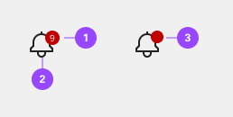
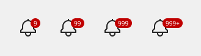
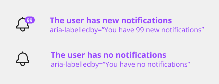

# Badge

Badge indicators let the user know that something is new or updated. A badge status is displayed over a ghost icon button, usually in the header, to indicate an active notification and is cleared after the user acknowledges the notification. Depending on your use case, the icon button can open a new page or launch a modal, pane, or flyout.

## Usage

### Variants

Like a button, a badge indicator’s text label or icon is the most important element, as it communicates importance.

#### Badge indicators (with numbers)

- **Usage** - Useful when a count of new or updated items is available, and it is important for the user to know the number of updates.
- **Context** - Most often used in notification panes in the header and used in conjunction with avatars or icons.

#### Badge indicators (without numbers)

- **Usage** - Useful when new or updated items are available, and the number of notifications is unknown or irrelevant to the user. The dot badge is also more compact and discrete.
- **Context** - Most often used in notification panes in the header and used in conjunction with avatars or icons.

### Anatomy

Like a button, a badge indicator’s text label or icon is the most important element, as it communicates importance.

1. Shape with number
2. Icon/object
3. Shape without number

### Badge status with number
Numbers are used in conjunction with a badge status when a count of new or updated items is available and it’s important for the user to know the number of updates.

Badge status numbers can only be used in conjunction with the large icon button because with anything smaller, the icon gets covered. In very rare cases badge number may exceed two digits.

### References

- Nick Babich, [4 Ways To Communicate the Visibility of System Status in UI](https://uxplanet.org/4-ways-to-communicate-the-visibility-of-system-status-in-ui-14ff2351c8e8), (UX Planet, 2020)
- Aurora Harley, [Visibility of System Status (Usability Heuristic #1)](https://www.nngroup.com/articles/visibility-system-status/), (Nielsen Norman Group, 2018)
- Miklos Philips, [A comprehensive guide to notification design](https://uxdesign.cc/a-comprehensive-guide-to-notification-design-2fff67f08b7a), (UX Planet, 2020)
- Kim Salazar, [Indicators, Validations, and Notifications: Pick the Correct Communication Option](https://www.nngroup.com/articles/indicators-validations-notifications/) (Nielsen Norman Group, 2015)

## Style

Below is the token architecture color build of the components. The token can be changed or defined through the token mapping script that has been placed in the application repository.

### Color

| Color                      | Element                    | Property                   | Token name                 |
| :------------------------- | :------------------------- | :------------------------- | :------------------------- |
| Black                      | Container                  | Background Color           | `$gray_900`                |
|                            | Text                       | Text Color                 | `$text_on_color`           |
| White                      | Container                  | Background Color           | `$white`                   |
|                            | Text                       | Text Color                 | `$text_primary`            |
| Gray                       | Container                  | Background Color           | `$gray_500`                |
|                            | Text                       | Text Color                 | `$text_on_color`           |
| Light gray                 | Container                  | Background Color           | `$gray_200`                |
|                            | Text                       | Text Color                 | `$text_primary`            |
| Blue                       | Container                  | Background Color           | `$blue_800`                |
|                            | Text                       | Text Color                 | `$text_on_color`           |
| Light blue                 | Container                  | Background Color           | `$blue_100`                |
|                            | Text                       | Text Color                 | `$text_primary`            |
| Slate                      | Container                  | Background Color           | `$slate_400`               |
|                            | Text                       | Text Color                 | `$text_on_color`           |
| Light slate                | Container                  | Background Color           | `$slate_100`               |
|                            | Text                       | Text Color                 | `$text_primary`            |
| Red                        | Container                  | Background Color           | `$red_900`                 |
|                            | Text                       | Text Color                 | `$text_on_color`           |
| Light red                  | Container                  | Background Color           | `$red_100`                 |
|                            | Text                       | Text Color                 | `$text_primary`            |
| Green                      | Container                  | Background Color           | `$green_800`               |
|                            | Text                       | Text Color                 | `$text_on_color`           |
| Light green                | Container                  | Background Color           | `$green_100`               |
|                            | Text                       | Text Color                 | `$text_primary`            |
| Yellow                     | Container                  | Background Color           | `$orange_100`              |
|                            | Text                       | Text Color                 | `$text_primary`            |
| Light yellow               | Container                  | Background Color           | `$orange_100`              |
|                            | Text                       | Text Color                 | `$text_primary`            |

### Typography

Tag labels should be set in sentence case and should only have one word. However, if more than one is necessary, then connect the words using a hyphen with no spaces.

### Typography

| Size                  | Font size | Font weight             | Token name                 |
| :-------------------- | :-------- | :---------------------- | :------------------------- | 
| Large                 | 14px      | 700 bold                | `$h6_compact_bold`         |
| Medium                | 10px      | 700 bold                | `$h8_compact_bold`         |
| Small                 | 10px      | 700 bold                | `$h8_compact_bold`         | 

### Token Architecture

| Token name                 | Description                                            |
| :------------------------- | :----------------------------------------------------- |
| `$badge_large`             | Defines height for the **large** variant.              |
| `$badge_medium`            | Defines height for the **medium** variant.             |
| `$badge_small`             | Defines height for the **small** variant.              |
| `$badge_padding`           | Defines **padding** for the component.                 |
| `$badge_margin`            | Defines **margin** for the component.                  |
| `$badge_border`            | Defines **border** weight for the accordion component. |
| `$badge_border_radius`     | Defines **border radius** for the component.           |

### Structure

| Size                 | Element               | Property                | Size      | Token name                  |
| :--------------------| :-------------------- | :---------------------- | :-------- | :-------------------------- |
| Large                | Container             | Height x Width          | 28px      | `$badge_large`              |
|                      |                       | Border Radius           | 50px      | `$badge_border_radius`      |
|                      | Icon                  | Height x Width          | 16px      |                             |
| Medium               | Container             | Height x Width          | 28px      | `$badge_medium`             |
|                      |                       | Border Radius           | 50px      | `$badge_border_radius`      |
|                      | Icon                  | Height x Width          | 10px      |                             |
| Small                | Container             | Height x Width          | 14px      | `$badge_small`              |
|                      |                       | Border Radius           | 50px      | `$badge_border_radius`      |
|                      | Icon                  | Height x Width          | 8px       |                             |

## Accessibility

### Development considerations

While the sighted users can perceive red dot as a visual cue for new notification, it is equally important to present the same cue to visually challenged users. Authors need to provide off-screen additional context programmatically to the screen reader users as described on the avatar component.

- Learn more about Success Criteria 1.3.1 (Info and relationship - non text content).
- Learn more about aria-label or aria-labelledby.

