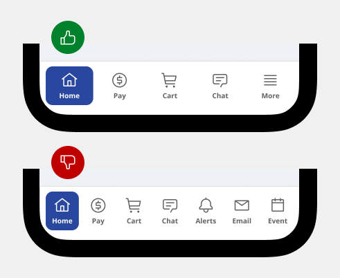
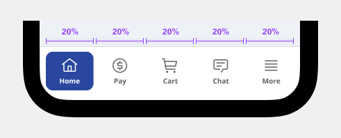
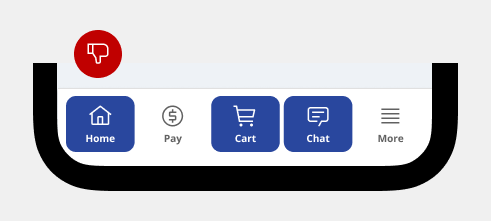
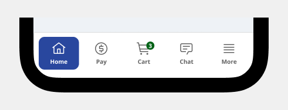
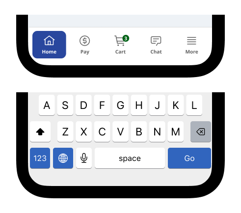
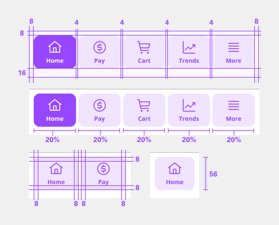

# Bottom Navigation

Bottom navigation bars display three to five destinations at the bottom of a screen. Each destination is represented by an icon and an optional text label. When a bottom navigation icon is tapped, the user is taken to the top-level navigation destination associated with that icon.

## Usage

### When to use

- Top-level destinations that need to be accessible from anywhere in the app
- Three to five destinations
- Mobile or tablet only

### When not to use

- Single tasks, such as viewing a single email
- User preferences or settings
- Don’t use a bottom navigation bar for fewer than three destinations (use tabs instead).
- Don’t use more than five destinations. For those cases, try tabs or a navigation drawer
- Combining bottom navigation and tabs may cause confusion, as their relationship to the content may be unclear. Tabs share a common subject, whereas bottom navigation destinations are top-level and disconnected from each other.

### Anatomy

1. Selection indicator
2. Label
3. Icon
4. Numbered badge (optional)
5. Non-numbered badge (optional)

### Container

Navigation bar containers hold all elements making up a destination, including icon, label text, and active indicator. The container is divided into equal-width columns, one for each destination. The width of each destination can be calculated by taking the width of the navigation bar and dividing it by the number of destinations.

### Active indicator

The active indicator is a background shape communicating which destination of the navigation bar is currently being displayed. This transformation is limited to one axis during the shape expansion.

- User the active indicator only for active destinations.
- Do not us the active indicator for more than one destination at a time.

### Label text

Label text provides short, meaningful descriptions of navigation bar destinations. It's possible to show only the label of the active destination. The active destination icon and label are centered while the inactive destinations have a centered icon Label text in navigation bars uses the overline style. Label text should have sufficient contrast with the container.

- Use brief text labels to identify the purpose of a destination.
- Do not wrap or truncate text as it can make the label hard to understand.
- Do not shrink longer text to fit on a single line.

### Badges

Icons in navigation bars can display badges in their upper right corners. [Badges](badge.md) can contain dynamic information, such as the number of new messages.

- A non-numbered badge uses only shape to indicate a status change or new notification.
- A numbered badge displays the value within a container to indicate a quantifiable status change related to a destination.

### Placement

- The bottom navigation bar is easy to reach on a handheld mobile device.
- When used, the bottom navigation bar appears at the bottom of every screen.
- Bottom navigation bar destinations should be of equal importance.

### Elevation

Bottom navigation can be temporarily covered by dialogs, bottom sheets, navigation drawers, the on-screen keyboard, or other elements needed to complete a flow. They should not be permanently obstructed on any screen.

### Fixed navigation bar

Bottom navigation bar destinations have fixed positions. They don’t scroll or move horizontally. Bottom navigation bar destinations don’t scroll.

### Landscape view

On mobile or tablet, bottom navigation:

- Destinations can retain the same spacing used in portrait mode, rather than being equally distributed across the bottom app bar.
- Bottom navigation destinations can be positioned horizontally instead of stacked. In this case, it’s recommended that destinations are evenly distributed across the entire bar.

### Responsive layout

Only use navigation bars on mobile and small tablet interfaces. On large screens, swap out navigation bars for a component that’s better suited to large screen contexts, such as a navigation rail or navigation drawer. At medium breakpoints, replace the navigation bar with a navigation rail. At large breakpoints, replace the navigation rail with a navigation drawer.

### Navigation

When you select a navigation bar item (one that’s not currently selected), the app navigates to that destination’s screen using a top-level transition pattern. After selection, destinations can behave in one of two ways:

- **Preserve state** -If the user previously interacted with this destination, it returns to that place on the screen, including scroll position, tab selection, and in-line search.
- **Reset state** - Any prior user interactions and temporary screen states are reset, including scroll position, tab selection, and in-line search.

Choose the behavior that best suits the product and user needs. For example, an app that requires frequent switching between sections should preserve each section’s state. Re-selecting the currently active destination resets the scroll position to the top of the page. 
When moving downward in the app’s hierarchy (from a parent screen to a child screen), a navigation bar can be displayed persistently for quick navigation between an app’s sections.

## Style

Below is the token architecture color build of the components. The token can be changed or defined through the token mapping script that has been placed in the application repository.

### Color

**Navbar**
| State                      | Element                    | Property                   | Token name                 |
| :------------------------- | :------------------------- | :------------------------- | :------------------------- |
| Enabled                    | Container                  | Background Color           | `$layer_1`                 |
|                            |                            | Border Color               |                            |
|                            |                            | Box Shadow                 | `$shadow_1`                | 

**Button**
| State                      | Element                    | Property                   | Token name                 |
| :------------------------- | :------------------------- | :------------------------- | :------------------------- |
| Enabled                    | Container                  | Background Color           | `$layer_1`                 |
|                            |                            | Border Color               |                            |  
|                            | Label                      | Text Color                 | `$text_secondary`          |
|                            | Icon                       | SVG Color                  | `$icon_secondary`          |
| Hover                      | Container                  | Background Color           | `$layer_hover_1`           |
|                            |                            | Border Color               |                            | 
|                            | Label                      | Text Color                 | `$text_primary`            |
|                            | Icon                       | SVG Color                  | `$icon_primary`            |
| Selected                   | Container                  | Background Color           | `$layer_selected_1`        |
|                            |                            | Border Color               |                            | 
|                            | Label                      | Text Color                 | `$text_on_color`           |
|                            | Icon                       | SVG Color                  | `$icon_on_color`           |
| Disabled                   | Container                  | Background Color           | `$layer_1`                 |
|                            |                            | Border Color               |                            | 
|                            | Label                      | Text Color                 | `$text_disabled`           |
|                            | Icon                       | SVG Color                  | `$icon_disabled`           |

### Typography

| Element               |  Font size | Font weight             | Token name                 |
| :-------------------- | :--------- | :---------------------- | :------------------------- | 
| Label                 |  10px      | 700 bold                | `$h8_compact_bold`         |

### Token Architecture

| Token name                 | Description                                            |
| :------------------------- | :----------------------------------------------------- |
| `$bottom_nav_small`         | Defines height for the **small** variant.              |
| `$bottom_nav_medium`        | Defines height for the **medium** variant.             |
| `$bottom_nav_large`         | Defines height for the **large** variant.              |
| `$bottom_nav_padding`       | Defines **padding** for the component.                 |
| `$bottom_nav_margin`        | Defines **margin** for the component.                  |
| `$bottom_nav_border`        | Defines **border** weight for the accordion component. |
| `$bottom_nav_border_radius` | Defines **border radius** for the component.           |

### Structure

| Element               | Property                | Size      | Token name                  |
| :-------------------- | :---------------------- | :-------- | :-------------------------- |
| Container             | Height                  | 58px      | `$bottom_nav_medium`        |
|                       | Padding Right x Left    | 2px       | `$bottom_nav_padding`       |
|                       | Padding Top x Bottom    | 2px       | `$bottom_nav_padding`       |
|                       | Border Top              | 1px       | `$bottom_nav_border`        |
| Button                | Height                  | 56px      |                             |
|                       | Padding Right x Left    | 8px       | `$spacing_8`                |
|                       | Padding Top x Bottom    | 8px       | `$spacing_8`                |
|                       | Border Radius           | 10px      | `$bottom_nav_border_radius` |
| Icon                  | Height                  | 20px      |                             |
|                       | Width                   | 20px      |                             |
|                       | Margin Bottom           | 4px       |                             |

