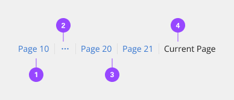
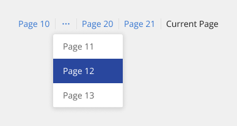
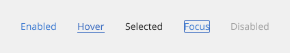
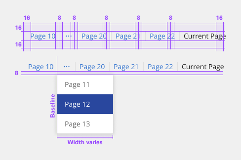
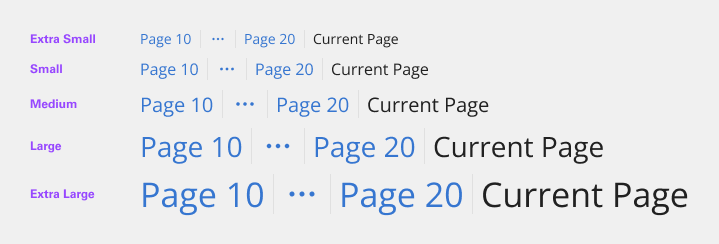
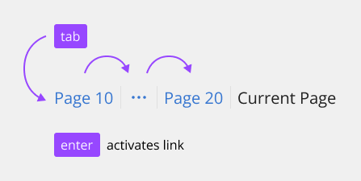
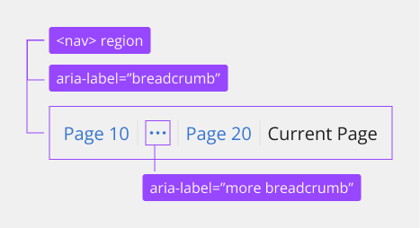

# Breadcrumb

Breadcrumbs show users their current location relative to the information architecture and enable them to quickly move up to a parent level or previous step.

## Usage

### When to use

Breadcrumbs are effective in products and experiences that have a large amount of content organized in a hierarchy of more than two levels. They take up little space but still provide context for the user’s place in the navigation hierarchy.

### When not to use

Breadcrumbs are always treated as secondary and should never entirely replace the primary navigation. They shouldn’t be used for products that have single level navigation because they create unnecessary clutter.

If you are taking users through a multistep process, use a progress indicator instead.

### Variants

The component supports two types of breadcrumbs. Both types are styled the same, but the methods for populating the breadcrumb trail are different. The breadcrumb type used should be consistent across a product.

- **Location based** - These illustrate the site’s hierarchy and show the user where they are within that hierarchy.
- **Path based** - These show the actual steps the user took to get to the current page, rather than reflecting the site’s information architecture. Path based breadcrumbs are always dynamically generated.

### Anatomy

1. Page link
2. Overflow link
3. Separator
4. Current page

### Placement

Breadcrumbs are placed in the top left portion of the page. They sit underneath the header and navigation, but above the page title.

### Content

- Each page link should be short and clearly reflect the location or entity it links to.
- Start with the highest-level parent page and move deeper into the information architecture as the breadcrumb trail progresses.
- By default, the current page is not listed in the breadcrumb trail.

### Overflow content

When space becomes limited, use an overflow menu to truncate the breadcrumbs. The first and last two-page links should be shown, but the remaining breadcrumbs in between are condensed into an overflow menu. Breadcrumbs should never wrap onto a second line.

### Universal behaviors

All the pages in the breadcrumb component should be interactive (except the current page) and link to their respective pages.

- Users can trigger an item by clicking on a breadcrumb page link. The separators between page links are not interactive.
- Users can navigate between breadcrumb links by pressing Tab and Shift-Tab. Users can trigger a breadcrumb link by pressing Enter while the link has focus. For additional keyboard interactions, see the accessibility tab.

By default, the breadcrumb trails should not include the current page. If a page doesn’t have a title or the current page is not clear, it can be included in the breadcrumb trail. If the current page is included in a breadcrumb trail, it is always the last text listed and is not an interactive link.

## Style

Below is the token architecture color build of the components. The token can be changed or defined through the token mapping script that has been placed in the application repository.

| State                      | Element                    | Property                   | Token name                 |
| :------------------------- | :------------------------- | :------------------------- | :------------------------- |
| Collapsed                  | Container                  | Background Color           |                            | 
|                            | Link                       | Text Color                 | `$link_primary`            |
|                            |                            | Border Color               |                            |
|                            | Icon                       | SVG Color                  | `$icon_interactive`        |
| Hover                      | Container                  | Background Color           |                            | 
|                            | Link                       | Text Color                 | `$link_primary_hover`      |
|                            |                            | Border Color               |                            |
|                            | Icon                       | SVG Color                  | `$icon_interactive`        |
| Selected                   | Container                  | Background Color           |                            | 
|                            | Link                       | Text Color                 | `$text_primary`            |
|                            |                            | Border Color               |                            |
|                            | Icon                       | SVG Color                  |                            |
| Focus                      | Container                  | Background Color           |                            | 
|                            | Link                       | Text Color                 | `$focus`                   |
|                            |                            | Border Color               | `$focus`                   |
|                            | Icon                       | SVG Color                  | `$focus`                   |
| Disabled                   | Container                  | Background Color           |                            | 
|                            | Link                       | Text Color                 | `$text_disabled`           |
|                            |                            | Border Color               |                            |
|                            | Icon                       | SVG Color                  | `$icon_disabled`           |

## Typography

When a user hovers overs a breadcrumb, the breadcrumb link should be underlined.

| Size                  | Font size | Font weight             | Token name                 |
| :-------------------- | :-------- | :---------------------- | :------------------------- | 
| X-large               | 22px      | 400 regular             | `$h2_compact_regular`      |
| Large                 | 28px      | 400 regular             | `$h3_compact_regular`      |
| Medium                | 20px      | 400 regular             | `$h4_compact_regular`      |
| Small                 | 16px      | 400 regular             | `$h5_compact_regular`      |
| X-small               | 14px      | 400 regular             | `$h6_compact_regular`      |

### Token Architecture

| Token name                  | Description                                            |
| :-------------------------- | :----------------------------------------------------- |
| `$breadcrumb_small`         | Defines height for the **small** variant.              |
| `$breadcrumb_medium`        | Defines height for the **medium** variant.             |
| `$breadcrumb_large`         | Defines height for the **large** variant.              |
| `$breadcrumb_padding`       | Defines **padding** for the component.                 |
| `$breadcrumb_margin`        | Defines **margin** for the component.                  |
| `$breadcrumb_border`        | Defines **border** weight for the accordion component. |
| `$breadcrumb_border_radius` | Defines **border radius** for the component.           |

## Structure

The on-click dropdown should follow the overflow menu specs for sizing, padding, and interaction. View contextual menu for additional specifications and guidelines.

**Breadcrumb**
| Element               | Property                | Size      | Token name                  |
| :-------------------- | :---------------------- | :-------- | :-------------------------- |
| Container             | Padding Right x Left    | 16px      | `$spacing_16`               |
|                       | Padding Top x Bottom    | 8px       | `$breadcrumb_padding`       |
| Link                  | Padding Right x Left    | 8px       | `$breadcrumb_padding`       |
|                       | Border Right            | 1px       | `$breadcrumb_border`        |
| Link: first-of-type   | Padding Left            | 8px       | `$breadcrumb_padding`       |
| Link: last-of-type    | Padding Right           |           |                             |
|                       | Border Right            | 1px       | `$breadcrumb_border`        |

**Overflow sizing**
| Variant               | Property                | Size      | Token name                  |
| :-------------------- | :---------------------- | :-------- | :-------------------------- |
| X-large               | Height x Width          | 40px      |                             |
| Large                 | Height x Width          | 36px      |                             |
| Medium                | Height x Width          | 28px      |                             |
| Small                 | Height x Width          | 22px      |                             |
| X-small               | Height x Width          | 18px      |                             |

## Accessibility

The design system bakes keyboard operation into its components, improving the experience of blind users and others who operate via the keyboard. The component incorporates many other accessibility considerations, some of which are described below.

### Keyboard

Each page link in the breadcrumb is reached by Tab and activated by Enter. The current page, if listed in the breadcrumb, is not a link. If the breadcrumb is truncated, the ellipsis button for the overflow menu is in the tab order. See overflow menu for details on its keyboard operation. The breadcrumb's links are reached by Tab and activated by Enter.

### Labeling and states

The component implements each page link as a list item inside a navigation region named “breadcrumb.” The ellipsis symbol is a button called “more breadcrumbs” which opens the overflow menu. The breadcrumb's links are reached by Tab and activated by Enter.

### Development recommendations

Keep these considerations in mind if you are modifying the design system or creating a custom component:
 
- The design system implementation uses an html5 element; this could also be achieved with a “navigation” landmark on a `
`.
- Each link in the breadcrumb is implemented as an unordered list item so that screen readers provide more context.
- The visual / separators do not need to be text (The design system uses CSS) and are not intended to be navigable.

