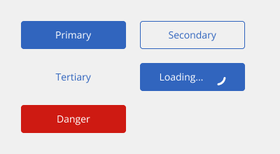
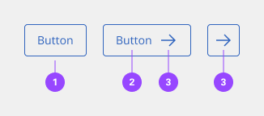
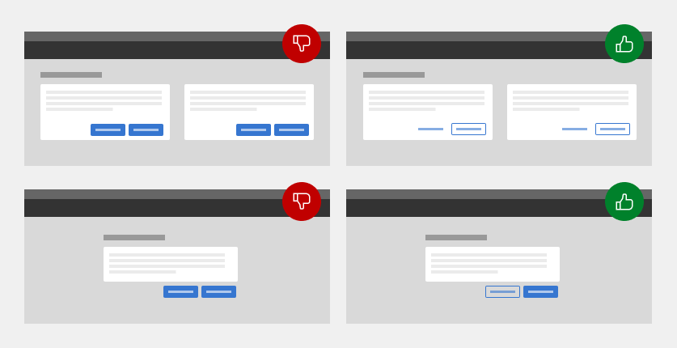
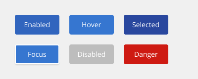
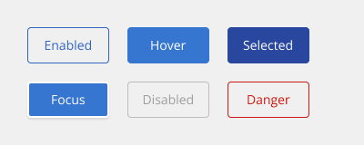
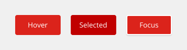
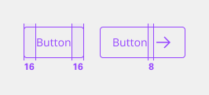
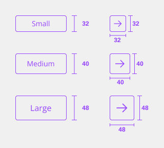
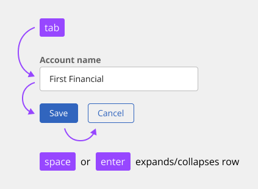

# Button

Buttons are clickable elements that are used to trigger actions. They communicate calls to action to the user and allow users to interact with pages in a variety of ways. Button labels express what action will occur when the user interacts with it.

## Usage

### When to use
Use buttons to communicate actions users can take and to allow users to interact with the page. Each page should have only one primary button, and any remaining calls to action should be represented as lower emphasis buttons.

### When not to use

Do not use buttons as navigational elements. Instead, use links when the desired action is to take the user to a new page.

### Variants

Each button variant has a particular function and its design signals that function to the user. It is therefore very important that the different variants are implemented consistently across products, so that they message the correct actions.

| Variant   | Purpose |
|:--------- | :------ |
| Primary   | For the principal call to action on the page. Primary buttons should only appear once per screen (not including the application header, modal dialog, or side panel). Primary buttons should only be labeled with positive actions. |
| Secondary | For secondary actions on each page. Secondary buttons can only be used in conjunction with a primary button. As part of a pair, the secondary button’s function is to perform the negative action of the set, such as “Cancel” or “Back." Do not use a secondary button in isolation and do not use a secondary button for a positive action. |
| Tertiary  | For the least pronounced actions, often used in conjunction with a primary button. In a situation such as a progress flow, a tertiary button may be paired with a primary and secondary button set, where the primary button is for forward action, the secondary button is for “Back," and the tertiary button is for “Cancel." |
| Danger    | For actions that could have destructive effects on the user’s data (for example, delete or remove). Danger button has three styles: primary, and tertiary. |
| Loading   | Loading button are used when performing actions. They notify to the user that their request is being processed. Although they do not provide details about what is occurring on the back end, they reassure the user that their action is being processed. |

### Anatomy

A button's text label is the most important element on a button, as it communicates the action that will be performed when the user interacts with it. In a contained button, the text is always left-aligned, not centered. By default, the component uses sentence case for all button labels.

If a text label is not used, an icon should be present to signify what the button does.
 
1. Container
2. Text label
3. Icon

### Button sizes

The table below adds more context around the use case for each size. For guidance on button heights as well as type sizes and tokens.

| Size   | Purpose |
| :----- | :------ |
| Small  | Use when there is not enough vertical space for the default or field-sized button. |
| Medium | Use when buttons are paired with input fields. |
| Large  | This is the most common button size. Use 14px body copy. |

### Emphasis
You don’t necessarily need to use the buttons in the order that their labels imply. For example, you don’t always need to use the secondary button as the second button in your layout. The most important thing is to establish a visual hierarchy between the buttons in your UI. Keep these best practices in mind.
 
- Do use high emphasis and medium emphasis buttons in a button group.
- Do not use two high emphasis buttons in a button group or page.

> [!Note]
> Reference the [Hicks Law](https://fiservcorp.sharepoint.com/sites/DigitalExperience/SitePages/laws-of-ux.aspx) for additional information.

#### A single, high-emphasis button

Generally, a layout should contain a single high-emphasis button that makes it clear that other buttons have less importance in the hierarchy. This high-emphasis button commands the most attention.

#### Multiple button emphasis

A high-emphasis button can be accompanied by medium- and low-emphasis buttons that perform less important actions. Keep in mind that you should only group together calls to action that have a relationship to one another. Although secondary buttons have less visual prominence because they are less saturated than their primary counterparts, they are still tonally heavy. If your layout requires multiple actions—as is the case with some toolbars, data lists and dashboards—low emphasis buttons (tertiary) may be a better choice.

### Alignment

Alignment refers to whether the buttons are aligned to the right or the left of a window, container, or layout. Buttons are unique, more so than any other component, in that their alignment depends on where they appear and whether they’re contained within another component.

Generally, on full-page designs, the primary button is on the left side of the page. When the browser window is large and the user is scrolling to read, it’s best to have the primary button where the user’s attention has been focused all along. Whereas in wizards, where a user is progressing through a series of steps or dialog windows, the primary action traditionally sits at the bottom right. Buttons within components such as notifications, search fields, and data tables are also right aligned.

In some cases, a button group—or even a single button in the case of a side panel or small tile—may span the entire width of a window or container. Typical nested button locations include:

- Banner calls to action
- Dialog windows
- Wizards
- Forms
- Cards
- Toolbars

| Alignment       | Purpose |
| :-------------- | :------ |
| Left justified  | Banner call to actions, in-page forms, and nested buttons in components like tiles. |
| Right justified | Inline notifications, inline field buttons and data tables, progressive forms, wizards, and single-button dialogs. |
| Full sapn       | Dialogs, side panels, and small tiles; currently the component does not offer a way to implement full-span buttons in code, without an override, they max out at 320px. |

### Button groups

Button groups are a useful way of aligning buttons that have a relationship. Group the buttons logically into sets based on usage and importance. Too many calls to action will overwhelm and confuse users so they should be avoided.

As mentioned in the Emphasis section, you don’t necessarily need to use the buttons in the order that their labels imply. Either a secondary or a tertiary button can be used in conjunction with a primary button. In fact, due to the visual weight of the secondary button, it’s recommended to use tertiary buttons in layouts with more than three calls to action.

Some products don’t want to hang their buttons into the gutter, but still want a 16px distance between buttons. This can be achieved while maintaining same-width buttons by treating the button group as a single object (rather than two separate entities) on the grid. Each button will essentially span 50% of their container with a programmatic 16px gutter between them.

#### Horizontally arranged groups

When using multiple buttons, the position of the primary button adheres to the alignment guidance above. To sum up, a primary button will be left-aligned and positioned to the left of the secondary/tertiary button on full-page designs. The primary button will be right-aligned and appear to the right of the secondary/tertiary button within wizards and dialog windows.

#### Stacked button groups

Typical landing pages for product have buttons side by side. However vertical button groups are also common in products, to save real estate in narrow columns and occasionally side panels. In these instances, the primary button is always on top, and the secondary or tertiary button is below.

Generally, when designers stack buttons, they tend to use the fixed buttons. However, stacked fluid buttons are also an option in desktop side panels with especially long calls to action. 

#### Groups with danger buttons

Danger buttons have a different visual style to inform users of potentially destructive actions they are about to take. Within a set, use the primary danger button style.

### Content

A button’s text label is the most important element on a button, as it communicates the action that will be performed when the user interacts with it. Buttons need to be clear and predictable.

Button labels should clearly indicate the action of the button. To provide enough context, use the {verb} + {noun} content formula on buttons except in the case of common actions like “Done,” “Close," “Cancel," “Add," or “Delete."

There are exceptions to this rule for situations in which button length could cause problems in compact UIs or negatively impact translation, but the {verb} + {noun} formula is still best practice.

### Universal behaviors

#### Primary button
The Primary button is the default action. When dialogs appear, the primary button typically takes focus. On a form, if focus is on a component that is not actionable with the Enter key, pressing Enter will activate the primary button.

#### Interactions

- **Mouse** - Users can trigger a button by clicking anywhere within the button container.
- **Keyboard** - Users can trigger a button by pressing Enter or Space while the button has focus.

### Modifiers

#### Buttons with icons

Icons can be placed next to labels to both clarify an action and call attention to a button. There are certain instances where an icon will suffice in place of a text label but use icon buttons cautiously.
 
- Use 16px glyphs within buttons; use 20px glyphs within the large expressive buttons
- Glyphs are distinguished by their solid shape and knocked-out details
- Glyphs should always appear to the right of the text
- Glyphs used in buttons must be directly related to the action that the user is taking
- Glyphs must be the same color value as the text within a button

#### Icon-only button

Icon buttons allow users to take actions, and make choices, with a single tap. Icon buttons can take the form of a primary, secondary, or tertiary variant but most commonly will be styled as primary or tertiary buttons.

#### Danger button

The danger button has three different styles: primary, and tertiary. Determining which danger button style to use will depend on the level of emphasis you want to give to the danger action. Destructive actions that are considered a required or primary step in a workflow should use the primary danger button style. However, if a destructive action is just one of several actions a user could choose from, then a lower emphasis style like the tertiary danger button or the tertiary danger button may be more appropriate.

#### Loader button
loading spinners are used when performing actions. They notify to the user that their request is being processed. Although they do not provide details about what is occurring on the back end, they reassure the user that their action is being processed.

Common actions that benefit from inline loading include any create, update, or delete actions that may have a lot of data to process. It can be used in a table, after a primary or secondary button click, or even in a modal.

## Style

Below is the token architecture color build of the components. The token can be changed or defined through the token mapping script that has been placed in the application repository.

### Color

**Primary button**

| State                      | Element                    | Property                   | Token name                   |
| :------------------------- | :------------------------- | :------------------------- | :--------------------------- |
| Enabled                    | Container                  | Background Color           | `$button_primary`            | 
|                            |                            | Border Color               |                              |
|                            |                            | Box Shadow                 |                              |
|                            | Label                      | Text Color                 | `$text_on_color`             | 
|                            | Icon                       | SVG Color                  | `$icon_on_color`             |
| Hover                      | Container                  | Background Color           | `$button_primary_hover`      | 
|                            |                            | Border Color               |                              |
|                            |                            | Box Shadow                 |                              |
|                            | Label                      | Text Color                 | `$text_on_color`             | 
|                            | Icon                       | SVG Color                  | `$icon_on_color`             |
| Active                     | Container                  | Background Color           |                              | 
|                            |                            | Border Color               |                              |
|                            |                            | Box Shadow                 |                              |
|                            | Label                      | Text Color                 |                              | 
|                            | Icon                       | SVG Color                  |                              |
| Selected                   | Container                  | Background Color           | `$button_primary_selected`   | 
|                            |                            | Border Color               |                              |
|                            |                            | Box Shadow                 |                              |
|                            | Label                      | Text Color                 | `$text_on_color`             | 
|                            | Icon                       | SVG Color                  | `$icon_on_color`             |
| Focus                      | Container                  | Background Color           | `$button_primary_hover`      |  
|                            |                            | Border Color               | `$focus`                     |
|                            |                            | Box Shadow                 | `$shadow_2`                  |
|                            | Label                      | Text Color                 | `$text_on_color`             | 
|                            | Icon                       | SVG Color                  | `$icon_on_color`             |
| Disabled                   | Container                  | Background Color           | `$button_disabled`           | 
|                            |                            | Border Color               |                              |
|                            |                            | Box Shadow                 |                              |
|                            | Label                      | Text Color                 | `$text_disabled`             | 
|                            | Icon                       | SVG Color                  | `$icon_disabled`             |
| Danger                     | Container                  | Background Color           | `$button_danger`             | 
|                            |                            | Border Color               |                              |
|                            |                            | Box Shadow                 |                              |
|                            | Label                      | Text Color                 | `$text_on_color`             | 
|                            | Icon                       | SVG Color                  | `$icon_on_color`             |

**Secondary button**

| State                      | Element                    | Property                   | Token name                   |
| :------------------------- | :------------------------- | :------------------------- | :--------------------------- |
| Enabled                    | Container                  | Background Color           |                              | 
|                            |                            | Border Color               | `$button_secondary`          |
|                            |                            | Box Shadow                 |                              |
|                            | Label                      | Text Color                 | `$button_secondary`          | 
|                            | Icon                       | SVG Color                  | `$button_secondary`          |
| Hover                      | Container                  | Background Color           |                              | 
|                            |                            | Border Color               | `$button_secondary_hover`    |
|                            |                            | Box Shadow                 |                              |
|                            | Label                      | Text Color                 | `$button_secondary_hover`    | 
|                            | Icon                       | SVG Color                  | `$button_secondary_hover`    |
| Active                     | Container                  | Background Color           |                              | 
|                            |                            | Border Color               |                              |
|                            |                            | Box Shadow                 |                              |
|                            | Label                      | Text Color                 |                              | 
|                            | Icon                       | SVG Color                  |                              |
| Selected                   | Container                  | Background Color           |                              | 
|                            |                            | Border Color               | `$button_secondary_selected` |   
|                            |                            | Box Shadow                 |                              |
|                            | Label                      | Text Color                 | `$button_secondary_selected` | 
|                            | Icon                       | SVG Color                  | `$button_secondary_selected` |
| Focus                      | Container                  | Background Color           | `$button_secondary_hover`    | 
|                            |                            | Border Color               | `$focus`                     |
|                            |                            | Box Shadow                 | `$shadow_2`                  |
|                            | Label                      | Text Color                 | `$text_on_color`             | 
|                            | Icon                       | SVG Color                  | `$icon_on_color`             |
| Disabled                   | Container                  | Background Color           |                              | 
|                            |                            | Border Color               | `$button_disabled`           |
|                            |                            | Box Shadow                 |                              |
|                            | Label                      | Text Color                 | `$text_disabled`             | 
|                            | Icon                       | SVG Color                  | `$icon_disabled`             |
| Danger                     | Container                  | Background Color           |                              | 
|                            |                            | Border Color               | `$button_danger`             |
|                            |                            | Box Shadow                 |                              |
|                            | Label                      | Text Color                 | `$text_on_color`             | 
|                            | Icon                       | SVG Color                  | `$icon_on_color`             |

**Tertiary button**

| State                      | Element                    | Property                   | Token name                   |
| :------------------------- | :------------------------- | :------------------------- | :--------------------------- |
| Enabled                    | Container                  | Background Color           |                              | 
|                            |                            | Border Color               |                              |
|                            |                            | Box Shadow                 |                              |
|                            | Label                      | Text Color                 | `$button_tertiary`           | 
|                            | Icon                       | SVG Color                  | `$button_tertiary`           |
| Hover                      | Container                  | Background Color           |                              | 
|                            |                            | Border Color               | `$button_tertiary_hover`     |
|                            |                            | Box Shadow                 |                              |
|                            | Label                      | Text Color                 | `$button_tertiary_hover`     | 
|                            | Icon                       | SVG Color                  | `$button_tertiary_hover`     |
| Active                     | Container                  | Background Color           |                              | 
|                            |                            | Border Color               |                              |
|                            |                            | Box Shadow                 |                              |
|                            | Label                      | Text Color                 |                              | 
|                            | Icon                       | SVG Color                  |                              |
| Selected                   | Container                  | Background Color           |                              | 
|                            |                            | Border Color               |                              |   
|                            |                            | Box Shadow                 |                              |
|                            | Label                      | Text Color                 | `$button_tertiary_selected`  | 
|                            | Icon                       | SVG Color                  | `$button_tertiary_selected`  |
| Focus                      | Container                  | Background Color           | `$focus_highlight`           | 
|                            |                            | Border Color               | `$focus`                     |
|                            |                            | Box Shadow                 | `$shadow_2`                  |
|                            | Label                      | Text Color                 | `$button_tertiary_hover`     | 
|                            | Icon                       | SVG Color                  | `$button_tertiary_hover`     |
| Disabled                   | Container                  | Background Color           |                              | 
|                            |                            | Border Color               |                              |
|                            |                            | Box Shadow                 |                              |
|                            | Label                      | Text Color                 | `$text_disabled`             | 
|                            | Icon                       | SVG Color                  | `$icon_disabled`             |
| Danger                     | Container                  | Background Color           |                              | 
|                            |                            | Border Color               |                              |
|                            |                            | Box Shadow                 |                              |
|                            | Label                      | Text Color                 | `$button_danger`             | 
|                            | Icon                       | SVG Color                  | `$button_danger`             |

**Danger button**

| State                      | Element                    | Property                   | Token name                   |
| :------------------------- | :------------------------- | :------------------------- | :--------------------------- |
| Hover                      | Container                  | Background Color           | `$button_danger_hover`       | 
|                            |                            | Border Color               |                              |
|                            |                            | Box Shadow                 |                              |
|                            | Label                      | Text Color                 | `$text_on_color`             | 
|                            | Icon                       | SVG Color                  | `$icon_on_color`             |
| Active                     | Container                  | Background Color           |                              | 
|                            |                            | Border Color               |                              |
|                            |                            | Box Shadow                 |                              |
|                            | Label                      | Text Color                 |                              | 
|                            | Icon                       | SVG Color                  |                              |
| Selected                   | Container                  | Background Color           | `$button_danger_selected`    | 
|                            |                            | Border Color               |                              |   
|                            |                            | Box Shadow                 |                              |
|                            | Label                      | Text Color                 | `$text_on_color`             | 
|                            | Icon                       | SVG Color                  | `$icon_on_color`             |
| Focus                      | Container                  | Background Color           | `$button_danger_hover`       | 
|                            |                            | Border Color               | `$focus`                     |
|                            |                            | Box Shadow                 | `$shadow_2`                  |
|                            | Label                      | Text Color                 | `$text_on_color`             | 
|                            | Icon                       | SVG Color                  | `$icon_on_color`             |

>[!Note]
> The danger button styling will override the Primary, Secondary, and Tertiary button modifier's styles. The **enabled** state is alreay included in each button above.

### Typography

Button text should be set in sentence case, with only the first word in a phrase and any proper nouns capitalized.

| Size                  | Font size | Font weight             | Token name                 |
| :-------------------- | :-------- | :---------------------- | :------------------------- | 
| Large                 | 16px      | 400 regular             | `$button_2_regular`        |
| Medium                | 14px      | 400 regular             | `$button_1_regular`        |
| Small                 | 14px      | 400 regular             | `$button_1_regular`        |

### Token Architecture

| Token name                  | Description                                            |
| :-------------------------- | :----------------------------------------------------- |
| `$button_small`             | Defines height for the **small** variant.              |
| `$button_medium`            | Defines height for the **medium** variant.             |
| `$button_large`             | Defines height for the **large** variant.              |
| `$button_padding`           | Defines **padding** for the component.                 |
| `$button_margin`            | Defines **margin** for the component.                  |
| `$button_border`            | Defines **border** weight for the accordion component. |
| `$button_border_radius`     | Defines **border radius** for the component.           |

### Structure

A button cannot have any element or text within 16 pixels / 1 rem of its borders. For button groups, the primary button is positioned on the outside of the set, while the secondary button is positioned inside. For a button with a glyph, the space between the button label and the glyph must be greater than or equal to 16 pixels / 1 rem. This is to accommodate for instances where two or more buttons with glyphs appear together.

| State                | Element               | Property                | Size      | Token name                  |
| :--------------------| :-------------------- | :---------------------- | :-------- | :-------------------------- |
| Enabled              | Container             | Padding Left x Right    | 16px      | `$button_padding`           |
|                      |                       | Padding Top x Bottom    |           |                             |
|                      |                       | Border                  | 1px       | `$button_border`            |
|                      |                       | Border Radius           | 4px       | `$button_border_radius`     |
|                      | Icon (Right)          | Margin Left             | 8px       | `$button_margin`            |
|                      | Icon (Left)           | Margin Left             | 8px       | `$button_margin`            |
| Focus                | Container             | Border                  | 1px       | `$border_1`                 |

### Size

| Variant                    | Element                   | Size                       | Token name                 |
| :------------------------- | :-------------------------| :------------------------- | :------------------------- |
| Small                      | Container                 | 32px                       | `$button_small`            |
|                            | Icon                      | 20px                       | `$icon_small`              |
| Medium                     | Container                 | 40px                       | `$button_medium`           |
|                            | Icon                      | 24px                       | `$icon_medium`             |
| Large                      | Container                 | 48px                       | `$button_large`            |
|                            | Icon                      | 20px                       | `$icon_large`              |

## Accessibility

The component bakes keyboard operation into its components, improving the experience of blind users and others who operate via the keyboard. The component incorporates many other accessibility considerations, some of which are described below.

### Keyboard

Buttons can be reached by Tab and selected with `Space` or `Enter`.

### Behavior

Icon-only button, which do not persistently display a text label, expose their label on hover and focus. When icon-only buttons are used to open menus, they are treated as separate components in the component. Icon-only buttons have their labels exposed automatically on hover and focus.

### Labeling

When buttons do not have a persistently displayed label, they must be annotated with a label that will be exposed on hover or focus.

### Development recommendations

Keep these considerations in mind if you are modifying the component or creating a custom component:

- Where links have been ‘repurposed’ as a button, they need to be coded so the Space key can also activate (since links are only activated by default by Enter).
- Toggle buttons can be accessibility supported by changing the value of aria-pressed between "true" and "false" or with a change of name that reflects a change in the icon shape (for example: “play” / “pause”)
- See the [ARIA authoring practices](https://www.w3.org/WAI/ARIA/apg/#button) for more considerations.

