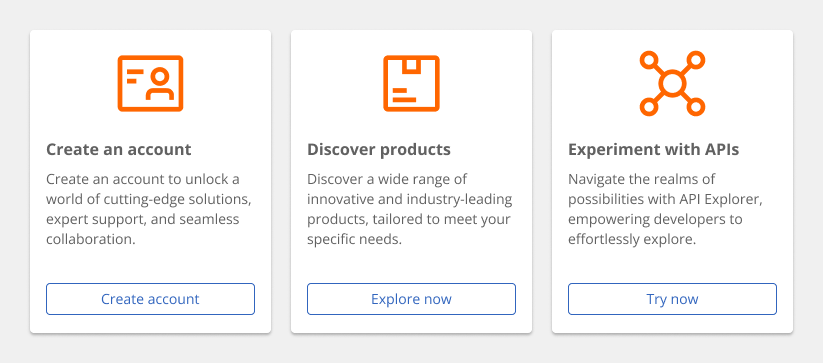
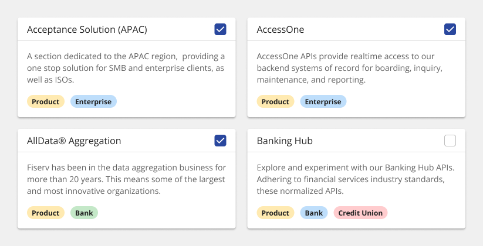
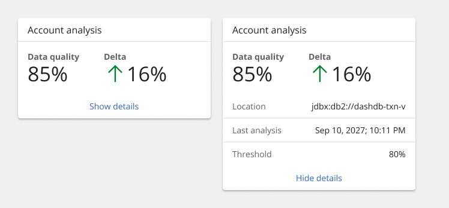
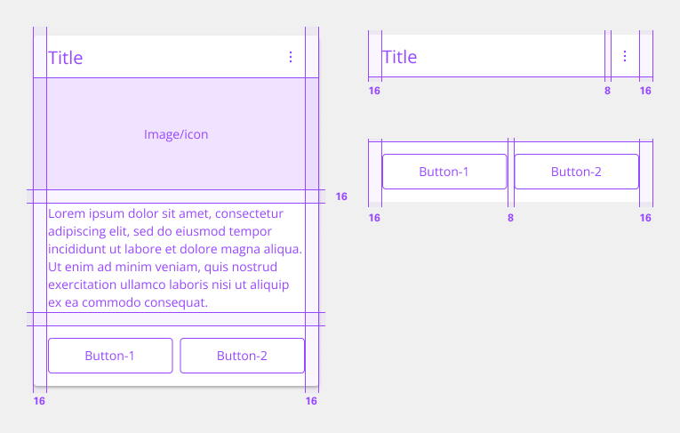

# Card

Cards are a highly flexible component for displaying a wide variety of content, including information, getting started, how-to, next steps, and more.

The system includes a basic card structure that responds to the grid. Cards can contain type, images and/or blocks of color. However, cards have no pre-set styles for the content inside. Card usage guidance focuses solely on basic card functions—not the information hierarchy within the tile or guidance around additional interactive elements that the card may contain.

## Usage

### When to use

Cards are reusable components to group related information in flexible containers. Here are some common use cases for when to use tiles:

- To contain related groupings of information or actions
- To guide users to take actions or navigate
- To present options for single or multiple selections
- To hide or show large amounts of content

### When not to use

Cards reside in the same plane as the background layer—they do not have elevation. Cards organize essential information and have the same visual hierarchy as content within the same page.

### Variants

Cards can function or be implemented in four ways—base, clickable, selectable, or expandable. These variations of tiles are flexible enough to support a variety of different use cases when building more complicated card features.

| Variant      | Purpose |
|:------------ | :------ |
| Base         | For high-level, short, and digestible content pieces such as features, plans, or services offered. |
| Clickable    | For prompting an action, navigating or directing to other pieces of information about the subject matter. |
| Selectable   | For presenting options to a user in a structured manner, such as a set of pricing plans. |
| Expandable   | For hiding and revealing a large amount of content to focus on specific pieces of information. |

### Base

Base cards are used to display information to the user, such as features or services offered. Base tiles are often seen on marketing pages to promote content or on highly interactive dashboards. These cards can have internal calls-to-action (CTAs), such as a button or a link.

### Clickable

Clickable tiles can be used as navigational elements that redirect the user to a new page. In these situations, the entire tile is in a clickable state. Due to accessibility concerns, clickable tiles cannot contain separate internal CTAs but can contain pictograms, icons, or media such as illustrations or images.

### Selectable

Selectable cards work well for presenting options to a user in a structured manner, such as a set of pricing plans. Selectable tiles may contain internal CTAs (like links to docs) if the internal CTA is given its own click target.

Selectable cards can either have a single-select state working like a radio button, or multi-select state working as a checkbox.

### Expandable

Expandable tiles are helpful for hiding and showing large amounts of content to a user. When expanded, tiles push content down the page. They allow the user to specifically focus on featured content while having access to the rest of the information. Expandable cards can contain internal CTAs (like links to docs) if they are given their own click targets.

### Anatomy

1. Title (optional)
2. Header action/icon (optional)
3. Image (optional)
4. Content
5. Footer (optional)

### Sizing

The **width** varies depending on three basic gutter modes: wide, narrow, and condensed. The minimum height starts with 2:1 aspect ratio. As the content grows, set vertical spacing between sections within the content area.

### States

| State        | Purpose |
|:------------ | :------ |
| Enabled      | When a card is live, but a user is not directly interacting with it. This is commonly referred to as the default or normal state of the component. |
| Hover        | When a user is hovering over the card with the mouse cursor to interact with it (except base card). |
| Focus        | When a user tabs to or clicks on the card, it becomes focused, indicating the user has successfully navigated to the component (except base card). |
| Selected     | When a user enters or clicks on the single-select card or the multi-select card to select an option or multiple options. |
| Disabled     | When the user is not allowed to interact with clickable and selectable (single-select and multi-select) cards due to either permissions, dependencies, or pre-requisites. The disabled state completely removes the interactive function from a component. The styling is not subject to WCAG contrast compliance. |'

### Universal behavior

#### Mouse

Users can trigger an item by clicking anywhere in any tile container, except base cards.

- Clickable, expandable, and selectable cards are clickable anywhere within the card.
- Base cards are static, except buttons or links.

Expandable tiles can either be triggered as a whole or contain internal CTAs only if they are given their own click targets. In these cases, the card’s click target is reduced to only the icon button.

#### Keyboard

Specific keyboard interactions will depend on the type of tile you are using and what content it contains but all types of tiles can take focus.

| Key                 | Interactions |
|:------------------- | :----------- |
| `Tab`               | When a card is live, but a user is not directly interacting with it. This is commonly referred to as the default or normal state of the component. |
| `Shift` + `Tab`     | When a user is hovering over the card with the mouse cursor to interact with it (except base card). |
| `Return` or `Enter` | When a user tabs to or clicks on the card, it becomes focused, indicating the user has successfully navigated to the component (except base card). |
| `Space`             | When a user enters or clicks on the single-select card or the multi-select card to select an option or multiple options. |

### Reference

Hagan Rivers, [Interactions design with cards/tiles](https://medium.com/%40hagan.rivers/interaction-design-with-cards-tiles-5a6895aa220d/) (Medium, 2017)

## Style

Below is the token architecture color build of the components. The token can be changed or defined through the token mapping script that has been placed in the application repository.

| Variant                    | Element                    | Property                   | Token name                   |
| :------------------------- | :------------------------- | :------------------------- | :--------------------------- |
| Default                    | Container                  | Background Color           | `$layer_1`                   | 
|                            |                            | Border Color               |                              |
|                            |                            | Box Shadow                 |                              |
|                            | Header                     | Background Color           | `$layer_1`                   | 
|                            |                            | Border Color               | `$border_subtle_1`           |
|                            |                            | Text Color                 | `$text_primary`              |
|                            |                            | SVG Color                  | `$icon_primary`              |
|                            | Footer                     | Background Color           | `$layer_1`                   | 
| Bordered                   | Container                  | Background Color           | `$layer_1`                   | 
|                            |                            | Border Color               | `$border_card_1`             |
|                            |                            | Box Shadow                 |                              |
|                            | Header                     | Background Color           | `$layer_1`                   | 
|                            |                            | Border Color               | `$border_subtle_1`           |
|                            |                            | Text Color                 | `$text_primary`              |
|                            |                            | SVG Color                  | `$icon_primary`              |
|                            | Footer                     | Background Color           | `$layer_1`                   |
| Shadowed                   | Container                  | Background Color           | `$layer_1`                   | 
|                            |                            | Border Color               |                              |
|                            |                            | Box Shadow                 | `$shadow_1`                  |
|                            | Header                     | Background Color           | `$layer_1`                   | 
|                            |                            | Border Color               | `$border_subtle_1`           |
|                            |                            | Text Color                 | `$text_primary`              |
|                            |                            | SVG Color                  | `$icon_primary`              |
|                            | Footer                     | Background Color           | `$layer_1`                   | 
| Modal Overlay              | Container                  | Background Color           | `$layer_1`                   | 
|                            |                            | Border Color               |                              |
|                            |                            | Box Shadow                 | `$shadow_5`                  |
|                            | Header                     | Background Color           | `$layer_1`                   | 
|                            |                            | Border Color               | `$border_subtle_1`           |
|                            |                            | Text Color                 | `$text_primary`              |
|                            |                            | SVG Color                  | `$icon_primary`              |
|                            | Footer                     | Background Color           | `$layer_1`                   |

### Token Architecture

| Token name                  | Description                                            |
| :-------------------------- | :----------------------------------------------------- |
| `$card_small`               | Defines height for the **small** variant.              |
| `$card_medium`              | Defines height for the **medium** variant.             |
| `$card_large`               | Defines height for the **large** variant.              |
| `$card_padding`             | Defines **padding** for the component.                 |
| `$card_margin`              | Defines **margin** for the component.                  |
| `$card_border`              | Defines **border** weight for the accordion component. |
| `$card_border_radius`       | Defines **border radius** for the component.           |

### Structure

| Element               | Property                | Size      | Token name                  |
| :-------------------- | :---------------------- | :-------- | :-------------------------- |
| Card                  | Minimum Height          | 64px      |                             |
|                       | Minimum Width           | 128px     |                             |
|                       | Border Radius           | 4px       | `$card_border_radius`       |
| Header                | Padding Right x Left    | 16px      | `$card_padding`             |
|                       | Border Bottom           | 1px       | `$card_border`              |
| Button Right          | Margin Left             | 8px       | `$card_margin`              |
| Button Left           | Margin Right            | 8px       | `$ard_margin`               |
| Body                  | Padding Right x Left    | 16px      | `$card_padding`             |
|                       | Padding Top x Bottom    | 16px      | `$card_padding`             |
| Footer                | Padding Right x Left    | 16px      | `$card_padding`             |
|                       | Border Top              | 1px       | `$card_border`              |

### Size

| Element               | Property                | Size      | Token name                  |
| :-------------------- | :---------------------- | :-------- | :-------------------------- |
| Large                 | Header                  | 56px      |                             |
|                       | Footer                  | 56px      |                             |
|                       | Button                  | 48px      | `$button_large`             |
|                       | Icon                    | 28px      | `icon_large`                |
| Medium                | Header                  | 48px      |                             |
|                       | Footer                  | 48px      |                             |
|                       | Button                  | 40px      | `$button_medium`            |
|                       | Icon                    | 24px      | `icon_medium`               |
| Small                 | Header                  | 40px      |                             |
|                       | Footer                  | 40px      |                             |
|                       | Button                  | 32px      | `$button_small`             |
|                       | Icon                    | 20px      | `icon_small`                |

## Accessibility

The card component has been tested against the latest [W3C Web Content Accessibility Guidelines (WCAG) 2.1 Level A and AA success criteria](https://www.w3.org/TR/WCAG21/) and violations have been identified as high priority issues. This document will be updated when these accessibility issues are resolved.

### Considerations

- Labels should be clear and concise.
- Users should be warned if selecting a card will cause a change in context.
- The components should be used to create the content that displays within each card.

### Resources

-	[W3C WAI-ARIA Authoring Practices Checkbox Design Pattern](https://www.w3.org/TR/wai-aria-practices/examples/checkbox/checkbox-1/checkbox-1.html) covers the usage of ARIA names, state and roles, as well as the expected keyboard interactions.
-	[W3C WAI-ARIA: Using aria-expanded to indicate the state of a collapsible element.](https://www.w3.org/WAI/GL/wiki/Using_aria-expanded_to_indicate_the_state_of_a_collapsible_element)

### Testing

Automated, manual and screen reader accessibility verification test has been performed on the card component.

| Environment                                 | Results (DAP) |
| :------------------------------------------ | :------------ |
| macOS Mojave version 10.14.6 with VoiceOver | No violations |
| Chrome version 77.0.3865.90                 | No violations | 
