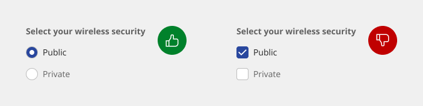
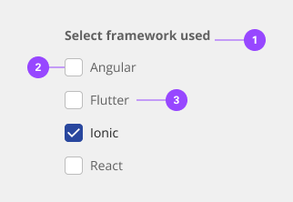
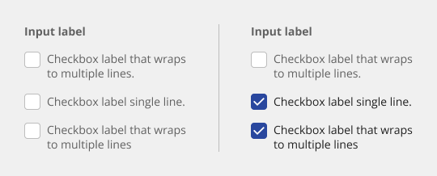
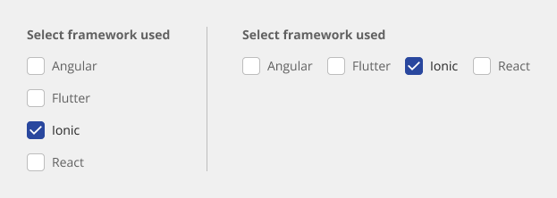
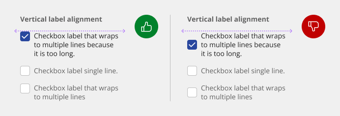
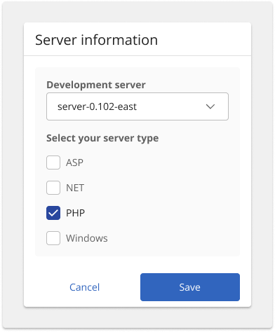
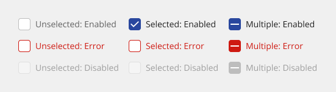
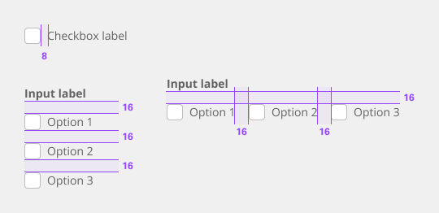
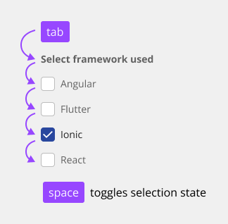
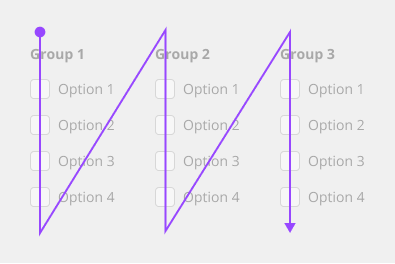

# Checkbox

Checkboxes are used for multiple choices, not for mutually exclusive choices. Each checkbox works independently from other checkboxes in the list, therefore checking an additional box does not affect any other selection.

## Usage

### When to use

- **Forms** - Cany be used in forms on a full page, modals, or on side panels.

- **Filtering and batch actions** - Used to filter data either on a page, menu, or within a component (molecule)

- **Terms and conditions** - Turning the checkbox input on or off can indicate if you agree to the terms.

- **List with sub-sections** - Used when there is a parent and child relationship. You can use a parent checkbox to make a bulk selection of all list items. Unchecking the parent deselects all the list items. Alternatively, you can select children individually when the parent is not selected, which is where the indeterminate state comes into play.

### When not to use

If a user can select only one option from a list, radio buttons should be used instead of checkboxes. Checkboxes allow the user to select multiple items in a set whereas radio buttons allow the user to select only one option.

- Do use radio buttons when only one item can be selected.
- Do not use checkboxes when only one item can be selected.

### Anatomy

The checkbox component is comprised of a checkbox label and a checkbox input. If there is a group of checkboxes, a group label can be added.

1. **Group label (optional)** - Communicates what needs to be selected below.
2. **Checkbox input** - A checkbox input indicating the appropriate state. By default, it is unselected.
3. **Checkbox label** - Describes the information you want to select or unselect.

### Group labels (optional)

- In most cases, a set of checkboxes is preceded by a group label to provide further context or clarity.
- A group label can either state the category of the grouping or describe what actions to take below.
- Use sentence case for group labels.
- In some cases, a group of checkboxes may be within a larger group of components that already have a group label. In this case, an additional group label for the checkbox component itself is not needed.

### Checkbox labels

- Always use clear and concise labels for checkboxes.
- Labels appear to the right of checkbox inputs.
- Regardless of whether the label is visible in the interface, a label is always needed in code, whether it’s for one checkbox or a group of them.

### Overflow content

- We recommend checkbox labels being fewer than three words.
- If you are tight on space, consider rewording the label. Do not truncate checkbox label text with an ellipsis.
- Long labels may wrap to a second line, and this is preferable to truncation.
- Text should wrap beneath the checkbox, so the control and label are top aligned.

### Alignment

Checkbox labels are positioned to the right of their inputs. If there is a checkbox grouping, they can be laid out vertically or horizontally depending on the use case and the structure of the UI. When possible, arrange the checkbox groups vertically for easier reading.

### Placement

The checkbox component is often used in forms. Forms can be placed on a full page, in a modal, or in a side panel. A checkbox can also be used for agreeing to terms and conditions or to filter information.

### States

The checkbox input allows for a series of states: unselected, selected, and indeterminate. The default view of a set of checkboxes is having no option selected. Use the indeterminate state when the checkbox contains a sub list of selections, some of which are selected, and some unselected. In addition to unselected, selected, and indeterminate states, checkboxes also have states for focus and disabled.

### Universal behaviors

#### Mouse

Users can trigger an item by clicking the checkbox input directly or by clicking the checkbox label. Having both regions interactive creates a more accessible click target. The only hover effect when the mouse is placed over the target is a pointer shape change.

#### Keyboard

Users can navigate to and between checkbox inputs by pressing Tab or Shift-Tab. Users can trigger a state change by pressing Space while the checkbox input has focus.

### Checkbox versus radio button

Radio buttons represent a group of mutually exclusive choices, while checkboxes allow users to select one or more checkboxes from a group. In use cases where only one selection of a group is allowed, use the radio button component instead of the checkbox.

### Checkbox versus toggle switch

Toggle switches are preferred when the resulting action will be instantaneously applied, without the need for further confirmation. By comparison, checkboxes represent one input in a larger flow which usually requires a final confirmation step.

## Style

Below is the token architecture color build of the components. The token can be changed or defined through the token mapping script that has been placed in the application repository.

### Color

Below is the token architecture color build of the components. The token can be changed or defined through the token mapping script that has been placed in the application repository.

**Unselected**
| State                      | Element                    | Property                   | Token name                 |
| :------------------------- | :------------------------- | :------------------------- | :------------------------- |
| Default                    | Container                  | Background Color           | `$field_1`                 | 
|                            |                            | Border Color               | `$border_strong_1`         |
|                            | Label                      | Text Color                 | `$text_secondary`          |
| Focus                      | Container                  | Background Color           | `$focus_highlight`         | 
|                            |                            | Border Color               | `$focus`                   |
|                            | Label                      | Text Color                 | `$text_primary`            |
| Error                      | Container                  | Background Color           | `$support_bg_error`        | 
|                            |                            | Border Color               | `$support_error`           |
|                            | Label                      | Text Color                 | `$support_error`           |
| Disabled                   | Container                  | Background Color           | `$field_disabled_1`        | 
|                            |                            | Border Color               | `$border_disabled_1`       |
|                            | Label                      | Text Color                 | `$text_disabled`           |

**Selected**
| State                      | Element                    | Property                   | Token name                 |
| :------------------------- | :------------------------- | :------------------------- | :------------------------- |
| Default                    | Container                  | Background Color           | `$button_primary_selected` | 
|                            |                            | Border Color               |                            |
|                            | Label                      | Text Color                 | `$text_primary`            |
|                            | Icon                       | SVG Color                  | `$icon_on_color`           |
| Focus                      | Container                  | Background Color           | `$button_primary_selected` | 
|                            |                            | Border Color               | `$focus`                   |
|                            | Label                      | Text Color                 | `$text_primary`            |
|                            | Icon                       | SVG Color                  | `$icon_on_color`           |
| Error                      | Container                  | Background Color           | `$support_error`           | 
|                            |                            | Border Color               | `$support_error`           |
|                            | Label                      | Text Color                 | `$support_error`           |
| Disabled                   | Container                  | Background Color           | `$field_disabled_1`        | 
|                            |                            | Border Color               |                            |
|                            | Label                      | Text Color                 | `$text_disabled`           |
|                            | Icon                       | SVG Color                  | `$icon_disabled`           |

### Typography

Checkbox labels and group labels should be sentence-case, with only the first word in a phrase and any proper nouns capitalized. Checkbox labels and group labels should not exceed three words.

| Element               | Font size | Font weight             | Token name                 |
| :-------------------- | :-------- | :---------------------- | :------------------------- | 
| Group label           | 14px      | 700 bold                | `$label_1_bold`            |
| Label                 | 14px      | 400 regular             | `$label_1_regular`         |

### Token Architecture

| Token name                  | Description                                            |
| :-------------------------- | :----------------------------------------------------- |
| `$checkbox_small`           | Defines height for the **small** variant.              |
| `$checkbox_medium`          | Defines height for the **medium** variant.             |
| `$checkbox_large`           | Defines height for the **large** variant.              |
| `$checkbox_padding`         | Defines **padding** for the component.                 |
| `$checkbox_margin`          | Defines **margin** for the component.                  |
| `$checkbox_border`          | Defines **border** weight for the accordion component. |
| `$checkbox_border_radius`   | Defines **border radius** for the component.           |

### Structure

Structure and spacing measurements for vertical and horizontal checkbox groupings.

| Element               | Property                | Size      | Token name                  |
| :-------------------- | :---------------------- | :-------- | :-------------------------- |
| Checkbox              | Height x Width          | 20px      |                             |
|                       | Margin Down             | 16px      | `$spacing_16`               |
|                       | Margin Right            | 16px      | `$spacing_16`               |
|                       | Border                  | 1px       | `$checkbox_border`          |
|                       | Border Radius           | 2px       | `$checkbox_border_radius`   |
| Group label           | Margin Bottom           | 8px       | `$checkbox_margin`          |
| Label                 | Margin Left             | 8px       | `$checkbox_margin`          |

## Accessibility

The component bakes keyboard operation into its components, improving the experience of blind users and others who operate via the keyboard. It incorporates many other accessibility considerations, some of which are described below.

### Keyboard

Each checkbox can be reached by Tab and selected with Space independently. This matches the established HTML interaction pattern.

### Grouping

For groups of checkboxes, the component already provides the code for screen readers to properly detect the set of checkboxes and announce the group label.

### Meaningful order

Checkboxes can appear in multiple columns. If there is a meaningful order to the items (such as days of the week), annotate whether the tab order is by row or by column.

### Development considerations

Keep these considerations in mind if you are modifying the component or creating a custom component:

- Checkboxes are grouped using `<fieldset>` and `<legend>`.
- A tri-state checkbox that is partially checked (indeterminate) has aria-checked set to "mixed."
- See the [ARIA authoring practices](https://www.w3.org/TR/wai-aria-practices-1.2/#checkbox) for more considerations.

