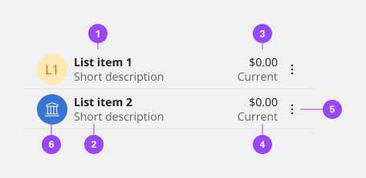

# Contained List

Contained lists are commonly used inside of containers like cards, sidebars, and disclosure situations. These lists have one header column of information with multiple list item rows. They help you organize related content within smaller spaces within a user interface and allow you to include inline actions and interactive elements.

## Usage

### When to use

- Use on a page inside of small spaces or in disclosure situations.
- Use when including interactive elements or inline actions in a list.
- To logically group items that follow the same content structure.

### When not to use

- Do not use if the list content needs to be nested more than one level deep and becomes overly complex and lengthy. For these situations, use the data table component instead.
- Do not use if the list needs to contain multiple column headers, instead use the structured list component.

### Variants

These are the following types of formats for the contained list component. Each format variation can contain multiple assets or nested components. The content of these formats can be a combination of various interactions including read-only, forms, navigation, etc.

| Variant        | Purpose |
|:-------------- | :------ |
| On-Page List   | Use this variant when placing the list in a persistent context like the main area in the user interface, such as on a card or in a sidebar. |
| Disclosed List | Use this variant when the list is shown within a temporary context, for example within a popover or layer that is elevated by a drop shadow/border. |
| Single         | Basic list items consisting of single line of text. A list of actions/navigation items are examples of single line-item list. |
| Stacked        | Complex structure using multiple lines of information. |
| Input          | A list that can accept user input. |

### Anatomy

#### Single

Basic list items consisting of single line of text. A list of actions/navigation items are examples of single line-item list.

1. Primary value
2. Secondary value (optional)
3. Icon (optional)

#### Stacked

Complex structure using multiple lines of information.

1. Primary value
2. Secondary value (optional)
3. Tertiary value (optional)
4. Quaternary value (optional)
5. Icon (optional)
6. Avatar (optional)

#### Inputs

A list that can accept user input.

1. Primary value
2. Input component

### Scrolling

Contained list header areas can be sticky and fixed in place while the list item rows scroll underneath. This functionality is optional depending on the use case.

### Content

Determinates have a label and an optional helper text.

**List title**
- A list title is a descriptive name for the group of list items.
- List titles should be short and clear, ranging from one to three words to describe the list group.
- Use sentence case capitalization.

**List item**
- List item text can vary but the structure of the content should be similar per row in the same contained list.
- List item text can have multiple lines of concise content but should not contain multiple paragraphs of lengthy information.
- Use sentence case capitalization.

### On page list

Use the on-page list variant when placing the list on the general page of a user interface. On-page lists typically appear in smaller spaces, like in a card or sidebars. The on-page list styling has no visible background header with fixed information. If there are scrolling capabilities, the header will remain sticky and have a background layer to differentiate it from the list item rows scrolling beneath it.

### Placement

On-page lists should span the entire width of the container they are placed within to make the best use of space and to achieve vertical type alignment with other text and components on the page.

### Disclosed list

Use the disclosed list variant when placing the list within a temporary context, like a popover or disclosure, which is typically accompanied by an enclosed border or drop shadow. The disclosed list styling has a background layer underneath the header. Each header has a smaller height than the on-page list styling to take up less real estate in the smaller and scrollable spaces it usually appears in.

#### Placement

Disclosed lists should span the entire width of the container they are placed within to make the best use of space.

### Inline actions

Contained lists can include inline actions, such as closing or dismissing row items in the list.

### Interactive elements

Contained lists can have interactive elements in headers and rows, such as links, icon buttons, and toggles. Contained lists can also have multiple row columns. Additional row columns act as list item details pertaining to the first list item in the row. If your list has an excess of row columns and needs multiple column headers, we recommend using a data table instead.

### Search and filtering

Contained lists can include a search or filter functionality. The search or filter can collapse and expand in the list header area or stay persistent on the page below the list header area, depending on the use case.

## Style

Below is the token architecture color build of the components. The token can be changed or defined through the token mapping script that has been placed in the application repository.

### Color

| State                      | Element                    | Property                   | Token name                 |
| :------------------------- | :------------------------- | :------------------------- | :------------------------- |
| Enabled                    | Container                  | Background Color           | `$layer_1`                 | 
|                            |                            | Border Color               | `$border_subtle_1`         |
|                            | Title                      | Text Color                 | `$text_primary`            |
|                            | Content                    | Text Color                 | `$text_secondary`          |
|                            | Icon                       | SVG Color                  | `$icon_secondary`          |
| Hover                      | Container                  | Background Color           | `$layer_hover_1`           | 
|                            |                            | Border Color               | `$border_subtle_1`         |
|                            | Title                      | Text Color                 | `$text_primary`            |
|                            | Content                    | Text Color                 | `$text_primary`            |
|                            | Icon                       | SVG Color                  | `$icon_primary`            |
| Selected                   | Container                  | Background Color           | `$layer_selected_1`        | 
|                            |                            | Border Color               |                            |
|                            | Title                      | Text Color                 | `$text_on_color`           |
|                            | Content                    | Text Color                 | `$text_on_color`           |
|                            | Icon                       | SVG Color                  | `$icon_on_color`           |
| Focus                      | Container                  | Background Color           | `$focus_highlight`         | 
|                            |                            | Border Color               | `$focus`                   |
|                            | Title                      | Text Color                 | `$text_primary`            |
|                            | Content                    | Text Color                 | `$text_primary`            |
|                            | Icon                       | SVG Color                  | `$icon_primary`            |
| Disabled                   | Container                  | Background Color           | `$layer_disabled`          | 
|                            |                            | Border Color               | `$border_subtle_1`         |
|                            | Title                      | Text Color                 | `$text_disabled`           |
|                            | Content                    | Text Color                 | `$text_disabled`           |
|                            | Icon                       | SVG Color                  | `$icon_disabled`           |
| Danger                     | Container                  | Background Color           | `$support_error`           | 
|                            |                            | Border Color               |                            |
|                            | Title                      | Text Color                 | `$text_on_color`           |
|                            | Content                    | Text Color                 | `$text_on_color`           |
|                            | Icon                       | SVG Color                  | `$icon_on_color`           |

### Typography

All text should be set in sentence case, with only the first word in a phrase and any proper nouns capitalized. The below measurements are baseline. Based on scenario/experience need, sizes and typography can be flexible.

| State      | Element    | Font size | Font weight | Token name                 |
| ---------- | ---------- | --------- | ----------- | -------------------------- | 
| Small      | Title      | 14px      | 700 bold    | `$body_standard_1_bold`    |
|            | Content    | 14px      | 400 regular | `$body_standard_1_regular` |
| Medium     | Title      | 14px      | 700 bold    | `$body_standard_1_bold`    |
|            | Content    | 14px      | 400 regular | `$body_standard_1_regular` |
| Large      | Title      | 16px      | 700 bold    | `$body_standard_2_bold`    |
|            | Content    | 16px      | 400 regular | `$body_standard_2_regular` |

### Token Architecture

| Token name                      | Description                                            |
| :------------------------------ | :----------------------------------------------------- |
| `$contained_list_small`         | Defines height for the **small** variant.              |
| `$contained_list_medium`        | Defines height for the **medium** variant.             |
| `$contained_list_large`         | Defines height for the **large** variant.              |
| `$contained_list_padding`       | Defines **padding** for the component.                 |
| `$contained_list_margin`        | Defines **margin** for the component.                  |
| `$contained_list_border`        | Defines **border** weight for the accordion component. |
| `$contained_list_border_radius` | Defines **border radius** for the component.           |

### Structure

| Element               | Property                | Size      | Token name                  |
| :-------------------- | :---------------------- | :-------- | :-------------------------- |
| Container             | Padding Right x Left    | 16px      | `$contained_list_padding`   |
|                       | Border Bottom           | 1px       | `$contained_list_border`    |
| Avatar                | Margin Right            | 8px       | `$contained_list_margin`    |
| Checkbox              | Margin Right            | 8px       | `$contained_list_margin`    |
| Radio Button          | Margin Right            | 8px       | `$contained_list_margin`    |
| Icon                  | Margin Left             | 8px       | `$contained_list_margin`    |

### Sizing

| Size                 | Element               | Property                | Size      | Token name                  |
| :--------------------| :-------------------- | :---------------------- | :-------- | :-------------------------- |
| Large                | Container             | Minimum Height          | 48px      | `$contained_list_large`     |
|                      |                       | Padding Top x Bottom    | 8px       | `$spacing_8`                |
|                      | Avatar                | Height x Width          | 38px      | `$avatar_small`             |
|                      | Icon                  | Height x Width          | 20px      | `$icon_medium`              |
| Medium               | Container             | Minimum Height          | 40px      | `$contained_list_medium`    |
|                      |                       | Padding Top x Bottom    | 8px       | `$spacing_8`                |
|                      | Avatar                | Height x Width          | 38px      | `$avatar_small`             |
|                      | Icon                  | Height x Width          | 20px      | `$icon_medium`              |
| Small                | Container             | Minimum Height          | 32px      | `$contained_list_small`     |
|                      |                       | Padding Top x Bottom    | 8px       | `$spacing_8`                |
|                      | Avatar                | Height x Width          | 38px      | `$avatar_small`             |
|                      | Icon                  | Height x Width          | 20px      | `$icon_medium`              |

