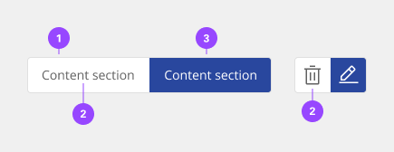
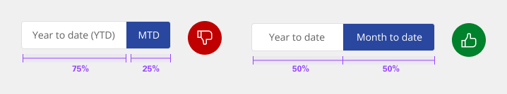
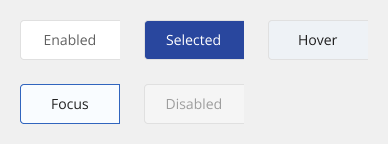
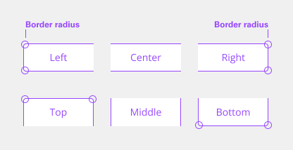
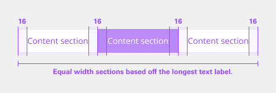
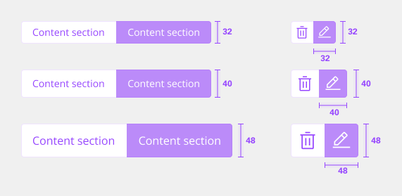
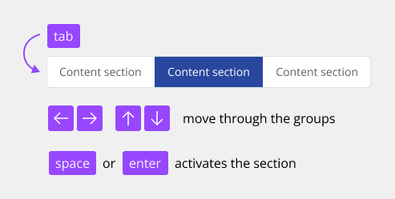

# Content Switcher

Content switchers allow users to toggle between alternate views of similar or related content. Only one content section is shown at a time.

## Usage

### When to use

Content switchers are frequently used to let users toggle between different formatting, like with a grid view and a table view. They are also often used to narrow content groups. For example, use a content switcher if you have a single category, such as “E-mail” and you want to divide it into views such as “All”, “Read”, and “Unread”.

### When not to use

- Use tabs when the content on the page is divided into related sections, but without any overlap. Tabs follow the metaphor for sections in a filing cabinet and two tabs wouldn't contain the same sheet of paper. So, the role of tabs in information hierarchy is to separate content.
- The content switcher is used for large groups of content, as opposed to the toggle which is meant for a "yes/no" or "on/off" binary decision.

### Anatomy

1. **Content tab** - Selectable container for each content view.
2. **Selected content tab** - Only one content tab can be selected at a time and there should always be one selected.
3. **Text/Icon label** - Describes the content view.

### Height

There are three height sizes for the content switcher: small (32px), medium (40px), and large (48px). Choose a size that best fits the density of your layout or the prominence of the switcher.

### Width

The overall content switcher width varies based on the content and layout. Each individual content tab should be the same width. The content tab with the longest text label should have 16px spacing to the right of the label. The width of all other tabs should match the widest tab.

### Text label

- Be concise and specific and limit text labels to two to three words.
- Text labels should clearly communicate the view users will see and the content contained in the view.

### Default selection

Only one content section can be shown at a time. The first content tab in the switcher should be determined based on usage and should always be the default selection.

### States

The content switcher includes two content tab states: selected and unselected. The selected state uses a high contrast color.

### Universal Behaviors

#### Mouse

Users can activate and navigate between content switcher tabs by clicking a content tab.

#### Keyboard

Users can activate and navigate between content switcher tabs by pressing the left or right arrow.

#### Screen readers

- **VoiceOver** - Users can activate and navigate between content switcher tabs by pressing the left or right arrow.
- **Jaws** - Users can activate and navigate between content switcher tabs by pressing the left or right arrow.
- **NVDA** - Users can activate and navigate between content switcher tabs by pressing the left or right arrow.

## Style

Below is the token architecture color build of the components. The token can be changed or defined through the token mapping script that has been placed in the application repository.

| State                      | Element                    | Property                   | Token name                 |
| :------------------------- | :------------------------- | :------------------------- | :------------------------- |
| Enabled                    | Container                  | Background Color           | `$layer_1`                 |
|                            |                            | Border Color               | `$border_subtle_1`         |  
|                            | Label                      | Text Color                 | `$text_secondary`          |
|                            | Icon                       | SVG Color                  | `$icon_secondary`          |
| Hover                      | Container                  | Background Color           | `$layer_hover_1`           |
|                            |                            | Border Color               | `$border_subtle_1`         |  
|                            | Label                      | Text Color                 | `$text_primary`            |
|                            | Icon                       | SVG Color                  | `$icon_primary`            |
| Selected                   | Container                  | Background Color           | `$layer_selected_1`        |
|                            |                            | Border Color               |                            |  
|                            | Label                      | Text Color                 | `$text_on_color`           |
|                            | Icon                       | SVG Color                  | `$icon_on_color`           |
| Focus                      | Container                  | Background Color           | `$focus_highlight`         |
|                            |                            | Border Color               | `$focus`                   |  
|                            | Label                      | Text Color                 | `$text_primary`            |
|                            | Icon                       | SVG Color                  | `$icon_primary`            |
| Disabled                   | Container                  | Background Color           | `$layer_disabled_1`        |
|                            |                            | Border Color               | `$border_subtle_1`         |  
|                            | Label                      | Text Color                 | `$text_disabled`           |
|                            | Icon                       | SVG Color                  | `$icon_disabled`           |

### Typography

Content switcher label text should be set in sentence case, with only the first word in a phrase and any proper nouns capitalized. The label text should not exceed three words.

| Size                  | Font size | Font weight             | Token name                 |
| :-------------------- | :-------- | :---------------------- | :------------------------- | 
| Large                 | 16px      | 400 regular             | `$button_2_regular`        |
| Medium                | 14px      | 400 regular             | `$button_1_regular`        |
| Small                 | 14px      | 400 regular             | `$button_1_regular`        |

### Token Architecture

| Token name                        | Description                                            |
| :-------------------------------- | :----------------------------------------------------- |
| `$content_switcher_small`         | Defines height for the **small** variant.              |
| `$content_switcher_medium`        | Defines height for the **medium** variant.             |
| `$content_swithcer_large`         | Defines height for the **large** variant.              |
| `$content_switcher_padding`       | Defines **padding** for the component.                 |
| `$content_switcher_margin`        | Defines **margin** for the component.                  |
| `$content_switcher_border`        | Defines **border** weight for the accordion component. |
| `$content_swithcer_border_radius` | Defines **border radius** for the component.           |

### Structure

Content switchers must have at least two options for the user to choose from. Each container that makes up the content switcher is equal in size. The width of a container is determined by the length of the longest container option text plus the 16px/1rem on both sides of the text.

| Variant               | Property                | Size      | Token name                       |
| :-------------------- | :---------------------- | :-------- | :------------------------------- |
| Text only             | Padding Right x Left    | 16px      | `$content_switcher_padding`      |
|                       | Border                  | 1px       | `$content_switcher_border`       |
|                       | Border Radius           | 4px       | `$content_switcher_border_radius`|
| Icon only             | Padding Right x Left    |           |                                  |
|                       | Border                  | 1px       | `$content_switcher_border`       |
|                       | Border Radius           | 4px       | `$content_switcher_border_radius`|

### Sizing

| Variant                    | Element                   | Size                       | Token name                 |
| :------------------------- | :-------------------------| :------------------------- | :------------------------- |
| Small                      | Text                      | 32px                       | `$content_switcher_small`  |
|                            | Icon                      | 20px                       | `$icon_small`              |
| Medium                     | Text                      | 40px                       | `$content_switcher_medium` |
|                            | Icon                      | 24px                       | `$icon_medium`             |
| Large                      | Text                      | 48px                       | `content_switcher_large`   |
|                            | Icon                      | 28px                       | `$icon_large`              |

## Accessibility

Each content switcher tab must have a unique title that clearly describes the content panel. This is particularly helpful for users of assistive technologies, so they have the necessary information to efficiently navigate the content. The component should be used to create the content that displays within each content panel.

Content authors need to ensure the content that is added to the tab panel is accessible. For example, if you add an image to the panel you need to include alternative text to pass accessibility testing.

### Testing

Automated, manual and screen reader accessibility verification test has been performed on the content switcher component. WCAG 2.1 Level A and AA success criteria issues have been identified and the list of open accessibility violations is available in the design system's component GitHub repository.

| Environment                                 | Results (DAP) |
| :------------------------------------------ | :------------ |
| macOS Mojave version 10.14.6 with VoiceOver | Violations    |
| Chrome version 77.0.3865.90                 | Violations    | 

