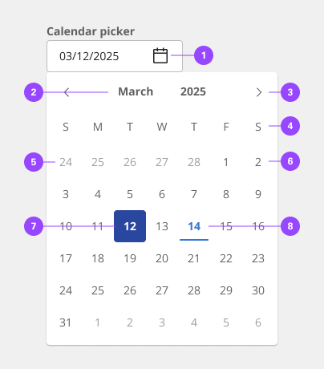
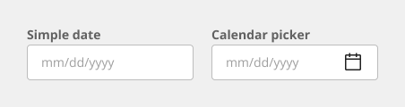
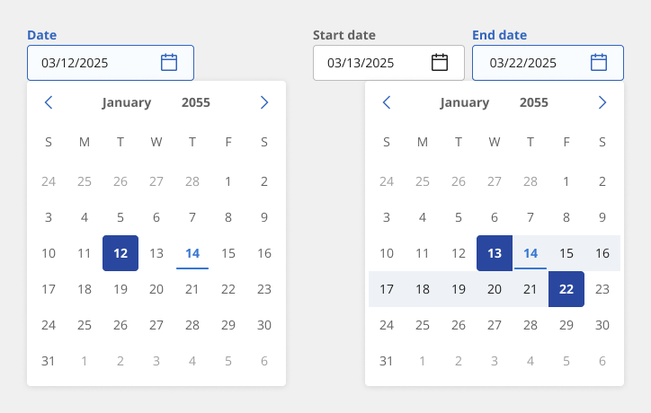
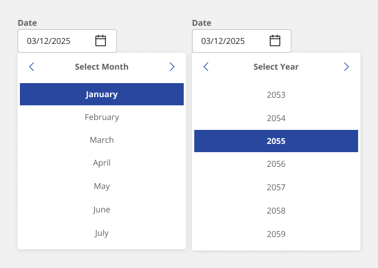
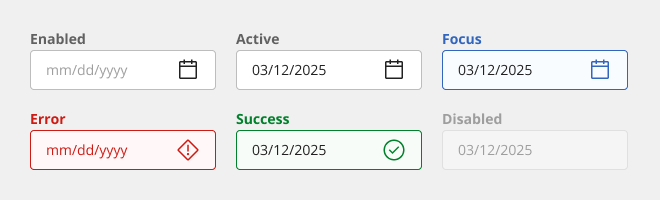
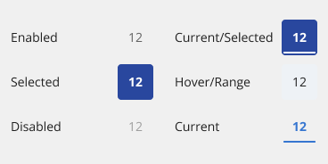
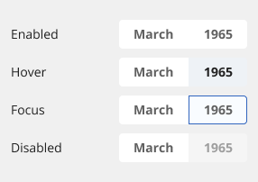
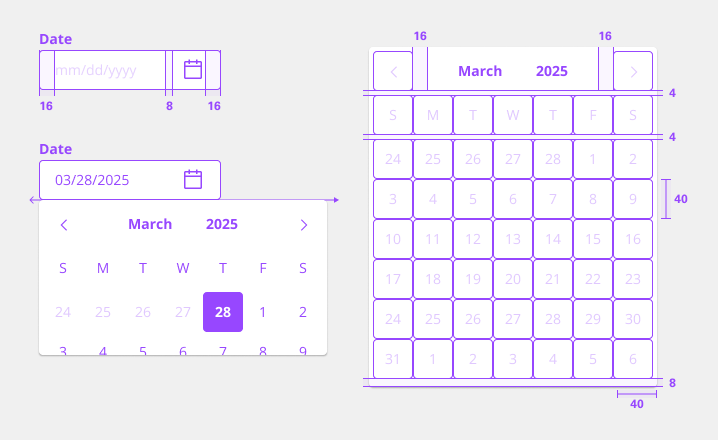

# Date Input

Date inputs are used to display past, present, or future dates or times. The kind of date (exact, approximate, memorable) you are requesting from the user will determine which picker is best to use. Each picker’s format can be customized depending on location or need.

## Usage

### When to use

When asking the user for an exact, approximate, or memorable date or time.
For scheduling tasks.

| Variant           | Purpose |
|:----------------- | :------ |
| Simple data input | Use this variant when placing the list in a persistent context like the main area in the user interface, such as on a card or in a sidebar. |
| Calendar picker   | Use this variant when the list is shown within a temporary context, for example within a popover or layer that is elevated by a drop shadow/border. |
| Date range picker | The date range picker functions much like the single date picker but instead of choosing just one date the user can choose a start and end date. For each date in the range, users have the option to manually enter the date in a text field or select the date in the calendar. Each point requires a day, month, and year to be selected. |

### Anatomy

1. Calendar icon indicates the calendar menu is available.
2. Month and Year (Content Switcher)
3. Controls to toggle between months.
4. Week titles
5. Previous/Future month dates
6. Days of the selected month and year
7. Selected day
8. Current day

### Alignment

By default, the pickers have fixed widths. If you are placing the picker in line with other inputs, such as in form, then the widths can be adjusted to match the other inputs. The picker can either increase or decrease in width as needed. If you adjust the size, be aware that pickers have minimum widths, and the date content should never horizontally scroll or overflow.

The calendar itself will always remain a fixed width and is not adjustable. It should always be aligned to the left edge of its assigned text field.

### Size

The input fields for date and time picker come in three height sizes: small (32px), medium (40px), and large (48px). Reference the Text Input component for additional information. The calendar menu in the date picker is a fixed height and width and does not change with the input size.

#### Label

- Both date and time pickers must be accompanied with labels.
- The labels should be clear and descriptive.
- Range inputs should be being properly labeled with a start and end label.

#### Date format

- The date format can be displayed differently depending on your location. For example, some countries use month/day/year while other use day/month/year.
- When using a simple date input include the date format in parentheses in line with the label or as helper text below the label.
- When using calendar picker, the date format will be automated if the user selects from the calendar menu.
- Only including the date format as placeholder text inside the field is problematic because it will disappear once the user begins typing.

### Validation

Invalid fields should be clearly marked. In pickers with more than one field, the invalid state should only be set on the individual factor that is triggering the error so the user can clearly understand which to address.

### Internationalization
Internationalization, also referred to as globalization, refers to software adapting to different languages, regional peculiarities, and technical requirements of a target locale without additional code changes. This means that if the location is known, then formatting of a date or time can automatically change to the acceptable local format. You should always try to design for internationalization.

### Simple date input/field
The simple date input provides the user with only a text field in which they can manually input a date. It allows dates to be entered without adding unnecessary interactions that come with the calendar menu or a dropdown.

The simple date input can include month/year or month/day/year. The formatting may be localized and rearranged in sequence of appearance.

#### When to use simple date input/field

- Use for memorable dates - Simple date inputs are typically used when the date is known by the user, such as a date of birth or credit card expiration.
- Use for approximate dates - Simple date inputs are best for when asking the user for an approximate date instead of an exact date, especially regarding past dates. For example, when was asking a user when a purchase was made, they will most likely easily recall the month and year (November 2019) versus the specific date (November 22, 2019).

### States

The simple date input is a text input and has the same interactive state and behaviors. See the style tab for more details.

### Calendar pickers

Calendar pickers default to showing today’s date when opened and only one month is shown at a time. Calendar pickers allow users to navigate through months and years, however they work best when used for recent or near future dates. If a user needs to input a far distant or future date, consider having the calendar default open to a more convenient day.

Keep in mind that some users may find calendar pickers difficult to use. There should always be a simple way to enter dates in a text field when using calendar pickers.

#### Use for scheduling

Use a calendar picker when the user needs to know a date’s relation to other days such as the day of the week it falls on or its proximity to today. They are optimal for scheduling tasks.

#### Calendar variants

- **Single date picker** - In a single date picker a user has the option to either manually input a date in the text field or select one specific date from the menu calendar. It requires a day, month, and year to be selected.
- **Date range picker** - The date range picker functions much like the single date picker but instead of choosing just one date the user can choose a start and end date. For each date in the range, users have the option to manually enter the date in a text field or select the date in the calendar. Each point requires a day, month, and year to be selected.

#### Opening the calendar

The calendar can be opened in two ways:

- Clicking the calendar icon on the far right of the field opens the calendar menu.
- When the text field receives focus the calendar menu also appears and remains open until a date is selected or the focus is removed from the picker.

#### Selecting a date

A date can be selected by:

- Manually entering a date in the text input field.
- Clicking on a date in the calendar menu.
- Navigating to a date by using the Arrow keys and then pressing Enter.

#### Next and previous month

A user can navigate between the months in a year by:

- Clicking on chevron icons at the top left and right of the calendar.
- Using the Arrow keys to move through the into the next or previous month.

#### Selecting a month or year

By default, the current date and year appears in the calendar. To navigate to another year the user can do one of the following:

- Manually typing the year in the date text field.
- Clicking/tapping the month name in the header will bring up the month menu.
- Clicking/tapping the year name in the header will bring up the year menu.
- Clicking the up and down arrows that appear when you focus or hover on the year input in the calendar.
- Selecting then typing into the year input.

#### Closing the calendar

The calendar can be closed in one of the following ways:

- Selecting a single date or the end date in a range. This will automatically close it.
- Clicking anywhere outside of the calendar menu.
- Removing focus from the picker.
- Pressing Esc

#### Selecting a range

There are several ways in which a range can be selected:

- Manually type the start and end dates in the text field.
- Once the calendar is open the first date you click becomes the start date and second date you click becomes the end date.
- Removing focus from the picker.
- Navigating to the start date by using the Arrow keys and pressing Enter. Then continue using the Arrow keys to navigate to a second date and press Enter again.

#### Minimum and maximum dates
To constrain the possible selectable dates in a calendar, a min and max date may be set. Once set, only the dates that fall within the min/max range will be selectable with the dates outside of the range being disabled.

Use min and max dates to help prevent user error. If a user cannot select dates in the past when scheduling, then set a min date to today.

## Style

Below is the token architecture color build of the components. The token can be changed or defined through the token mapping script that has been placed in the application repository.

### Color

**Date picker**
| State                      | Element                    | Property                   | Token name                 |
| :------------------------- | :------------------------- | :------------------------- | :------------------------- |
| Enabled                    | Container                  | Background Color           |                            |
|                            |                            | Border Color               |                            |  
|                            | Label                      | Text Color                 | `$text_secondary`          |
|                            | Icon                       | SVG Color                  | `$icon_secondary`          |
| Hover                      | Container                  | Background Color           | `$layer_hover_1`           |
|                            |                            | Border Color               |                            |  
|                            | Label                      | Text Color                 | `$text_primary`            |
|                            | Icon                       | SVG Color                  | `$icon_primary`            |
| Range                      | Container                  | Background Color           | `$layer_hover_1`           |
|                            |                            | Border Color               |                            |  
|                            | Label                      | Text Color                 | `$text_primary`            |
|                            | Icon                       | SVG Color                  | `$icon_primary`            |
| Active                     | Container                  | Background Color           |                            |
|                            |                            | Border Color               | `$border_interactive`      |  
|                            | Label                      | Text Color                 | `$link_primary`            |
|                            | Icon                       | SVG Color                  | `$link_primary`            |
| Selected                   | Container                  | Background Color           | `$layer_selected_1`        |
|                            |                            | Border Color               |                            |  
|                            | Label                      | Text Color                 | `$text_on_color`           |
|                            | Icon                       | SVG Color                  | `$icon_on_color`           |
| Focus                      | Container                  | Background Color           | `$focus_highlight`         |
|                            |                            | Border Color               | `$focus`                   |  
|                            | Label                      | Text Color                 | `$text_primary`            |
|                            | Icon                       | SVG Color                  | `$icon_primary`            |
| Disabled                   | Container                  | Background Color           |                            |
|                            |                            | Border Color               |                            |  
|                            | Label                      | Text Color                 | `$text_disabled`           |
|                            | Icon                       | SVG Color                  | `$icon_disabled`           |

**Calendar header**
| State                      | Element                    | Property                   | Token name                 |
| :------------------------- | :------------------------- | :------------------------- | :------------------------- |
| Enabled                    | Container                  | Background Color           |                            |
|                            |                            | Border Color               |                            |  
|                            | Label                      | Text Color                 | `$text_secondary`          |
|                            | Icon                       | SVG Color                  | `$icon_secondary`          |
| Hover                      | Container                  | Background Color           | `$layer_hover_1`           |
|                            |                            | Border Color               |                            |  
|                            | Label                      | Text Color                 | `$text_primary`            |
|                            | Icon                       | SVG Color                  | `$icon_primary`            |
| Range                      | Container                  | Background Color           | `$layer_hover_1`           |
|                            |                            | Border Color               |                            |  
|                            | Label                      | Text Color                 | `$text_primary`            |
|                            | Icon                       | SVG Color                  | `$icon_primary`            |
| Focus                      | Container                  | Background Color           | `$focus_highlight`         |
|                            |                            | Border Color               | `$focus`                   |  
|                            | Label                      | Text Color                 | `$text_primary`            |
|                            | Icon                       | SVG Color                  | `$icon_primary`            |
| Disabled                   | Container                  | Background Color           | `$layer_disabled_1`        |
|                            |                            | Border Color               |                            |  
|                            | Label                      | Text Color                 | `$text_disabled`           |
|                            | Icon                       | SVG Color                  | `$icon_disabled`           |

### Typography

Labels should be set in sentence case, with only the first word in a phrase and any proper nouns capitalized, and no more than three words.

| State      | Element      | Font size | Font weight | Token name                 |
| ---------- | ------------ | --------- | ----------- | -------------------------- | 
| Small      | Label        | 14px      | 400 regular | `$body_standard_1_regular` |
|            | Month + Year | 14px      | 700 bold    | `$body_standard_1_bold`    |
| Medium     | Label        | 14px      | 400 regular | `$body_standard_1_regular` |
|            | Month + Year | 14px      | 700 bold    | `$body_standard_1_bold`    |
| Large      | Label        | 16px      | 400 regular | `$body_standard_2_regular` |
|            | Month + Year | 16px      | 700 bold    | `$body_standard_2_bold`    |

### Token Architecture

| Token name                  | Description                                            |
| :-------------------------- | :----------------------------------------------------- |
| `$date_input_small`         | Defines height for the **small** variant.              |
| `$date_input_medium`        | Defines height for the **medium** variant.             |
| `$date_input_large`         | Defines height for the **large** variant.              |
| `$date_input_padding`       | Defines **padding** for the component.                 |
| `$date_input_margin`        | Defines **margin** for the component.                  |
| `$date_input_border`        | Defines **border** weight for the accordion component. |
| `$date_input_border_radius` | Defines **border radius** for the component.           |

### Structure

The widths of the date inputs may vary based on the grid and layout.

| Element               | Property                | Size      | Token name                  |
| :-------------------- | :---------------------- | :-------- | :-------------------------- |
| Date Picker           | Padding Right x Left    | 4px       | `$spacing_4`                |
|                       | Border Radius           | 4px       | `$date_input_border_radius` |
|                       | Box Shadow              |           | `$shadow_1`                 |
| Button Right          | Margin Left             | 8px       | `$date_input_margin`        |
| Button Left           | Margin Right            | 8px       | `$date_input_margin`        |
| Radio Button          | Margin Right            | 8px       | `$contained_list_margin`    |
| Date                  | Padding Right x Left    |           |                             |
|                       | Border Bottom           | 2px       | `$border_2`                 |

### Sizing

| Size    | Element               | Property       | Size      | Token name                  |
| :------ | :-------------------- | :------------- | :-------- | :-------------------------- |
| Small   | Calendar Header       | Height         | 38px      | `$content_switcher_small`   |
|         | Toggle Buttons        | Height         | 38px      | `$button_small`             |
|         | Date                  | Height         | 38px      | `$date_input_small`         |
|         | Input                 | Height x Width | 38px      | `$text_input_small`         |
| Medium  | Calendar Header       | Height         | 40px      | `$content_switcher_medium`  |
|         | Toggle Buttons        | Height         | 40px      | `$button_medium`            |
|         | Date                  | Height         | 40px      | `$date_input_medium`        |
|         | Input                 | Height x Width | 40px      | `$text_input_medium`        |
| Large   | Calendar Header       | Height         | 48px      | `$content_switcher_large`   |
|         | Toggle Buttons        | Height         | 48px      | `$button_large`             |
|         | Date                  | Height         | 48px      | `$date_input_large`         |
|         | Input                 | Height x Width | 48px      | `$text_input_large`         |

## Accessibility

The component bakes keyboard operation into its components, improving the experience of blind users and others who operate via the keyboard. It incorporates many other accessibility considerations, some of which are described below.

The date picker labels should clearly describe the dates that the user needs to input, such as arrival date or departure date when making travel arrangements.

### Testing

Automated, manual and screen reader accessibility verification test has been performed on the component. WCAG 2.1 Level A and AA success criteria issues have been identified and the list of open accessibility violations is available in the design system's component GitHub repository.

| Environment                                     | Results (DAP) |
| :---------------------------------------------- | :------------ |
| macOS Mojave version 10.14.6 with VoiceOver     | No violations |
| Chrome version 77.0.3865.90                     | No violations | 
| Dynamic Assessment Plugin (DAP) version 1.8.0.0 | No violations |
