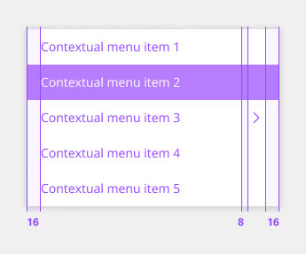

# Dropdown

Dropdowns present a list of options from which a user can select one option, or several. A selected option can represent a value in a form, or can be used as an action to filter or sort existing content. There are three different variants of dropdowns that support various kinds of functionality - dropdown, multiselect, and combo box.

## Usage

### When to use

Dropdowns can be used in forms on full pages, in modals, or on side panels. The dropdown component is used to filter or sort contents on a page. It is a stylized version of the select component and can be styled as needed.

### When not to use

- It is best practice not to use a dropdown if there are two options to choose from. In this case, use a radio button group instead.
- Do not nest dropdowns or use them to display overly complex information. Keep option selections as straight forward as possible.
- Consider using a select dropdown if most of your experience is form-based or frequently used on mobile platforms. The native select works more easily with a native form when submitting data and is also easier to use on a mobile platform.

### Variants

| Variant           | Purpose |
|:----------------- | :------ |
| Dropdown    | Allows the user to select one option from a list. |
| Multiselect | Allows the user to select multiple options from a list and filter. |
| Stacked     | Provides information stacked for more advanced applications. |
| Combo Box   | Allows the user to select from a list of suggested, likely, or desired values. 

### Dropdown

Use when you can select only one option from a list at a time.

- By default, the dropdown displays placeholder text in the field when closed.
- Clicking on a closed field opens a menu of options.
- Selecting an option from the menu closes it and the selected option text replaces the placeholder text in the field and remains as an option in place if the menu is open.

#### Anatomy

Dropdowns are composed of four distinct sections—assistive text like labels or helper text, a field, a menu, and options contained within the menu. Labels and helper text can guide the user to make an informed decision when selecting.

1. Label
2. Selected value
3. Icon
4. Helper text (optional)
5. Menu Option
6. Menu Selection

### Multiselect

Use when you can select multiple options from a list or to filter information.

#### Making a selection

- By default, the dropdown displays placeholder text in the field when closed.
- Clicking a closed field opens a menu of options. Each option contains a checkbox input to the left of the option text.
- The menu stays open while options are being selected. The menu closes by clicking the field or outside of the dropdown.
- Once options have been selected from the menu, a tag appears to the left of the text in the field containing the total number of selected options. The placeholder text can change to text that better reflects what is selected.
- Selected options shift to the top of the menu in alphanumeric order.
- Unlike dropdown and combo box, the menu does not close once the user makes selections. Because multiple selections are possible, the user needs to click outside of the dropdown or on the parent element to close the menu.
- Once options have been selected from the menu, a tag appears to the left of the text in the field containing the total number of selected options. The placeholder text can change to text that better reflects what is selected.
- Selected options shift to the top of the menu in alphanumeric order.
- Unlike dropdown and combo box, the menu does not close once the user makes selections. Because multiple selections are possible, the user needs to click outside of the dropdown or on the parent element to close the menu.

#### Clear all

To clear all selected options from a list, hover over the filterable tag and click the “x” (or close) icon next to the value. To help with clarity, a browser tooltip appears when the user hovers over the “x” icon to indicate the click action results. If you want to unselect individual options, you can do so by unselecting the checkbox of each option.

#### Filtering

Use filtering to narrow down a long list of options to find the option you want to select.

- By default, the filterable multiselect dropdown displays placeholder text in the field when closed.
- When hovering over the field, a text cursor appears.
- The menu opens by clicking anywhere in the field and you can start typing to filter the list of options. The options that start to match your entry remain in the list while other existing options are temporarily removed.
- After typing text in the field, the close (x) icon appears to the right of the text in the field. This clears any text that’s been entered in the field.
- Once options have been selected from the menu, a tag appears to the left of the text in the field containing the total number of selected options. The placeholder text can change to text that better reflects what is selected.
- Selected options shift to the top of the menu in alphanumeric order.
- Like the default multiselect dropdown, the menu does not close once the user makes selections.

#### Anatomy
Dropdowns are composed of four distinct sections—assistive text like labels or helper text, a field, a menu, and options contained within the menu. Labels and helper text can guide the user to make an informed decision when making a selection.

1. **Labels** - Text that informs the user what to expect in the list of dropdown options.
2. **Placeholder text** - Static text to support the tag.
3. **Icon** - Persists when the dropdown is open or closed.
4. **Helper text** - Provide additional instructions for the user.
5. **Tag** - Indicates the number of selections.
6. **Unselected menu item** - Provides visual indication to the user that this has not be selected.
7. **Selected menu item** - Provides visual indication to the user that this have been selected.

### Stacked

The stacked dropdown is like the Contained list component. It offers the use of various content layouts within the component to provide additional information with the interaction/experience.

#### Anatomy

1. **Label** - Text that informs the user what to expect in the list of dropdown options.
2. **Icon** - Persists when the dropdown is open or closed.
3. **Text 2** - Optional content area.
4. **Text 3** - Optional content area.
5. **Title** - Primary content area.
6. **Text 1** - Description/Content area.
7. **Helper text** - Provide additional instructions for the user.
8. **Unselected menu item** - Provides visual indication to the user that this has not be selected.
9. **Selected menu item** - Provides visual indication to the user that this have been selected.

### Combo box

Allows the user to make a selection from a predefined list of options and is typically used when there are many options to choose from.

- By default, the combo box displays placeholder text in the field when closed.
- When hovering over the field, a text cursor appears.
- The menu opens by clicking anywhere in the field and you can start typing to sort through the list of options. The option that best matches the typed characters is highlighted.
- After typing text in the field, the close (x) icon appears to the right of the text in the field. This clears any text that’s been entered in the field.
- Selecting an option closes the menu and the selected option replaces the placeholder text.

### Height

There are three dropdown height sizes: small, medium, and large. Use a consistent dropdown height when it is being used alongside other form components on the same page. Supporting three different dropdown sizes gives you more flexibility when structuring layouts. When in doubt, use the default medium size height.

When the menu is open, each option in the menu should be the same height as the field. Use a consistent size of form components on the same page. For example, if you are using a medium size dropdown, also use the same size text inputs, buttons, etc.

| Size   | Height | Purpose |
|:------ | :----- | :------ |
| Small  | 32px   | Use when space is constricted or when placing a dropdown in a form that is long and complex. |
| Medium | 40px   | This is our default size and should be used whenever possible. |
| Large  | 48px   | Choose this size when there is a lot of space to work with. This size is typically used in simple forms or when a dropdown is placed by itself on a page, for example as a filter. |

### Width

There is no minimum or maximum width for a dropdown. The width can be customized appropriately for its content.

### Placement

Field containers should vertically align to the grid and with other form components on a page.

### Contextual Menu

For most scenarios the menu should be positioned connected and at the bottom of the dropdown input. If using native mobile operating systems, this principle can change. Mobile the menu component can be shown at the bottom of the device, or treated like an overlay modal.

### Content

#### Labels

- Labels inform users what to expect in the list of dropdown options.
- Keep the label short and concise by limiting it to a single line of text.

#### Helper text

- Helper text is pertinent information that assists the user in choosing the right selection from the dropdown menu.
- Helper text is always available when the dropdown field is focused and appears underneath the label.
- Use sentence-style capitalization and write the text as full sentences with punctuation, unless space is limited.

#### Field placeholder text

- Placeholder text is presented in the field by default if no selection has been made from the dropdown. This is important to have in case the dropdown does not have a label above it.
- Use clear placeholder text for the dropdown trigger so that users understand the purpose.

#### Options in a menu

- Describe the dropdown option succinctly in one line of text.
- Never use decorative images or icons within a dropdown.
- We recommend presenting the options in alphabetical order.

### Optional versus required fields

All fields in a form are assumed required, and optional fields are tagged.

### Direction

A dropdown can open or down depending on its position on the screen. For example, if the dropdown appears at the bottom and close to the edge of the interface, the menu expands upward to avoid being cropped. By default, our dropdowns open downward.

### Elevation

The component has one layer style called a box-shadow. The box-shadow is placed behind the dropdown menu when open. Box-shadow is also used in other components that have overlayed menus, such as the overflow menu and date picker calendar. The SCSS for `box-shadow is 0 2px 6px 0 rgba (0,0,0,.2)`.

### Universal behaviors

#### Scrolling

Scroll bars may not always be enabled so we recommend showing 50% of the last option’s container height to indicate there is more to see within the menu. We recommend starting a scroll at the sixth option in the menu list, but this may vary based on your specific use case.

#### Mouse

Users trigger a dropdown menu to open by clicking the chevron icon or clicking anywhere within the field. Users can close the menu by clicking the chevron icon or clicking outside of the menu. 

- To select an option the user can click anywhere inside an option container.
- To clear all selected options from a list in a multiselect dropdown, click the “x” icon next to the value inside the tag. 
- To clear a selected value in a combo box or a filterable dropdown, click the “x” icon to the right of the field input text.

#### Keyboard

- **Dropdown** - The dropdown field is the element that receives focus. All keyboard interactions happen from this element. Users can move the highlighted option to the next option by pressing the Down arrow. Users can move the highlighted option to the previous option by pressing the Up arrow. Users can open the dropdown menu by pressing Space, Enter, Down arrow or the Up arrow. Users can close the dropdown menu by pressing Escape, Space, or Enter.
- **Combo box** - When typing a character, focus stays on the field while an option in the menu is highlighted that best matches the typed character. When typing multiple characters in rapid succession, focus stays on the field while an option in the menu is highlighted that best matches the string of characters typed.
- **Multiselect** - The multiselect field receives focus if none of the options are selected in the menu. Once an option in the dropdown menu receives focus, users can press Enter to select or deselect the option. Users can open and close a dropdown menu by pressing Space.
- **Screen readers** - Labels must be announced to the screen reader on focus. Ensure the helper text that appears under an input is read when an assistive technology user stops at an input using ARIA.

	- **VoiceOver** - Users can trigger a state change by pressing Control-Option-Space or Space while the dropdown field has screen reader focus.
	- **JAWS** - Users can trigger a state change by pressing Space while the dropdown field has screen reader focus.
	- **NVDA** - Users can trigger a state change by pressing Space while the dropdown field has screen reader focus.

### Modifiers

#### Inline

When placing a dropdown in line with other content use the inline modifier. If adding a visual label to an inline dropdown it should appear inline to the left of the dropdown. If there is no visual label present, you must supply an appropriate accessibility label to the inline dropdown. Note: Inline is only a modifier for dropdown and does not have filtering functionality.

#### Invalid

Real time validation helps to streamline the process of filling out a form. We have three indicators of an invalid state: a border, an icon indicator, and an error message. Having text, color, and weight differentiation as invalid indicators help meet accessibility requirements.

#### Disabled

A dropdown cannot be clicked, selected, or interacted with if it is disabled. It is not read by a screen reader and takes on the default disabled visual style. Tooltips on a disabled state are also not read by screen readers and we recommend having an alternative way to show descriptive text if needed.

### Dropdown versus select

Dropdown and select components have functionality and style differences.

- The underlying code of a dropdown component is styled to match the component framework, while the select component’s appearance is determined by the browser being used.
- Use a dropdown component in forms, to select multiple options at a time and to filter or sort content on a page. The select dropdown does not have filtering or multiselect functionality.
- Use a select dropdown component if most of your experience is form based. Custom dropdowns can be used in these situations, but the native select works more easily with a native form when submitting data.
- Use a select dropdown component if your experience will be frequently used on mobile. The native select dropdown uses the native control for the platform which makes it easier to use.

### Dropdown versus combo box

While the dropdown and combo box look similar, they have different functions. With a dropdown list, the selected option is always visible, and the other options are visible by clicking and opening the list. A combo box is a combination of a standard list box or a dropdown list that lets users type inside the input field to find an option that matches their inputted value.

### AI Presence

Dropdown and its variants have a modification that takes on the AI visual styling when the AI slug is present in the input. The AI variant of these components function the same as the normal version except with the addition of the AI slug which is both a visual indicator and the trigger for the explainability popover.

#### Revert to AI

A dropdown can toggle between the AI variant and the non-AI variant depending on the user’s interaction. If the user manually overrides the AI-suggested content, then the input will change from the AI variant to the non-AI variant. Once edited, the user should still be able to switch back to the initially AI generated content via a revert to AI button.

## Style

Below is the token architecture color build of the components. The token can be changed or defined through the token mapping script that has been placed in the application repository.

### Color

**Dropdown**
| State                      | Element                    | Property                   | Token name                 |
| :------------------------- | :------------------------- | :------------------------- | :------------------------- |
| Enabled                    | Container                  | Background Color           | `$field_1`                 |
|                            |                            | Border Color               | `$border_strong_1`         |  
|                            | Label                      | Text Color                 | `$text_secondary`          |
|                            | Value                      | Text Color                 | `$text_primary`            |
|                            | Placeholder                | Text Color                 | `$text_placeholder`        |
|                            | Help Text                  | Text Color                 | `$text_secondary`          |
|                            | Icon                       | SVG Color                  | `$icon_secondary`          |
| Focus                      | Container                  | Background Color           | `$focus_highlight`         |
|                            |                            | Border Color               | `$focus`                   |  
|                            | Label                      | Text Color                 | `$text_secondary`          |
|                            | Value                      | Text Color                 | `$text_primary`            |
|                            | Placeholder                | Text Color                 | `$text_placeholder`        |
|                            | Help Text                  | Text Color                 | `$text_secondary`          |
|                            | Icon                       | SVG Color                  | `$icon_secondary`          |
| Disabled                   | Container                  | Background Color           | `$field_disabled_1`        |
|                            |                            | Border Color               | `$border_disabled_1`       |  
|                            | Label                      | Text Color                 | `$text_disabled`           |
|                            | Value                      | Text Color                 | `$text_disabled`           |
|                            | Placeholder                | Text Color                 | `$text_placeholder`        |
|                            | Help Text                  | Text Color                 | `$text_disabled`           |
|                            | Icon                       | SVG Color                  | `$icon_disabled`           |
| Error                      | Container                  | Background Color           | `$support_bg_error`        |
|                            |                            | Border Color               | `$support_error`           |  
|                            | Label                      | Text Color                 | `$support_error`           |
|                            | Value                      | Text Color                 | `$support_error`           |
|                            | Placeholder                | Text Color                 | `$support_error`           |
|                            | Help Text                  | Text Color                 | `$support_error`           |
|                            | Icon                       | SVG Color                  | `$support_error`           |

**Contextual menu**
The contextual menu sub component uses the same color and specifications as contained lists.

| State                      | Element                    | Property                   | Token name                 |
| :------------------------- | :------------------------- | :------------------------- | :------------------------- |
| Enabled                    | Container                  | Background Color           | `$layer_1`                 |
|                            |                            | Border Color               | `$border_subtle_1`         |  
|                            | Label                      | Text Color                 | `$text_secondary`          |
|                            | Icon                       | SVG Color                  | `$icon_secondary`          |
| Hover                      | Container                  | Background Color           | `$layer_hover_1`           |
|                            |                            | Border Color               | `$border_subtle_1`         |  
|                            | Label                      | Text Color                 | `$text_primary`            |
|                            | Icon                       | SVG Color                  | `$icon_primary`            |
| Selected                   | Container                  | Background Color           | `$layer_selected_1`        |
|                            |                            | Border Color               |                            |  
|                            | Label                      | Text Color                 | `$text_on_color`           |
|                            | Icon                       | SVG Color                  | `$icon_on_color`           |
| Focus                      | Container                  | Background Color           | `$focus_highlight`         |
|                            |                            | Border Color               | `$focus`                   |  
|                            | Label                      | Text Color                 | `$text_primary`            |
|                            | Icon                       | SVG Color                  | `$icon_primary`            |
| Disabled                   | Container                  | Background Color           | `$layer_disabled_1`        |
|                            |                            | Border Color               | `$border_subtle_1`         |  
|                            | Label                      | Text Color                 | `$text_disabled`           |
|                            | Icon                       | SVG Color                  | `$icon_disabled`           |
| Danger                     | Container                  | Background Color           | `$support_error`           |
|                            |                            | Border Color               |                            |  
|                            | Label                      | Text Color                 | `$text_on_color`           |
|                            | Icon                       | SVG Color                  | `$icon_on_color`           |

### Typography

All dropdown text should be set in sentence case, with only the first word in a phrase and any proper nouns capitalized. Dropdown menu option text should not exceed three words.

| State      | Element         | Font size | Font weight | Token name                |
| ---------- | --------------- | --------- | ----------- | ------------------------- | 
| Small      | Label           | 14px      | 700 bold    | `$label_1_bold`           |
|            | Helper Text     | 12px      | 400 regular | `$helper_text_1_regular`  |
|            | Value           | 14px      | 400 regular | `$body_1_compact_regular` |
|            | Placeholder     | 14px      | 400 regular | `$body_1_compact_regular` |
|            | Contextual Menu | 14px      | 400 regular | `$body_1_compact_regular` |
| Medium     | Label           | 14px      | 700 bold    | `$label_1_bold`           |
|            | Helper Text     | 12px      | 400 regular | `$helper_text_1_regular`  |
|            | Value           | 14px      | 400 regular | `$body_1_compact_regular` |
|            | Placeholder     | 14px      | 400 regular | `$body_1_compact_regular` |
|            | Contextual Menu | 14px      | 400 regular | `$body_1_compact_regular` |
| Large      | Label           | 14px      | 700 bold    | `$label_1_bold`           |
|            | Helper Text     | 12px      | 400 regular | `$helper_text_1_regular`  |
|            | Value           | 16px      | 400 regular | `$body_2_compact_regular` |
|            | Placeholder     | 16px      | 400 regular | `$body_2_compact_regular` |
|            | Contextual Menu | 16px      | 400 regular | `$body_2_compact_regular` |

### Token Architecture

| Token name                | Description                                            |
| :------------------------ | :----------------------------------------------------- |
| `$dropdown_small`         | Defines height for the **small** variant.              |
| `$dropdown_medium`        | Defines height for the **medium** variant.             |
| `$dropdown_large`         | Defines height for the **large** variant.              |
| `$dropdown_padding`       | Defines **padding** for the component.                 |
| `$dropdown_margin`        | Defines **margin** for the component.                  |
| `$dropdown_border`        | Defines **border** weight for the accordion component. |
| `$dropdown_border_radius` | Defines **border radius** for the component.           |

### Structure

Dropdowns have two states, open and closed. An open and closed dropdown should be the same width and appropriately fit the design, layout, and content. The height of a closed dropdown stays consistent while the height of an open dropdown will vary based on the number of options it has. Please note the various color differences for closed and open dropdowns.

**Dropdown**
| Element               | Property                | Size      | Token name                  |
| :-------------------- | :---------------------- | :-------- | :-------------------------- |
| Input                 | Padding Right x Left    | 16px      | `$dropdown_padding`         |
|                       | Border                  | 1px       | `$dropdown_border`          |
|                       | Border Radius           | 4px       | `$dropdown_border_radius`   |
| Icon                  | Margin Left             | 8px       | `$dropdown_margin`          |
| Label                 | Margin Bottom           | 2px       | `$spacing_2`                |
| Helper Text           | Margin Top              | 2px       | `$spacing_2`                |

**Contextual Menu**
The contextual menu sub component uses the same color and specifications as contained lists.

| Element               | Property                | Size      | Token name                      |
| :-------------------- | :---------------------- | :-------- | :------------------------------ |
| Menu                  | Border Radius           | 4px       | `$contained_list_border_radius` |
|                       | Box Shadow              |           | `$shadow_1`                     |
| Menu Item             | Padding Right x Left    | 16px      | `$contained_list_border_radius` |
| Menu Item: Icon       | Margin Left             | 8px       | `$contained_list_margin`        |
| Menu Item: Checkbox   | Margin Right            | 8px       | `$contained_list_margin`        |

### Sizing

The field height and menu option height should always match. These sizes options can be applied to all variants of dropdown.

| Size    | Element               | Property       | Size      | Token name                |
| :------ | :-------------------- | :------------- | :-------- | :------------------------ |
| Small   | Input                 | Height         | 32px      | `$dropdown_small`         |
|         | Icon                  | Height x Width | 20px      | `$icon_small`             |
|         | Menu Item             | Height         | 32px      | `$contained_list_small`   |
| Medium  | Input                 | Height         | 40px      | `$dropdown_medium`        |
|         | Icon                  | Height x Width | 24px      | `$icon_medium`            |
|         | Menu Item             | Height         | 40px      | `$contained_list_medium`  |
| Large   | Input                 | Height         | 48px      | `$dropdown_large`         |
|         | Icon                  | Height x Width | 28px      | `$icon_large`             |
|         | Menu Item             | Height         | 48px      | `$contained_list_large`   |

## Accessibility

### Design considerations

- Avoid very long option names to facilitate understandability and perceivability.
- Do not use the same word or phrase at the beginning of a set of options.
- Avoid options that contain headings and interactive elements such as links, buttons, or checkboxes.

### Development considerations

- If the dropdown is a required field include the [aria-required property](https://www.w3.org/TR/WCAG20-TECHS/ARIA2.html) and indicate that it is a required field and use the validation message for input errors.

### Testing

Automated, manual and screen reader accessibility verification test has been performed on the dropdown component.

