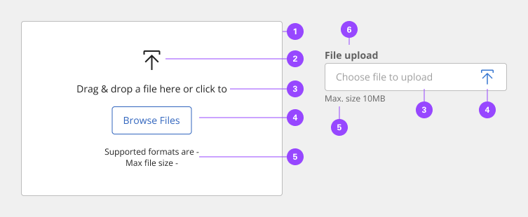
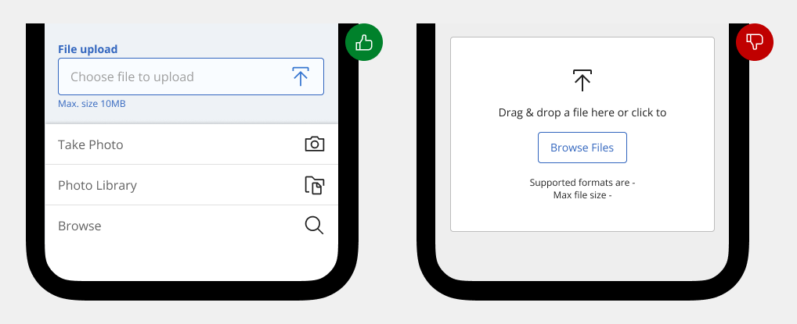
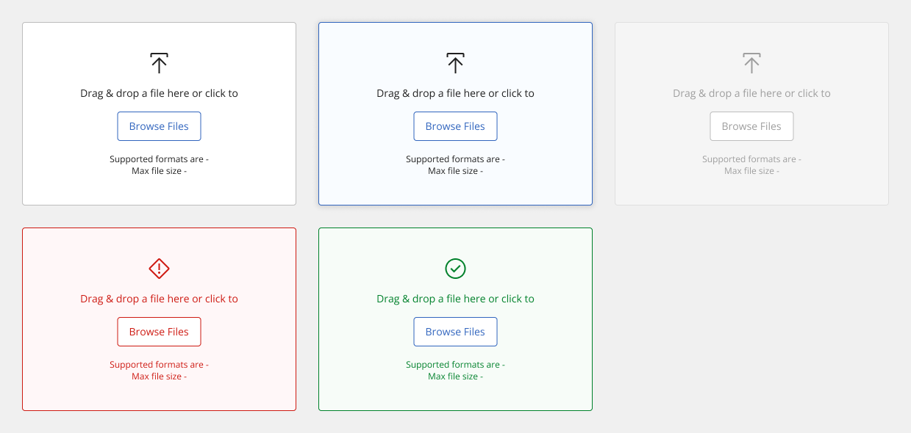
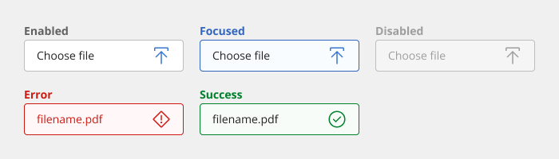
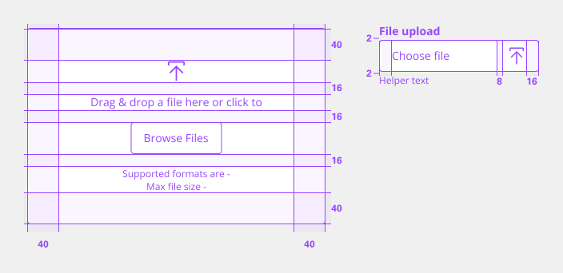

# File Input

File input enables users to attach files to their form submissions, such as photos, PDFs or other documents.  So, file field inherits all the attributes of text input.

## Usage

File input field allow users to upload content of their own. A file uploader is commonly found in forms but can also live as a standalone element. There are two variants of file up-loaders—our default file uploader and a drag and drop file uploader.

### When to use

- Uploading one or more files.
- Uploading files by dragging and dropping.
- Showing the process of uploading.

### Variants

| Variant       | Purpose |
|:------------- | :------ |
| File Input    | Upload one or more files by clicking an action button that prompts a file selection dialog. |
| Drag and drop | Drag and drop selected files directly into a drop zone area to upload. |

### Anatomy

1. **Field-set/Drop zone** - Section where files can be dragged and dropped to upload.
2. **Icon** - Provides indication of purpose of interaction.
3. **Instructions** - Instructions to the user on how to properly upload a file using the component/pattern.
4. **Action/Button** - Button to trigger native operating system file browser.
5. **Requirements** - Additional instructional content.
6. **Label** - Highlighting primary action to upload files.

### Mobile

While using this component on mobile, drag and drop won't be a preferred method. Consider on reducing the height as the preferred method would be click/tap to trigger the file browser.

## Style

Below is the token architecture color build of the components. The token can be changed or defined through the token mapping script that has been placed in the application repository.

### Color

**Drag and Drop**

| State                      | Element                    | Property                   | Token name                 |
| :------------------------- | :------------------------- | :------------------------- | :------------------------- |
| Enabled                    | Container                  | Background Color           | `$field_1`                 |
|                            |                            | Border Color               | `$border_strong_1`         |
|                            |                            | Box Shadow                 |                            |  
|                            | Title                      | Text Color                 | `$text_primary`            |
|                            | Content                    | Text Color                 | `$text_secondary`          |
|                            | Icon                       | SVG Color                  | `$icon_secondary`          |
| Hover                      | Container                  | Background Color           | `$focus_highlight`         |
|                            |                            | Border Color               | `$focus`                   |
|                            |                            | Box Shadow                 | `$shadow_2`                |  
|                            | Title                      | Text Color                 | `$text_primary`            |
|                            | Content                    | Text Color                 | `$text_secondary`          |
|                            | Icon                       | SVG Color                  | `$icon_secondary`          |
| Focus                      | Container                  | Background Color           | `$focus_highlight`         |
|                            |                            | Border Color               | `$focus`                   |
|                            |                            | Box Shadow                 | `$shadow_2`                |  
|                            | Title                      | Text Color                 | `$text_primary`            |
|                            | Content                    | Text Color                 | `$text_secondary`          |
|                            | Icon                       | SVG Color                  | `$icon_secondary`          |
| Disabled                   | Container                  | Background Color           | `$field_disabled_1`        |
|                            |                            | Border Color               | `$border_disabled_1`       |
|                            |                            | Box Shadow                 |                            |  
|                            | Title                      | Text Color                 | `$text_disabled`           |
|                            | Content                    | Text Color                 | `$text_disabled`           |
|                            | Icon                       | SVG Color                  | `$icon_disabled`           |
| Error                      | Container                  | Background Color           | `$support_bg_error`        |
|                            |                            | Border Color               | `$support_error`           |
|                            |                            | Box Shadow                 |                            |  
|                            | Title                      | Text Color                 | `$support_error`           |
|                            | Content                    | Text Color                 | `$support_error`           |
|                            | Icon                       | SVG Color                  | `$support_error`           |
| Success                    | Container                  | Background Color           | `$support_bg_success`      |
|                            |                            | Border Color               | `$support_success`         |
|                            |                            | Box Shadow                 |                            |  
|                            | Title                      | Text Color                 | `$support_success`         |
|                            | Content                    | Text Color                 | `$support_success`         |
|                            | Icon                       | SVG Color                  | `$support_success`         |

**File Upload**

| State                      | Element                    | Property                   | Token name                 |
| :------------------------- | :------------------------- | :------------------------- | :------------------------- |
| Enabled                    | Container                  | Background Color           | `$field_1`                 |
|                            |                            | Border Color               | `$border_strong_1`         |
|                            |                            | Box Shadow                 |                            |  
|                            | Label                      | Text Color                 | `$text_secondary`          |
|                            | Placeholder                | Text Color                 | `$text_placeholder`        |
|                            | Value                      | Text Color                 | `$text_primary`            |
|                            | Helper Text                | Text Color                 | `$text_secondary`          |
|                            | Icon                       | SVG Color                  | `$icon_secondary`          |
| Focus                      | Container                  | Background Color           | `$focus_highlight`         |
|                            |                            | Border Color               | `$focus`                   |
|                            |                            | Box Shadow                 | `$shadow_1`                |  
|                            | Label                      | Text Color                 | `$text_secondary`          |
|                            | Placeholder                | Text Color                 | `$text_placeholder`        |
|                            | Value                      | Text Color                 | `$text_primary`            |
|                            | Helper Text                | Text Color                 | `$text_secondary`          |
|                            | Icon                       | SVG Color                  | `$icon_secondary`          |
| Disabled                   | Container                  | Background Color           | `$field_disabled_1`        |
|                            |                            | Border Color               | `$border_disabled_1`       |
|                            |                            | Box Shadow                 |                            |  
|                            | Label                      | Text Color                 | `$text_disabled`           |
|                            | Placeholder                | Text Color                 | `$text_placeholder`        |
|                            | Value                      | Text Color                 | `$text_disabled`           |
|                            | Helper Text                | Text Color                 | `$text_disabled`           |
|                            | Icon                       | SVG Color                  | `$icon_disabled`           |
| Error                      | Container                  | Background Color           | `$support_bg_error`        |
|                            |                            | Border Color               | `$support_error`           |
|                            |                            | Box Shadow                 |                            |  
|                            | Label                      | Text Color                 | `$support_error`           |
|                            | Placeholder                | Text Color                 | `$support_error`           |
|                            | Value                      | Text Color                 | `$support_error`           |
|                            | Helper Text                | Text Color                 | `$support_error`           |
|                            | Icon                       | SVG Color                  | `$support_error`           |
| Success                    | Container                  | Background Color           | `$support_bg_success`      |
|                            |                            | Border Color               | `$support_success`         |
|                            |                            | Box Shadow                 |                            |  
|                            | Label                      | Text Color                 | `$support_success`         |
|                            | Placeholder                | Text Color                 | `$support_success`         |
|                            | Value                      | Text Color                 | `$support_success`         |
|                            | Helper Text                | Text Color                 | `$support_success`         |
|                            | Icon                       | SVG Color                  | `$support_success`         |

### Typography

**Drag and Drop**
| Element         | Font size | Font weight | Token name                 |
| --------------- | --------- | ----------- | -------------------------- | 
| Title           | 16px      | 700 bold    | `$h5_standard_bold`        |
| Content         | 14px      | 400 regular | `$body_1_standard_regular` |

**File Input**
| State      | Element         | Font size | Font weight | Token name                |
| ---------- | --------------- | --------- | ----------- | ------------------------- | 
| Small      | Label           | 14px      | 700 bold    | `$label_1_bold`           |
|            | Helper Text     | 12px      | 400 regular | `$helper_text_1_regular`  |
|            | Value           | 14px      | 400 regular | `$body_1_compact_regular` |
|            | Placeholder     | 14px      | 400 regular | `$body_1_compact_regular` |
|            | Contextual Menu | 14px      | 400 regular | `$body_1_compact_regular` |
| Medium     | Label           | 14px      | 700 bold    | `$label_1_bold`           |
|            | Helper Text     | 12px      | 400 regular | `$helper_text_1_regular`  |
|            | Value           | 14px      | 400 regular | `$body_1_compact_regular` |
|            | Placeholder     | 14px      | 400 regular | `$body_1_compact_regular` |
|            | Contextual Menu | 14px      | 400 regular | `$body_1_compact_regular` |
| Large      | Label           | 14px      | 700 bold    | `$label_1_bold`           |
|            | Helper Text     | 12px      | 400 regular | `$helper_text_1_regular`  |
|            | Value           | 16px      | 400 regular | `$body_2_compact_regular` |
|            | Placeholder     | 16px      | 400 regular | `$body_2_compact_regular` |
|            | Contextual Menu | 16px      | 400 regular | `$body_2_compact_regular` |

### Token Architecture

| Token name                  | Description                                            |
| :-------------------------- | :----------------------------------------------------- |
| `$file_input_small`         | Defines height for the **small** variant.              |
| `$file_input_medium`        | Defines height for the **medium** variant.             |
| `$file_input_large`         | Defines height for the **large** variant.              |
| `$file_input_padding`       | Defines **padding** for the component.                 |
| `$file_input_margin`        | Defines **margin** for the component.                  |
| `$file_input_border`        | Defines **border** weight for the accordion component. |
| `$file_input_border_radius` | Defines **border radius** for the component.           |

### Structure

The width of a file uploaded varies based on the content and layout of a design.

**Drag and Drop**
| Element               | Property                | Size      | Token name                  |
| :-------------------- | :---------------------- | :-------- | :-------------------------- |
| Container             | Padding Right x Left    | 40px      | `$spacing_40`               |
|                       | Border                  | 1px       | `$file_input_border`        |
|                       | Border Radius           | 4px       | `$file_input_border_radius` |
| Icon                  | Height x Width          | 8px       | `$icon_large`               |
|                       | Margin Down             | 8px       | `$file_input_margin`        |
| Title                 | Margin Down             | 8px       | `$file_input_margin`        |
| Content               | Margin Up               | 8px       | `$file_input_margin`        |
| Button                | Height                  | 40px      | `$button_medium`            |

**File Input**
| Element               | Property                | Size      | Token name                  |
| :-------------------- | :---------------------- | :-------- | :-------------------------- |
| Input                 | Padding Right x Left    | 16px      | `$file_input_padding`       |
|                       | Border                  | 1px       | `$file_input_border`        |
|                       | Border Radius           | 4px       | `$file_input_border_radius` |
| Icon                  | Margin Left             | 8px       | `$file_input_margin`        |
| Label                 | Margin Bottom           | 2px       | `$spacing_2`                |
| Helper Text           | Margin Top              | 2px       | `$spacing_2`                |

### Sizing

| Size    | Element               | Property       | Size      | Token name                  |
| :------ | :-------------------- | :------------- | :-------- | :-------------------------- |
| Small   | Input                 | Height         | 32px      | `$file_input_small`         |
|         | Icon                  | Height x Width | 32px      | `$icon_small`               |
| Medium  | Input                 | Height         | 40px      | `$file_input_medium`        |
|         | Icon                  | Height x Width | 24px      | `$icon_medium`              |
| Large   | Input                 | Height         | 48px      | `$file_input_large`         |
|         | Icon                  | Height x Width | 48px      | `$icon_large`               |

## Accessibility

The component bakes keyboard operation into its components, improving the experience of blind users and others who operate via the keyboard. The system incorporates many other accessibility considerations, some of which are described below.

## Keyboard

Both variants of the file uploader provide buttons for uploading and removing files. The drop target “Drag and drop files here…” also provides conventional button keyboard interaction (Tab to reach; Enter or Space to activate). Once a file has been added, it can be removed by activating the delete (“x”) button after each file name.

- The drop zone is also a button that responds to standard keyboard interaction.
- Uploaded files can be removed by tabbing to each “x” button and activating.

## Development considerations

Keep these considerations in mind if you are modifying the component or creating a custom component:

- The ‘Drag files’ area is constructed as a button to support keyboard operation.
- Error messages about file uploads must be exposed to assistive technology.
- The Delete button needs to have the uploaded file name associated with it programmatically, so the user understands which file will be removed.

