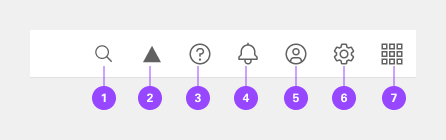
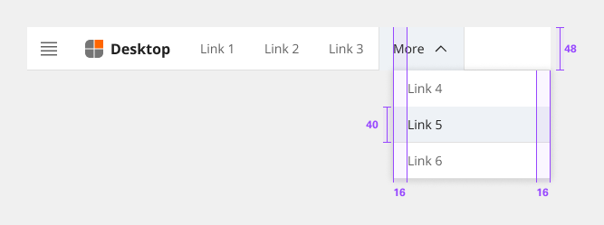

# Header

The header is the foundation for navigating and orienting your user to the user interface. The user interface header shell can be used by itself or combined with the left and right panels for more complex navigation.

## Usage

### When to use

- Identify the UI by name.
- Globally persistent location for navigational links and utilities.

| Variant                        | Purpose |
|:------------------------------ | :------ |
| Header base                    | Has a persistent site title that can be used to identify a single page UI (user interface). |
| Header with navigation         | Includes links and dropdowns for a simple navigation. |
| Header with actions            | Actions or utilities appear in the header as icon buttons to give users quick access to common utilities. |
| Header with side navigation    | The header can be paired with the UI shell left panel to offer a deeper level of navigation in a user interface. |

### Anatomy

The header spans the full width of the viewport and is the topmost element in the browser window. The header is persistent throughout the product experience.

For each UI shell component, left-to-right translates to product-to-global. The left side of the header contains items relevant at the product level. Moving to the right along the header, the functions become more global. Elements in the middle of the header should represent system-level controls. Elements on the right side of the header, such as the switcher, are the most global in their scope and span multiple products.

1. **Menu** - The hamburger icon is used to open product navigation such as the left panel. The hamburger menu is only needed when there is a collapsible left navigation.
2. **Branded logo** - Logo/graphic branding. 
3. **Branded name** - For Financial Institutions branding.
4. **Link** - Links in the header are supported as product navigation, if required. These links move to the side menu in narrow screen widths.
5. **Link selected** - Indicated what area the user is one with the application.
6. **Link sub-menu** - Sub-menus are supported as product navigation, if required. Include the down-pointing chevron after the link label. Sub-menus open on click and are closed by either selecting an item in the menu, clicking outside the menu area, or clicking on the menu label. When open, the chevron should point up. Sub-menu labels serve only to open the dropdown; they cannot link to another page in the product.
7. **Utilities** - These utilities are reserved for universal, system-level functions such as profile, search, notifications, and similar functions. Not every product on a system is required to show the same utilities, but it is recommended for a better cross-product user experience.

### Search

The header will have a global search that focuses on not just the page but the complete application. Please reference the global search pattern. When the user clicks the search icon, it should use majority of the header to provide the best experience for the user. In the example below we have deprioritized the primary links of the application - keeping the navbar, branding and utility actions.

When the user clicks the close icon for the search, the header will transition back to the original layout.
 
- **Option 1** - 60% of the header; Primary links deprioritized.
- **Option 2** - 100% of the header; All elements deprioritized.

### Placement

Icons are not a required element of the header, and a product may choose to use any set of icons for their UI. Icons should always be aligned to the right of the header with no gaps between icons. Header utilities are right aligned with no gaps. Below are standard utilities items that are used in the header. These options are recognized and standardized in product design by users.

Below are standard utilities items that are used in the header. These options are recognized and standardized in product design by users.

|     | Icon     | Placement |
|:--- | :------- | :-------- |
| 1   | Search   | Search should always be positioned as the furthest left icon. This is to allow for an expanding search field that does not disrupt other icon positions. |
| 2   | Other    | The number of header icons a product uses may vary. This placement will help avoid disrupting the position of the core icons and inconsistencies as your user navigates between other product shell headers. |
| 3   | Help     | Help is positioned 5th from the right. |
| 4   | Alerts   | Notifications should be 4th from the right when paired with the account and switcher icon. |
| 5   | Account  | The account should be the 3rd from the right. This global link gives a user quick access to their account from anywhere in the product UI. |
| 6   | Settings | Settings is position 2nd from the right next to account. |
| 7   | Switcher | The switcher should always be positioned as the furthest right icon. This ensures the icon does not shift when navigating across systems. |

### Content

The header name should be the name of the parent domain and be as brief as possible while giving the user a sense of place. Header links should be unique and clearly describe the content and location that it will link to. Avoid using verbs as header links which could imply that an action will be taken when clicking a header link.

### Universal behaviors

#### Mouse

The header element target areas span the full height of the header. See the Style tab for detailed visual information about the various states.

#### Keyboard

Some users may use a keyboard to navigate your site. Starting focus in the main navigation lets them quickly navigate to other areas in your UI but could block them from the main content if there are many navigation items to tab through first.

Success Criterion 2.4.1 (Bypass Blocks) suggest bypassing these blocks by providing a “Skip to main” link at the start of the navigation’s focusable controls. This lets users easily skip the navigation region and begin interacting with the page’s main content area.

- **Voice Over** - Users can trigger a state change by pressing Control-Option-Space or Space while the header area has screen reader focus.
- **JAWS** - Users can trigger a state change by pressing Enter or Space while the header area has screen reader focus.
- **NVDA** - Users can trigger a state change by pressing Enter or Space while the header area has screen reader focus.

### Responsive behavior

As a header scales down to fit smaller screen sizes, header links and menus should collapse into a left-panel hamburger menu. See the examples below to better understand the header’s responsive behavior.

If your UI includes a left panel, the header links should be added above the left panel items, pushing them down accordingly.

#### Navigation reduction

As the user interface scales downward the various parts of the header should be responsive. Primary navigation will bucket into a More dropdown to provide additional space and reduce overlap. Utility actions will be bucket into a navbar experience. At the mobile state of the user interface all navigation items will be bucket into the supportive navbar.

### References

- Susan Farrell, [Utility Navigation: What It Is and How to Design It](https://www.nngroup.com/articles/utility-navigation/) (Nielsen Norman Group, 2015)
- WebAIM, [“Skip Navigation” Links](https://webaim.org/techniques/skipnav/) (2013)
- [Web Content Accessibility Guidelines](https://www.w3.org/WAI/standards-guidelines/wcag/) (W3C, 2018)

## Style

Below is the token architecture color build of the components. The token can be changed or defined through the token mapping script that has been placed in the application repository.

### Color

**Header**
| State                      | Element                    | Property                   | Token name                 |
| :------------------------- | :------------------------- | :------------------------- | :------------------------- |
| Enabled                    | Container                  | Background Color           | `$layer_1`                 |
|                            |                            | Border Color               |                            |
|                            |                            | Box Shadow                 |                            | 

**Branding**
| State                      | Element                    | Property                   | Token name                 |
| :------------------------- | :------------------------- | :------------------------- | :------------------------- |
| Enabled                    | Container                  | Background Color           |                            |
|                            |                            | Border Color               | `$border_subtle_1`         |
|                            |                            | Box Shadow                 |                            |
|                            | Text                       | Text Color                 | `$text_primary`            |  

**Links**
| State                      | Element                    | Property                   | Token name                 |
| :------------------------- | :------------------------- | :------------------------- | :------------------------- |
| Enabled                    | Container                  | Background Color           |                            |
|                            |                            | Border Color               | `$border_subtle_1`         |
|                            |                            | Box Shadow                 |                            |  
|                            | Label                      | Text Color                 | `$text_secondary`          |
|                            | Icon                       | SVG Color                  | `$icon_secondary`          |
| Hover                      | Container                  | Background Color           | `$layer_hover_1`           |
|                            |                            | Border Color               | `$border_subtle_1`         |
|                            |                            | Box Shadow                 |                            |  
|                            | Label                      | Text Color                 | `$text_primary`            |
|                            | Icon                       | SVG Color                  | `$icon_primary`            |
| Selected                   | Container                  | Background Color           | `$backround`               |
|                            |                            | Border Color               | `$border_subtle_1`         |
|                            |                            | Box Shadow                 |                            |  
|                            | Label                      | Text Color                 | `$text_primary`            |
|                            | Icon                       | SVG Color                  | `$icon_primary`            |
| Focus                      | Container                  | Background Color           | `$focus_highlight`         |
|                            |                            | Border Color               | `$focus`                   |
|                            |                            | Box Shadow                 |                            |  
|                            | Label                      | Text Color                 | `$text_primary`            |
|                            | Icon                       | SVG Color                  | `$icon_primary`            |

**Utilities actions**
| State                      | Element                    | Property                   | Token name                 |
| :------------------------- | :------------------------- | :------------------------- | :------------------------- |
| Enabled                    | Container                  | Background Color           |                            |
|                            |                            | Border Color               | `$border_subtle_1`         |  
|                            | Icon                       | SVG Color                  | `$icon_secondary`          |
| Hover                      | Container                  | Background Color           | `$layer_hover_1`           |
|                            |                            | Border Color               | `$border_subtle_1`         |  
|                            | Icon                       | SVG Color                  | `$icon_primary`            |
| Selected                   | Container                  | Background Color           | `$background`              |
|                            |                            | Border Color               | `$border_subtle_1`         |  
|                            | Icon                       | SVG Color                  | `$icon_primary`            |
| Focus                      | Container                  | Background Color           | `$focus_highlight`         |
|                            |                            | Border Color               | `$focus`                   |  
|                            | Icon                       | SVG Color                  | `$icon_primary`            |

### Typography

Menu labels and text should be set in sentence case.

| Element         | Font size | Font weight | Token name                 |
| --------------- | --------- | ----------- | -------------------------- | 
| Title           | 16px      | 700 bold    | `$h5_compact_bold`         |
| Link            | 14px      | 400 regular | `$button_1_regular`        |
| Contextual menu | 14px      | 400 regular | `$body_1_compact_regular`  |

### Token Architecture

| Token name                  | Description                                            |
| :-------------------------- | :----------------------------------------------------- |
| `$header_small`             | Defines height for the **small** variant.              |
| `$header_medium`            | Defines height for the **medium** variant.             |
| `$header_large`             | Defines height for the **large** variant.              |
| `$header_padding`           | Defines **padding** for the component.                 |
| `$header_margin`            | Defines **margin** for the component.                  |
| `$header_border`            | Defines **border** weight for the accordion component. |
| `$header_border_radius`     | Defines **border radius** for the component.           |

### Structure

The header should span the full width of the browser window. The header can either stay sticky to the top of the browser or scroll away.

**Header**
| Element               | Property                | Size      | Token name                  |
| :-------------------- | :---------------------- | :-------- | :-------------------------- |
| Container             | Border Bottom           | 1px       | `$header_border`            |

**Branding**
| Element               | Property                | Size      | Token name                  |
| :-------------------- | :---------------------- | :-------- | :-------------------------- |
| Container             | Border Bottom           | 1px       | `$header_border`            |

**Links**
| State     | Element               | Property             | Size      | Token name                  |
| :-------- | :-------------------- | :------------------- | :-------- | :-------------------------- |
| Enabled   | Container             | Padding Right x Left | 16px      | `$header_padding`           |
|           |                       | Border Bottom        | 1px       | `$header_border`            |
|           | Icon                  | Margin Left          | 8px       | `$header_margin`            |
| Selected  | Container             | Padding Right x Left | 16px      | `$header_padding`           |
|           |                       | Border Bottom        |           |                             |
|           |                       | Border Right x Left  | 1px       | `$header_border`            |
| Focus     | Container             | Padding Right x Left | 16px      | `$header_padding`           |
|           |                       | Border               | 1px       | `$header_border`            |

**Utility icons**
| State     | Element               | Property             | Size      | Token name                  |
| :-------- | :-------------------- | :------------------- | :-------- | :-------------------------- |
| Enabled   | Container             | Height x Width       | 48px      |                             |
|           |                       | Border Bottom        | 1px       | `$header_border`            |
| Selected  | Container             | Height x Width       | 48px      |                             |
|           |                       | Border Right x Left  | 1px       | `$header_border`            |
| Focus     | Container             | Height x Width       | 48px      |                             |
|           |                       | Border               | 1px       | `$header_border`            |

## Accessibility

The header component bakes in keyboard interaction, including a skip-to-main-content mechanism. The component also supports assistive technologies such as screen readers by setting labeling and page structure.

## Keyboard interactions

Each element in the header can be reached by the Tab key. A “Skip to main content” link appears when a keyboard user first tabs into the page. Links and icons are activated by Enter. Icons can also be activated by Space.

## Regions

Each element in the header can be reached by the Tab key. A “Skip to main content” link appears when a keyboard user first tabs into the page. Links and icons are activated by Enter. Icons can also be activated by Space. The component applies a header region around the whole header.

## Labeling

The component provides default names for each icon-only button in the header, and these names are revealed on hover or focus. Interactions for some header components are covered under other component topics such as search, notifications, and the right panel switcher. The component provides default names for its icon-only components and reveals them on hover or focus.

## Design recommendations

For every product, there should be a one-time design exercise to annotate the UI shell keyboard interaction. This is an important step to carry out, since header functionality and component names vary significantly between products, even though they appear similar until interacted with. Annotating expected behavior increases consistent implementation.
 
- Annotate the header, even if your design matches the default component header behavior.
- Once a product-specific header annotation exists, individual product pages only need to annotate the header if something differs.
- Where the header deviates from the default component behavior or labeling, it should be annotated. Such annotations could call out different labels for icons or indicate interaction changes such as keyboard navigation.

