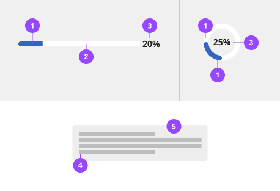
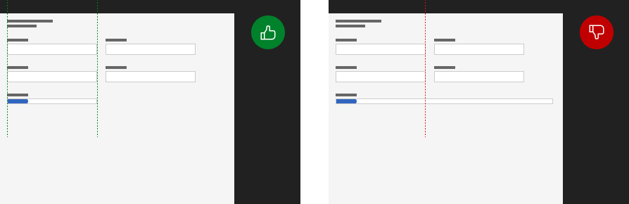

# Loaders

Loading spinners are used when retrieving data or performing slow computations. They notify to the user that their request is being processed. Although they do not provide details about what is occurring on the backend, they reassure the user that their action is being processed.

## Usage

A Determinate Loader indicates that the user’s request has been received and the application is making progress toward completing the requested action. Loader Determinate inform users about the status of ongoing processes, the estimated time of how long a process will take, or if a request is being executed.

Indeterminate loader does not provide details about what is occurring on the backend, they reassure the user that their action is being processed.

Inline loading spinners are used when performing actions. They notify to the user that their request is being processed. Although they do not provide details about what is occurring on the backend, they reassure the user that their action is being processed.

Common actions that benefit from inline loading include any create, update, or delete actions that may have a lot of data to process. It can be used in a table, after a primary or secondary button click, or even in a modal.

### Variants

| Interactions  | Purpose |
|:------------- | :------ |
| Determinate   | Use determinate Loader Determinates where there is clear information about the progression — they convey exact and qualitative information about the progression. |
| Indeterminate | Use indeterminate Loader Determinates where there is unclear information about the progression — they convey that users’ request, action, or data is being processed now without indicating how long the activity will take. |
| Skeleton      | Skeleton states are simplified versions of components used on an initial page load to indicate that the information on the page has not fully loaded yet. |

### When to use

#### Determinate loader

- For a long operation or a process that can take a considerable or unknown amount of time.
- When the process can be described with quantitative information, such as a percentage.
- To visually show the progression of a system operation such as downloading, uploading, loading data, submitting a form, or saving updates.

#### Indeterminate loader

- To convey that data is being requested, transferred, or processed.
- Loading a section of the page or application.
- Showing that an action is processing.

### When not to use

#### Determinate loader

- When manual user actions are required to progress, use a progress indicator instead.
- When the progress is determined by user actions such as tutorials completed, or storage space, rather than system actions.

#### Indeterminate loader

- If the process takes less than 5 seconds to load, use loading instead.
- Don’t use inline loading for full page/multiple sections loads, use skeleton loaders instead.
- When the load time is expected to display expanded information. Use skeleton loaders instead.
- Don’t trigger inline loading on more than one item or action at a time, unless on initial page load or refresh.

### Progress status

It’s best to give the user transparency about the process which usually leads to increased trust in the software or platform. As a more concrete set of examples, there are generally three different major progressions of a system operation: downloading, uploading, and local processing.

#### Downloading

For downloading actions, it’s usually possible to get a value of progress and update it in real time for a determinate Loader Determinate. Depending on the information reported from a data source, time remaining could be estimated based on how much has been downloaded so far over a time.

#### Uploading

Upload actions may be unable to report real time progress status depending on the data source and API configuration. However, always strive to provide users the determinate value whenever it’s possible to inform them about the process.

#### Data processing

Data processing refers to manipulations of data to produce meaningful information. This can include currency exchange, file generation, data reformatting, or similar operations. Depending on the operation, time estimated or cycles to complete processing could be used to populate a determinate Loader Determinate.

### Anatomy

1. **Stroke** - Indicates how much the process has progressed.
2. **Background** - The static area that the bar indicator moves on top of and acts as a fixed visual reference of what the total length and duration of the process could be.
3. **Percentage** - provides a textual indicator of progress. (optional)
4. **Skeleton container** - Show the various sections that are currently loading content.
5. **Skeleton elements** - Shows the type of data that is being loaded

### Content

#### Labels

- Labels inform users what information the Loader Determinate is processing.
- Keep the label short and concise by limiting it to a few words or a single line of text.
- Label text should never change as the Loader Determinate is loading. It also does not need to be updated when the process ends, since the success or error information is provided by the bar indicator color and an icon, along with any helper text.

#### Helper text

- Helper text is used to show additional information about the process taking place.
- Common use cases of helper text for a Loader Determinate can either be a generic phrase, for example “Fetching assets…”, or it can indicate an exact amount of something to be completed, for example “42/256 items”.
- When indicating a loading percentage, the percentage number should count as the bar progresses.

### Placement

The large loading spinner should appear centered over a page or content that it is loading. Please note that the top-level navigation is not included in the page loading overlay.

### States

There are three states for the Loader Determinate: active, success, and error. After the process completes successfully or unsuccessfully, a Loader Determinate can either remain persistent as confirmation or validation, or it can be automatically dismissed depending on what is most suitable for the use case.

### Active

The active loading state, represented by an animated blue bar indicator, conveys that the action is still in progress.

### Error

The error loading state indicates that the action did not successfully complete. If an error occurs, an inline notification or error handling within the form should appear. As soon as a process fails, the indicator bar’s progress spans full width, turns red, and remains visible. A failed icon is also shown.

### Part of a page

While the Loader Determinate is processing information on part of a page, you can still interact with other elements on the page. When the Loader Determinate finishes processing it can either remain persistent on the page for confirmation or automatically dismiss itself depending on the use case.

### Inside a container

While the Loader Determinate is processing information that could affect multiple pieces of content within a container, such as a card, depending on the use case, the whole container should become inactive until processing has been completed or the specific section within the container being processed should become inactive until processing has been completed. The user should be able to interact with the rest of the container or page that is unaffected by the Loader Determinate.

### Height

The Loader Determinate is offered in two different sizes—big (8px) and small (4px). The big Loader Determinate height is typically used when there are large amounts of space on a page. The small Loader Determinate height is commonly used when space is restricted and can be placed within cards, data tables, or side panels.

### Width

The width of a Loader Determinate can vary based on the content. The minimum width of a Loader Determinate is 48px and keep its width to a maximum of six columns when possible. If the Loader Determinate width is too long, it can reduce readability. Don’t increase the Loader Determinate length to fill the entire width of a window or application.

## Style

Below is the token architecture color build of the components. The token can be changed or defined through the token mapping script that has been placed in the application repository.

### Color

| State                      | Element                    | Property                   | Token name                 |
| :------------------------- | :------------------------- | :------------------------- | :------------------------- |
| Enabled                    | Track                      | Background Color           | `$support_bg_info`         |
|                            |                            | Border Color               |                            |  
|                            |                            | Box Shadow                 |                            |
|                            | Fill bar                   | Background Color           | `$border_interactive`      |
|                            | Label                      | Text Color                 | `$text_secondary`          |
|                            | Helper Text                | Text Color                 | `$text_secondary`          |
|                            | Precentage                 | Text Color                 | `$text_secondary`          |
|                            | Icon                       | SVG Color                  | `$icon_secondary`          |
| Error                      | Track                      | Background Color           | `$support_bg_error`        |
|                            |                            | Border Color               |                            |  
|                            |                            | Box Shadow                 |                            |
|                            | Fill bar                   | Background Color           | `$support_error`           |
|                            | Label                      | Text Color                 | `$support_error`           |
|                            | Helper Text                | Text Color                 | `$support_error`           |
|                            | Precentage                 | Text Color                 | `$support_error`           |
|                            | Icon                       | SVG Color                  | `$support_error`           |

### Typography

| Element      | Font size | Font weight | Token name                 |
| ------------ | --------- | ----------- | -------------------------- | 
| Percentage   | 14px      | 700 bold    | `$label_1_bold`            |
| Helper Text  | 12px      | 400 regular | `$helper_text_1_regular`   |
| Label        | 14px      | 700 bold    | `$label_1_bold`            |

### Token Architecture

| Token name                  | Description                                            |
| :-------------------------- | :----------------------------------------------------- |
| `$loader_small`             | Defines height for the **small** variant.              |
| `$loader_medium`            | Defines height for the **medium** variant.             |
| `$loader_large`             | Defines height for the **large** variant.              |
| `$loader_padding`           | Defines **padding** for the component.                 |
| `$loader_margin`            | Defines **margin** for the component.                  |
| `$loader_border`            | Defines **border** weight for the accordion component. |
| `$loader_border_radius`     | Defines **border radius** for the component.           |

### Structure

**Linear loaders**

| Element               | Property                | Size      | Token name                  |
| :-------------------- | :---------------------- | :-------- | :-------------------------- |
| Track                 | Height                  | 8px       |                             |
|                       | Padding Top x Bottom    |           |                             |
|                       | Padding Right x Left    |           |                             |
|                       | Border Radius           | 50px      | `$loader_border_radius`     |
|                       | Border                  | 1px       | `$loader_border`            |
| Bar                   | Height                  | 8px       |                             |
| Label                 | Margin Down             | 2px       | `$spacing_2`                |
| Helper Text           | Margin Up               | 2px       | `$spacing_2`                |
| Percentage            | Margin Left             | 8px       | `$loader_margin`            |

**Circular loaders**

| Element               | Property                | Size      | Token name                  |
| :-------------------- | :---------------------- | :-------- | :-------------------------- |
| Track                 | Height                  | 8px       |                             |
|                       | Padding Top x Bottom    |           |                             |
|                       | Padding Right x Left    |           |                             |
|                       | Border Radius           | 50px      | `$loader_border_radius`     |
|                       | Border                  | 1px       | `$loader_border`            |
| Bar                   | Height                  | 8px       |                             |
| Label                 | Margin Down             | 2px       | `$spacing_2`                |
| Helper Text           | Margin Up               | 2px       | `$spacing_2`                |
| Percentage            | Margin Left             | 8px       | `$loader_margin`            |

## Accessibility

The loading component has no keyboard accessibility considerations since it is intentionally not operable or navigable. However, the component incorporates other accessibility considerations, some of which are described below.

### Status updates

The primary accessibility consideration for the loading component is to convey its meaning to assistive technologies so users are aware of changes in status. The component achieves this by exposing the title value (normally “loading”) of the spinning wheel SVG image.

### Convey when loading has completed

When the loading indicator disappears, it conveys a second meaning, which is ‘not loading’ or ‘finished’. However, especially where loads may take more than a few seconds, a user who cannot see the icon disappear needs to be made aware the system is no longer “loading” and is thus available for usage.

There are several ways to do this. If new content takes focus when the loading is completed (for instance after a full-page load), then users will understand the system is now available. Annotating what component takes focus will ensure this is properly implemented.

Where a change of focus is not appropriate when the loading icon disappears, the information can be surfaced to users through a non-displayed status message, such as “finished” or “loading complete,” that can be conveyed to users through assistive technology.

### Development considerations

Keep these considerations in mind if you are modifying the component or creating a custom component.

- The component uses aria-live set to "assertive" to immediately surface a loading status to assistive technologies.
- The component provides an SVG title value for the loading icon, which is exposed through the aria-live section.
- The completion of the loading state should be conveyed to assistive technologies. A non-visible status message such as "loading complete" could be put in the aria-live section or exposed through a role="status". Alternatively, focus could be set to an appropriate element.

