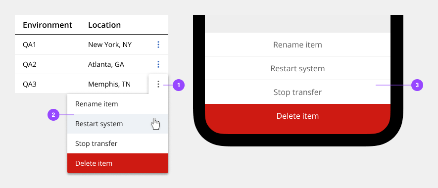
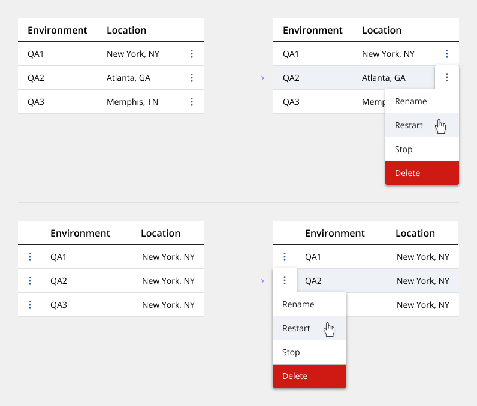
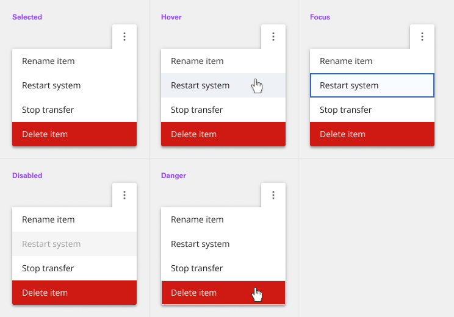
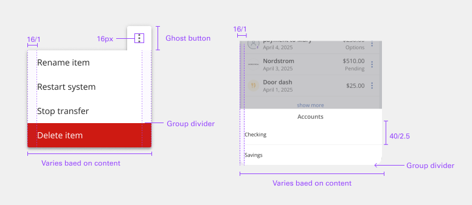
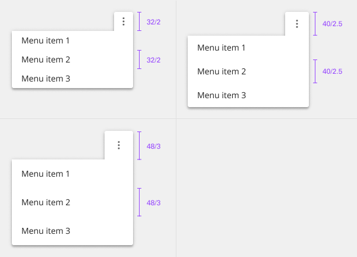
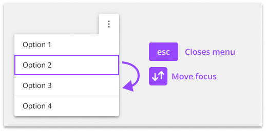

# Menu

Use the menu component when additional options are available to the user but there is a space constraint.

## Usage

### Anatomy

The text within an overflow menu should be direct so users can quickly decide on an action. Actions that could cause a significant change to the user's data (delete app, delete service, etc.) are separated by a divider and live below the primary set of actions.
 
1. Trigger icon
2. Contextual menu

### Placement

Depending on where the Overflow menu appears within the UI, the tab tip may appear on the left or right, so it always remains visible.

## Style

Below is the token architecture color build of the components. The token can be changed or defined through the token mapping script that has been placed in the application repository.

### Color

Below is the token architecture color build of the components. The token can be changed or defined through the token mapping script that has been placed in the application repository.

**Menu**

| State                      | Element                    | Property                   | Token name                 |
| :------------------------- | :------------------------- | :------------------------- | :------------------------- |
| Enabled                    | Container                  | Background Color           | `$layer_1`                 |
|                            |                            | Border Color               |                            |
|                            |                            | Box Shadow                 | `$shadow_1`                |  
|                            | Overflow Icon              | SVG Color                  | `$icon_interactive`        |

**Menu item**

The contextual menu sub component uses the same color and specifications as contained lists.

| State                      | Element                    | Property                   | Token name                 |
| :------------------------- | :------------------------- | :------------------------- | :------------------------- |
| Enabled                    | Container                  | Background Color           |                            |
|                            |                            | Border Color               | `$border_subtle_1`         |
|                            | Label                      | Text Color                 | `$text_secondary`          |  
|                            | Icon                       | SVG Color                  | `$icon_secondary`          |
| Hover                      | Container                  | Background Color           | `$layer_hover_1`           |
|                            |                            | Border Color               | `$border_subtle_1`         |
|                            | Label                      | Text Color                 | `$text_primary`            |  
|                            | Icon                       | SVG Color                  | `$icon_primary`            |
| Selected                   | Container                  | Background Color           | `$layer_selected_1`        |
|                            |                            | Border Color               |                            |
|                            | Label                      | Text Color                 | `$text_on_color`           |  
|                            | Icon                       | SVG Color                  | `$icon_on_color`           |
| Disabled                   | Container                  | Background Color           | `$layer_disabled_1`        |
|                            |                            | Border Color               |                            |
|                            | Label                      | Text Color                 | `$text_disabled`           |  
|                            | Icon                       | SVG Color                  | `$icon_disabled`           |
| Danger                     | Container                  | Background Color           | `$support_error`           |
|                            |                            | Border Color               |                            |
|                            | Label                      | Text Color                 | `$text_on_color`           |  
|                            | Icon                       | SVG Color                  | `$icon_on_color`           |

### Typography

All text should be set in sentence case, with only the first word in a phrase and any proper nouns capitalized. The below measurements are baseline. Based on scenario/experience need, sizes and typography can be flexible.

| State      | Element      | Font size | Font weight | Token name                 |
| ---------- | ------------ | --------- | ----------- | -------------------------- | 
| Small      | Label        | 14px      | 400 regular | `$body_standard_1_regular` |
| Medium     | Label        | 14px      | 400 regular | `$body_standard_1_regular` |
| Large      | Label        | 16px      | 400 regular | `$body_standard_2_regular` |

### Token Architecture

| Token name                  | Description                                            |
| :-------------------------- | :----------------------------------------------------- |
| `$menu_small`               | Defines height for the **small** variant.              |
| `$menu_medium`              | Defines height for the **medium** variant.             |
| `$menu_large`               | Defines height for the **large** variant.              |
| `$menu_padding`             | Defines **padding** for the component.                 |
| `$menu_margin`              | Defines **margin** for the component.                  |
| `$menu_border`              | Defines **border** weight for the accordion component. |
| `$menu_border_radius`       | Defines **border radius** for the component.           |

### Structure

Structure and spacing measurements for vertical and horizontal checkbox groupings.

**Menu**

| Element               | Property                | Size      | Token name                  |
| :-------------------- | :---------------------- | :-------- | :-------------------------- |
| Container             | Padding Right x Left    | 2px       | `$spacing_2`                |
|                       | Padding Bottom x Top    | 2px       | `$spacing_2`                |
|                       | Box Shadow              |           | `$shadow_2`                 |
|                       | Border Radius           |           | `$menu_border_radius`       |

**Menu item**

| Element               | Property                | Size      | Token name                  |
| :-------------------- | :---------------------- | :-------- | :-------------------------- |
| Container             | Padding Right x Left    | 16px      | `$menu_padding`             |
|                       | Border Bottom           | 1px       | `$menu_border`              |
| Icon (Right)          | Margin Left             | 8px       | `$menu_margin`              |
| Icon (Left)           | Margin Right            | 8px       | `$menu_margin`              |

## Accessibility

The component bakes keyboard operation into its components, improving the experience of blind users and others who operate via the keyboard. The design system incorporates many other accessibility considerations, some of which are described below.

### Keyboard

Make sure overflow menus are in the default focus order and can be reached by single finger Left flick and is activated by double finger Double Tap When the menu is open, the first item takes focus. Focus is moved between menu items with the Left and Right swipe. Double finger Double Tap activates the item with focus (which causes focus to go somewhere else and the menu to close). Two Finger flick left to exit and return to the origination point.

### Development considerations

Keep these considerations in mind if you are modifying the component or creating a custom component.

- Overflow menus are buttons with `aria-haspopup` set to “true”.
- The overflow menu is named with aria-label.
- Each menu item is a li in a ul.
- Each list item contains a button with `role="menuitem"` and `tabindex="-1"`. See the ARIA authoring practices on menubutton for more considerations.

