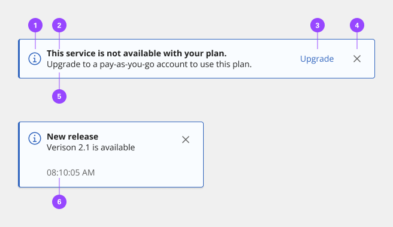
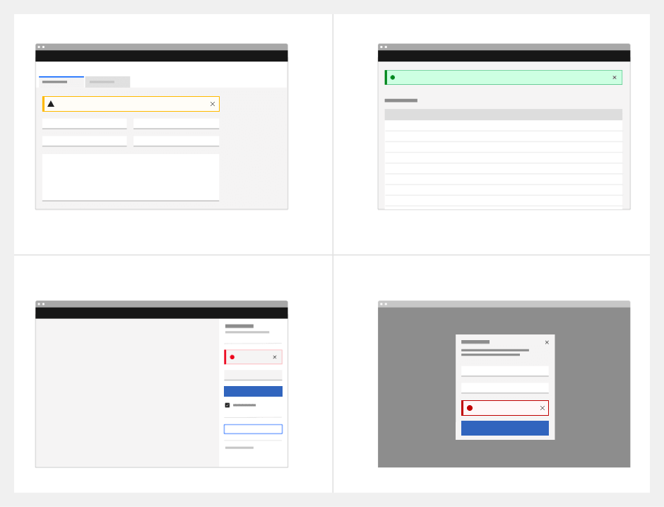
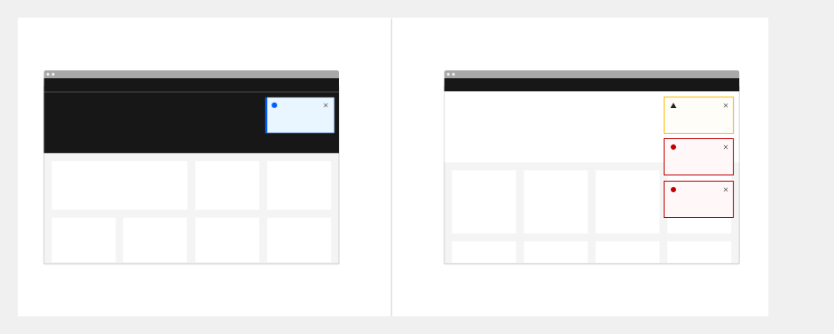
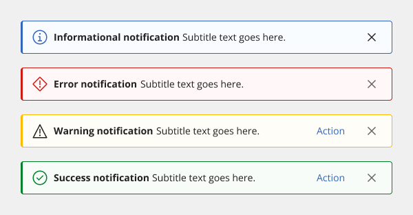
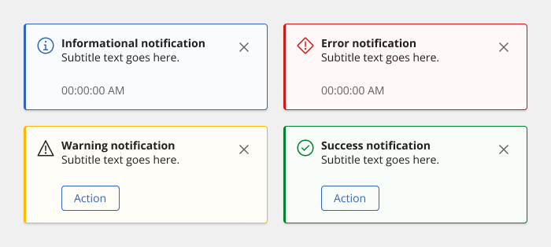
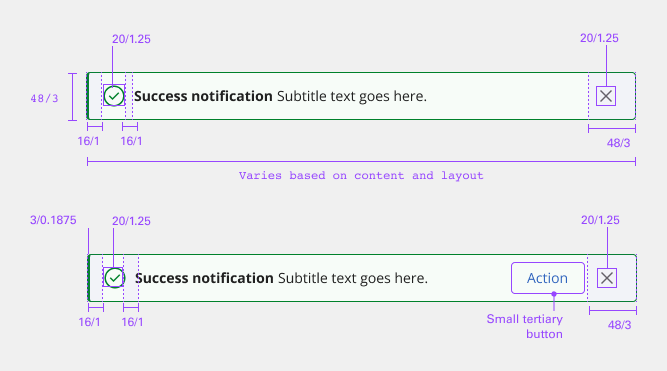

# Notifications

Notifications are messages that communicate information to the user. The three variants of notifications are toast notifications, inline notifications, and actionable notifications.

## Usage

### When to use

Use notifications to inform users of updates or changes to system status. Communicating with users and providing immediate feedback are important for building trust. While notifications are an effective method of communicating with users, they are disruptive and should be used sparingly.

### Variants

| Variant       | Purpose |
|:------------- | :------ |
| Inline        | Inline notifications show up in task flows, to notify users of the status of an action. They usually appear at the top of the primary content area. |
| Toast         | Toasts are non-modal, time-based window elements used to display short messages; they usually appear at the top of the screen and disappear after a few seconds. |
| Actionable    | Actionable notifications allow for interactive elements within a notification styled like an inline or toast notification. |

### Anatomy

1. **Icon** - Informs users of the kind of notification briefly.
2. **Title** - Gives users a quick overview of the notification.
3. **Action** (actionable only) - Ghost or tertiary button that allows users to address the notification or navigates them to a page with further details.
4. **Close button (optional)** - Closes the notification.
5. **Message** - Provides additional detail and actionable steps for the user to take.
6. **Timestamp (optional for toast)** - Shows the time the toast notification was sent.

### Content

Notifications provide limited space for content, and therefore the content must be short and concise. A user should be able to quickly scan the notification, be apprised of the situation, and know what to do next.

#### Title

- The title should be short and descriptive, explaining the most important piece of information.
- When possible, communicate the main message using just the title.
- Use a period only if the title is a full sentence.
- When using rich text, such as in a title, a screen reader will read aloud the entire message as one sentence. Since the message will be read as one string, make sure that any text styling does not convey meaning.

#### Body content

- Be concise and avoid repeating or paraphrasing the title.
- Limit content to one or two short sentences.
- Explain how to resolve the issue by including any troubleshooting actions or next steps. You can include links within the notification body that redirect the user to next steps by using an actionable notification.

#### Action (actionable only)

- Only actionable notifications can contain interactive elements such as a link or button.
- Keep labels concise and clearly indicate the action the user can take.
- Limit action labels to one or two words.

### Overflow content

If a toast or inline notification requires a message longer than two lines, use an actionable notification and include a short message with a “View more” link that takes the user to a view of the full notification message. This can be either a full page with more details or a modal.

### Inline notifications

Inline notifications show up in task flows, to notify users of the status of an action or system. They usually appear at the top of the primary content area or close to the item needing attention.

#### Formatting

- **Sizing** - The width of inline notifications varies based on content and layout. They can expand to the fill the container or content area they relate to. Their height is based on the content length, which should not exceed two lines of text.
- **Placement** - Inline notifications appear near their related items. They can expand to fill the width of the container or content area they are in and should align to the grid columns.

We recommend placing inline notifications at the bottom of forms, just above the submission and cancel buttons. When error notifications apply to individual text inputs, they should supplement the error state on that specific input field.

#### Dismissal

Inline notifications do not dismiss automatically. They persist on the page until the user dismisses them or takes action that resolves the notification.

A small “x” in the top right corner is used to dismiss inline notifications. Including the close button is optional and should not be included if it is critical for a user to read or interact with the notification.

### Toast notifications

Toasts are non-modal, time-based window elements used to display short messages; they usually appear at the top of the screen and disappear after a few seconds.

#### Formatting

- **Time stamp** - Toast notifications can include a time stamp at the bottom the container. The time stamp shows the time the notification was sent. Using time stamps is optional but toasts should be consistent across the product so either all toasts should include time stamps or none of them should. The time stamp is optional and can be removed if a third line of content is needed.
- **Sizing** - Toast notifications use a fixed width, and their height depends on the length of the notification message. As noted in the content guidelines, limit toast notifications to two lines of text.
- **Placement** - Toast notifications slide in and out from the top right of the screen. They stack with $spacing_03 in-between. New toast notifications should appear at the top of the list, with older notifications being pushed down until they are dismissed.

#### Dismissal

Toast notifications persist by default. Toasts do have the option to timeout and dismiss automatically after five seconds on the screen. They can also include a close button so users can dismiss them sooner. Toasts cover content on the screen so they should always be easily dismissed. Because toast notifications can dismiss automatically, users should be able to access them elsewhere after the toast disappears. This allows them to be accessible for users who need more time reading the notification or who may want to refer to the notification.

### Actionable notifications

Actionable notifications allow for interactive elements within a notification styled like an inline or toast notification. Actionable notifications, since they require user interaction, take focus when triggered and can be highly disruptive to screen readers and keyboard users. With actionable notifications, only one action is allowed per notification. This action frequently takes users to a flow or page related to the message, where they can resolve the notification. Consider using a notification center where a user can revisit and act on past notifications.

#### Formatting

- **Inline** - Actionable inline notifications have a ghost button action that is adjacent to the title and body content. On mobile screens the action button wraps under the body content. This button should allow users to take further action on the notification.

- **Toast** - Actionable toast notifications can include a button at the end of their body content. This button should be short and navigate users to a page or modal where they can take action to address the notification or find further information. Because toast notifications automatically dismiss, it is important that there are alternative routes to navigate to the link destination.

#### Dismissal

All notifications, including actionable, persist by default until a user dismissed them. If using inline styling refer to inline notifications for inline dismissal. If using toast styling for an actionable notification, then the notification should remain on screen until the user dismisses it. With the notification remaining open, the user has enough time to interact with the button without the toast closing too soon. Refer to toast notifications for further information.

### Universal behaviors

#### Mouse

Notifications are system generated. A user can close a dismissible notification by clicking the close x.

#### Keyboard

For actionable notifications, the action gets focus first. Use Tab to move between action and the close x. To close notifications, press Enter or Space while the close x has focus or use the Esc key.

- **VoiceOver** - To close notifications, press Enter or Space while the close x has focus or use the Esc key.
- **JAWS** - To close notifications, press Enter or Space while the close x has focus or use the Esc key.
- **NVDA** - To close notifications, press Enter or Space while the close x has focus or use the Esc key.

## Style

Below is the token architecture color build of the components. The token can be changed or defined through the token mapping script that has been placed in the application repository.

**Inline alerts**

| Type                       | Element                    | Property                   | Token name                 |
| :------------------------- | :------------------------- | :------------------------- | :------------------------- |
| Informational              | Container                  | Background Color           | `$support_bg_info`         |
|                            |                            | Border Color               | `$support_info`            |
|                            |                            | Box Shadow                 |                            |  
|                            | Title                      | Text Color                 | `$text_primary`            |
|                            | Description                | Text Color                 | `$text_primary`            |
|                            | Icon                       | SVG Color                  | `$support_info`            |
|                            | Icon (Close)               | SVG Color                  | `$icon_secondary`          |
| Error                      | Container                  | Background Color           | `$support_bg_error`        |
|                            |                            | Border Color               | `$support_error`           |
|                            |                            | Box Shadow                 |                            |  
|                            | Title                      | Text Color                 | `$text_primary`            |
|                            | Description                | Text Color                 | `$text_primary`            |
|                            | Icon                       | SVG Color                  | `$support_error`           |
|                            | Icon (Close)               | SVG Color                  | `$icon_secondary`          |
| Warning                    | Container                  | Background Color           | `$support_bg_warning`      |
|                            |                            | Border Color               | `$support_warning`         |
|                            |                            | Box Shadow                 |                            |  
|                            | Title                      | Text Color                 | `$text_primary`            |
|                            | Description                | Text Color                 | `$text_primary`            |
|                            | Icon                       | SVG Color                  | `$support_warning`         |
|                            | Icon (Close)               | SVG Color                  | `$icon_secondary`          |
| Success                    | Container                  | Background Color           | `$support_bg_success`      |
|                            |                            | Border Color               | `$support_success`         |
|                            |                            | Box Shadow                 |                            |  
|                            | Title                      | Text Color                 | `$text_primary`            |
|                            | Description                | Text Color                 | `$text_primary`            |
|                            | Icon                       | SVG Color                  | `$support_success`         |
|                            | Icon (Close)               | SVG Color                  | `$icon_secondary`          |

**Toast alerts**

| Type                       | Element                    | Property                   | Token name                 |
| :------------------------- | :------------------------- | :------------------------- | :------------------------- |
| Informational              | Container                  | Background Color           | `$support_bg_info`         |
|                            |                            | Border Color               | `$support_info`            |
|                            |                            | Box Shadow                 | `$shadow_1`                |  
|                            | Title                      | Text Color                 | `$text_primary`            |
|                            | Description                | Text Color                 | `$text_primary`            |
|                            | Icon                       | SVG Color                  | `$support_info`            |
|                            | Icon (Close)               | SVG Color                  | `$icon_secondary`          |
| Error                      | Container                  | Background Color           | `$support_bg_error`        |
|                            |                            | Border Color               | `$support_error`           |
|                            |                            | Box Shadow                 | `$shadow_1`                |  
|                            | Title                      | Text Color                 | `$text_primary`            |
|                            | Description                | Text Color                 | `$text_primary`            |
|                            | Icon                       | SVG Color                  | `$support_error`           |
|                            | Icon (Close)               | SVG Color                  | `$icon_secondary`          |
| Warning                    | Container                  | Background Color           | `$support_bg_warning`      |
|                            |                            | Border Color               | `$support_warning`         |
|                            |                            | Box Shadow                 | `$shadow_1`                |  
|                            | Title                      | Text Color                 | `$text_primary`            |
|                            | Description                | Text Color                 | `$text_primary`            |
|                            | Icon                       | SVG Color                  | `$support_warning`         |
|                            | Icon (Close)               | SVG Color                  | `$icon_secondary`          |
| Success                    | Container                  | Background Color           | `$support_bg_success`      |
|                            |                            | Border Color               | `$support_success`         |
|                            |                            | Box Shadow                 | `$shadow_1`                |  
|                            | Title                      | Text Color                 | `$text_primary`            |
|                            | Description                | Text Color                 | `$text_primary`            |
|                            | Icon                       | SVG Color                  | `$support_success`         |
|                            | Icon (Close)               | SVG Color                  | `$icon_secondary`          |

### Typography

| Element         | Font size | Font weight | Token name                 |
| --------------- | --------- | ----------- | -------------------------- | 
| Title           | 14px      | 700 bold    | `$h6_compact_bold`         |
| Description     | 14px      | 400 regular | `$body_1_compact_regular`  |

### Token Architecture

| Token name                    | Description                                            |
| :---------------------------- | :----------------------------------------------------- |
| `$notification_small`         | Defines height for the **small** variant.              |
| `$notification_medium`        | Defines height for the **medium** variant.             |
| `$notification_large`         | Defines height for the **large** variant.              |
| `$notification_padding`       | Defines **padding** for the component.                 |
| `$notification_margin`        | Defines **margin** for the component.                  |
| `$notification_border`        | Defines **border** weight for the accordion component. |
| `$notification_border_radius` | Defines **border radius** for the component.           |

### Structure

**Inline alerts**

| Element               | Property                | Size      | Token name                    |
| :-------------------- | :---------------------- | :-------- | :---------------------------- |
| Container             | Padding Right x Left    | 16px      | `$notification_padding`       |
|                       | Padding Top x Bottom    | 8px       | `$spacing_8`                  |
|                       | Border Radius           | 4px       | `$notification_border_radius` |
|                       | Border                  | 1px       | `$notification_border`        |
|                       | Border Left             | 3px       | `$border_3`                   |
| Icon                  | Height x Width          | 24px      | `$icon_medium`                |
|                       | Margin Right            | 8px       | `$notification_margin`        |
| Icon (Close)          | Height x Width          | 24px      | `$icon_medium`                |
|                       | Margin Right            | 8px       | `$notification_margin`        |
| Button (Action)       | Margin Left             | 8px       | `$notification_margin`        |

**Toast alerts**

| Element               | Property                | Size      | Token name                    |
| :-------------------- | :---------------------- | :-------- | :---------------------------- |
| Container             | Minimum Width           | 288px     |                               |
|                       | Padding Top x Bottom    | 16px      | `$notification_padding`       |
|                       | Padding Right x Left    | 16px      | `$notification_padding`       |
|                       | Border Radius           | 4px       | `$notification_border_radius` |
|                       | Border                  | 1px       | `$notification_border`        |
|                       | Border Left             | 3px       | `$border_3`                   |
| Icon                  | Height x Width          | 24px      | `$icon_medium`                |
|                       | Margin Right            | 8px       | `$notification_margin`        |
| Icon (Close)          | Height x Width          | 24px      | `$icon_medium`                |
|                       | Margin Right            | 8px       | `$notification_margin`        |
| Button (Action)       | Margin Left             | 8px       | `$notification_margin`        |
| Description           | Margin Bottom           | 8px       | `$notification_margin`        |

## Accessibility

Notification components are messages that communicate information to a user. The WAI-ARIA `role="status"` and role="log" is equivalent to `aria-live="polite"`. It is used to display a message to the user in a way that does not interrupt the user’s current task and queues the notification until whatever task the user is currently working on is complete. If the notification contains an urgent message, a `role="alert"` can be used, it is equivalent to `aria-live="assertive"`. It is used to display a message to the user that interrupts the user’s current task. These are considerably more disruptive to users than the `{{role="status"}}` or `{{role="log"}}`. In either case, these notifications attract the user’s attention without receiving focus to communicate the message.

Details pertaining to these roles include specifics around containing interactive elements, focus behavior, close behavior, and semantic contents. The role of status, log, and alert cannot contain interactive elements, should not be given focus, and can optionally be closed by pressing the Escape key. The close button is given `aria-hidden="true"`so it is ignored by assistive technologies. Generally, plain text is preferred to be used within these notifications. When read by screen readers, any semantic meaning surrounding the contents is not reflected to the user. For instance - Bold or italic emphasis, and/or semantic elements such as `<li>` etc. are not read to the user. If semantics are included, it should be non-essential to the understanding or meaning of the contents.

Notification components are allowed interactive children (actions) though, and when an interactive element is provided, a `role="alertdialog"` is used. These notifications should immediately be given focus so the user can navigate through the interactive elements. The close button is given an ARIA label of `aria-label="close"`, and the icon has `aria-hidden="true"` so it is ignored by assistive technologies. The Tab key is used to move focus to the action and close button within the notification and the Space key or Enter key activate the appropriate button within the notification. It can also be optionally closed via pressing the Escape key.

- Avoid using a toast notification for critical alerts or long messages because they are timed and will disappear automatically making it difficult for people with various disabilities to get the entire message. An alert that disappears too quickly can lead to failure of the optional WCAG 2.0 success criterion 2.2.3 (AAA).
- Provide a means to turn off nonessential alerts to enhance usability for people with visual and cognitive disabilities. Additional information is available in WCAG 2.0 success criterion 2.2.4 (AAA). Note: Providing this functionality is optional.
- Ensure the use of color and hidden icons are not used as the only means of conveying the importance of the notification.

### Testing

| Environment                                     | Results (DAP)                                                                                                                                                                                                            |
| :---------------------------------------------- | :----------------------------------------------------------------------------------------------------------------------------------------------------------------------------------------------------------------------- |
| macOS Mojave version 10.14.6 with VoiceOver     | Violations 																																																			     |
| Chrome version 77.0.3865.90                     | Violations 																														                                           												 | 
| Dynamic Assessment Plugin (DAP) version 1.8.0.0 | Voice Over (VO) test: Press Control-Option-Shift keys to enter the Web content. Press the Tab key. VO announces the notification text and the close button. Press the Space key or Enter key to close the notification.  |
| Chrome version 77.0.3865.90                     | Voice Over (VO) test: Press Control-Option-Shift keys to enter the Web content. Press the Tab key. VO announces the notification text and the close button. Press the Space key or Enter key to close the notification.  |
| Microsoft Windows 10                            | JAWS test: Press H, JAWS announce the notification title. Press Alt-Down Arrow, JAWS announces each line of the notification text. Press the Tab, JAWS announces the close button. Press the Space key or Enter key to close the notification.  |
| Firefox version 68                              | JAWS test: Press H, JAWS announce the notification title. Press Alt-Down Arrow, JAWS announces each line of the notification text. Press the Tab, JAWS announces the close button. Press the Space key or Enter key to close the notification.  |
| JAWS version 18                                 | JAWS test: Press H, JAWS announce the notification title. Press Alt-Down Arrow, JAWS announces each line of the notification text. Press the Tab, JAWS announces the close button. Press the Space key or Enter key to close the notification.  |
| iOS version 13.1.3 with VoiceOver               | Voice Over test: Swipe right to the notification and to read the notification text. Swipe right to the X icon. VO announces the close button. Double tap to close the notification.  |
| Safari version 13.1.3                           | Voice Over test: Swipe right to the notification and to read the notification text. Swipe right to the X icon. VO announces the close button. Double tap to close the notification.  |
