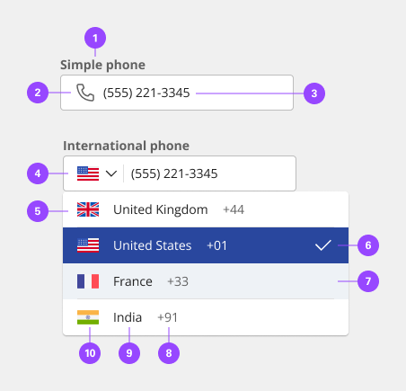
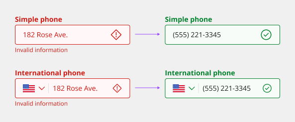
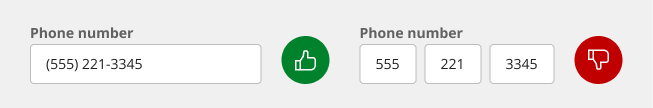
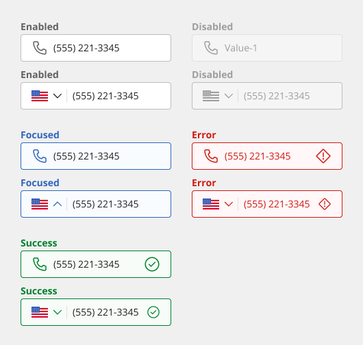
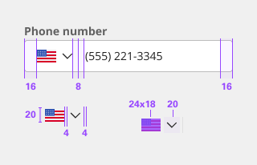
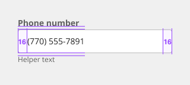
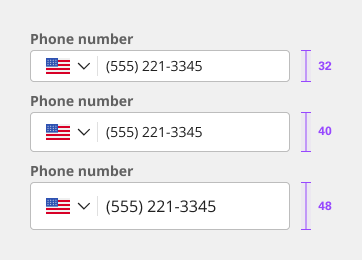

# Phone Input

The phone inputs are a common UI feature for tons of websites and applications. The component provides the user guidance in providing the correctly formatted data into the text input. There are a couple variants that can be used to make the user's experience more enjoyable.

## Usage

### When to use

- Use phone fields to validate phone numbers against the correct format for the selected country.
- Set a sensible default for the country. Prefill country code based on user geolocation data.
- Allow users to modify country code when necessary. The country selector should look like an interactive element - the user should know that they can change it.

### Variants

| Variant             | Purpose |
|:------------------- | :------ |
| Simple Phone        | Standard text input that used the telephone type for formatting and eliminating errors. |
| International Phone | More advanced phone input that gives the user the ability to select a country and country code in additional to the simple phone input. |

### Anatomy

1. Label
2. Icon (optional)
3. Value
4. Country dropdown
5. Default list item
6. Selected list item
7. Hovered list item
8. Country code
9. Country name
10. Country flag

### Country selector

Phone numbers are standardized in an international format known as E.164 which combines country codes and subscriber numbers in a format like this: +14155552671. This format is required by many APIs and means that you don't have to store country codes and phone numbers in two separate database columns.

However, you probably don't want your users to have to type in a + sign and country code when they provide their phone number to:
 
- Register a new account
- Enable SMS 2-factor authorization
- Request a callback from customer service
- Sign up for account notifications

By default, the country selector is set to the United States, but you can specify a different default value. You can also set the default dynamically. For example, you can set the default value using location detection.

The selected country determines the format to use to validate phone numbers. If users enter phone numbers from a different country, they must also select that country to validate phone numbers based on the correct format.

### Validation

The phone field input directive validates phone numbers based on the format for the selected country. You must specify an error message. In most cases, the error message should be "Enter a phone number matching the format for the selected country."

#### Do not split input fields

From first glance, splitting the field into a few fields will solve the problem of formatting the user will have a natural constraint that will prevent them from adding an incorrect number. However, this design decision will introduce a few serious problems:

- Higher interaction cost. The user will need to navigate from one field to another. This is particularly difficult for mobile users because they cannot rely on Tab to move to another field.
- This solution won't work for different phone formatting. Creating input fields localized to one country can cause problems for international user they won't be able to provide a number in their format. For example, the US phone format is the same for local and mobile number +1 (xxx) xxx-xx-xx while for the UK the format varies drastically depending on the region.

### Reference

Twilio® International Telephone Input [plugin](https://intl-tel-input.com/).

## Style

Below is the token architecture color build of the components. The token can be changed or defined through the token mapping script that has been placed in the application repository.

| State                      | Element                    | Property                   | Token name                 |
| :------------------------- | :------------------------- | :------------------------- | :------------------------- |
| Enabled                    | Container                  | Background Color           | `$field_1`                 |
|                            |                            | Border Color               | `$border_strong_1`         |
|                            |                            | Box Shadow                 |                            |  
|                            | Title                      | Text Color                 | `$text_primary`            |
|                            | Content                    | Text Color                 | `$text_secondary`          |
|                            | Icon                       | SVG Color                  | `$icon_secondary`          |
| Hover                      | Container                  | Background Color           | `$focus_highlight`         |
|                            |                            | Border Color               | `$focus`                   |
|                            |                            | Box Shadow                 | `$shadow_2`                |  
|                            | Title                      | Text Color                 | `$text_primary`            |
|                            | Content                    | Text Color                 | `$text_secondary`          |
|                            | Icon                       | SVG Color                  | `$icon_secondary`          |
| Focus                      | Container                  | Background Color           | `$focus_highlight`         |
|                            |                            | Border Color               | `$focus`                   |
|                            |                            | Box Shadow                 | `$shadow_2`                |  
|                            | Title                      | Text Color                 | `$text_primary`            |
|                            | Content                    | Text Color                 | `$text_secondary`          |
|                            | Icon                       | SVG Color                  | `$icon_secondary`          |
| Disabled                   | Container                  | Background Color           | `$field_disabled_1`        |
|                            |                            | Border Color               | `$border_disabled_1`       |
|                            |                            | Box Shadow                 |                            |  
|                            | Title                      | Text Color                 | `$text_disabled`           |
|                            | Content                    | Text Color                 | `$text_disabled`           |
|                            | Icon                       | SVG Color                  | `$icon_disabled`           |
| Error                      | Container                  | Background Color           | `$support_bg_error`        |
|                            |                            | Border Color               | `$support_error`           |
|                            |                            | Box Shadow                 |                            |  
|                            | Title                      | Text Color                 | `$support_error`           |
|                            | Content                    | Text Color                 | `$support_error`           |
|                            | Icon                       | SVG Color                  | `$support_error`           |
| Success                    | Container                  | Background Color           | `$support_bg_success`      |
|                            |                            | Border Color               | `$support_success`         |
|                            |                            | Box Shadow                 |                            |  
|                            | Title                      | Text Color                 | `$support_success`         |
|                            | Content                    | Text Color                 | `$support_success`         |
|                            | Icon                       | SVG Color                  | `$support_success`         |

### Typography

Input labels should use sentence case, with only the first word in a phrase and any proper nouns capitalized.

| State      | Element         | Font size | Font weight | Token name                |
| ---------- | --------------- | --------- | ----------- | ------------------------- | 
| Small      | Label           | 14px      | 700 bold    | `$label_1_bold`           |
|            | Helper Text     | 12px      | 400 regular | `$helper_text_1_regular`  |
|            | Value           | 14px      | 400 regular | `$body_1_compact_regular` |
|            | Placeholder     | 14px      | 400 regular | `$body_1_compact_regular` |
|            | Contextual Menu | 14px      | 400 regular | `$body_1_compact_regular` |
| Medium     | Label           | 14px      | 700 bold    | `$label_1_bold`           |
|            | Helper Text     | 12px      | 400 regular | `$helper_text_1_regular`  |
|            | Value           | 14px      | 400 regular | `$body_1_compact_regular` |
|            | Placeholder     | 14px      | 400 regular | `$body_1_compact_regular` |
|            | Contextual Menu | 14px      | 400 regular | `$body_1_compact_regular` |
| Large      | Label           | 14px      | 700 bold    | `$label_1_bold`           |
|            | Helper Text     | 12px      | 400 regular | `$helper_text_1_regular`  |
|            | Value           | 16px      | 400 regular | `$body_2_compact_regular` |
|            | Placeholder     | 16px      | 400 regular | `$body_2_compact_regular` |
|            | Contextual Menu | 16px      | 400 regular | `$body_2_compact_regular` |

### Token Architecture

| Token name                   | Description                                            |
| :--------------------------- | :----------------------------------------------------- |
| `$phone_input_small`         | Defines height for the **small** variant.              |
| `$phone_input_medium`        | Defines height for the **medium** variant.             |
| `$phone_input_large`         | Defines height for the **large** variant.              |
| `$phone_input_padding`       | Defines **padding** for the component.                 |
| `$phone_input_margin`        | Defines **margin** for the component.                  |
| `$phone_input_border`        | Defines **border** weight for the accordion component. |
| `$phone_input_border_radius` | Defines **border radius** for the component.           |

### Structure

| Element               | Property                | Size      | Token name                  |
| :-------------------- | :---------------------- | :-------- | :-------------------------- |
| Input                 | Padding Right x Left    | 16px      | `$phone_input_padding`      |
|                       | Border                  | 1px       | `$phone_input_border`       |
|                       | Border Radius           | 4px       | `$phone_input_border_radius`|
| Icon                  | Margin Left             | 8px       | `$phone_input_margin`       |
| Label                 | Margin Bottom           | 2px       | `$spacing_2`                |
| Helper Text           | Margin Top              | 2px       | `$spacing_2`                |
| Flag Image            | Width                   | 24px      |                             |
|                       | Height                  | 28px      |                             |
|                       | Border Right            | 24px      | `$phone_input_border`       |

### Sizing

| Size    | Element               | Property       | Size      | Token name                |
| :------ | :-------------------- | :------------- | :-------- | :------------------------ |
| Small   | Input                 | Height         | 32px      | `$phone_input_small`      |
|         | Icon                  | Height x Width | 20px      | `$icon_small`             |
| Medium  | Input                 | Height         | 40px      | `$phone_input_medium`     |
|         | Icon                  | Height x Width | 24px      | `$icon_medium`            |
| Large   | Input                 | Height         | 48px      | `$phone_input_large`      |
|         | Icon                  | Height x Width | 28px      | `$icon_large`             |

## Accessibility

The component bakes keyboard operation into its components, improving the experience of blind users and others who operate via the keyboard. The component incorporates many other accessibility considerations, some of which are described below.

### Keyboard interaction

Text inputs and text areas replicate the default HTML component operation. Each input field is a tab stop, as are any preceding information icons (which open with Enter/Space and close with Esc). For password inputs, the component provides a keyboard-operable ability to toggle the password value’s visibility using Enter or Space.

### Labeling and helper text

The component’s programmatically surfaces both the input’s label and any helper text to assistive technologies such as screen readers. Any error messages for text inputs are also accessibly revealed.

### Development recommendations

Keep these considerations in mind if you are modifying the component or creating a custom component.

- Labels are properly associated with inputs using the for attribute.
- Helper text is surfaced to assistive technology through aria-describedby.

