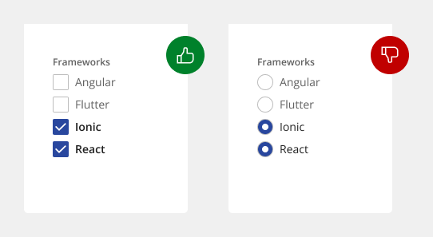
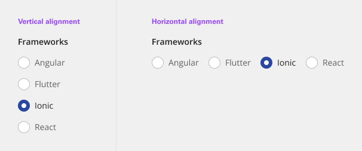
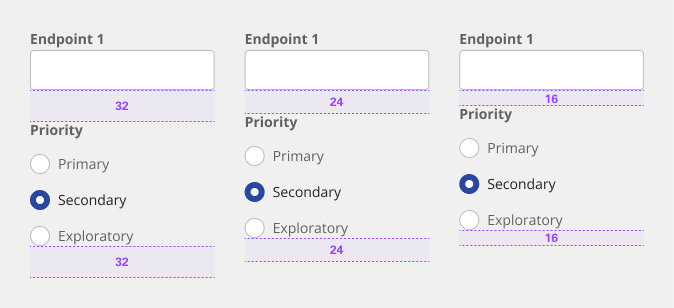
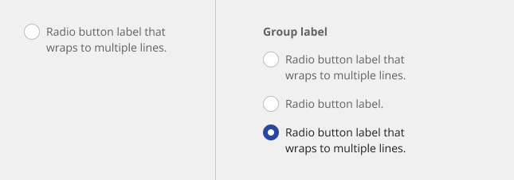
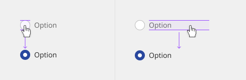
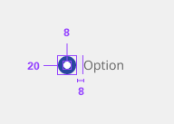
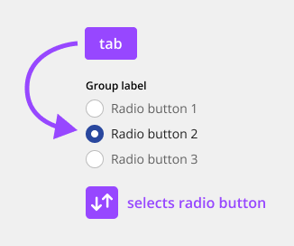

# Radio Button

Radio buttons are used for mutually exclusive choices, not for multiple choices. Only one radio button can be selected at a time. When a user chooses a new item, the previous choice is automatically deselected.

## Usage

### When to use

If a user can select from multiple options, use checkboxes instead of radio buttons. Radio buttons allow the user to select only one item in a set whereas checkboxes allow the user to select multiple items.

- Do use checkboxes when multiple items can be selected.
- Do let text wrap beneath the radio button so the control and label are top aligned.

### When not to use

- Do not vertically center wrapped text with the radio button.
- Do not use radio buttons when multiple items can be selected.

### Variants

| Variant  | Purpose |
|:-------- | :------ |
| Form     | Can be used in tiles, data tables, modals, side panels, and in forms on full pages. |
| Settings | Used to change from one setting to another in a menu, page, or component. It can often act as a filtering mechanism. 

### Anatomy

The radio button component is comprised of a set of clickable circles (the inputs) with text labels positioned to the right. If there is a group of radio buttons, a group label can be added.

1. **Group label (optional)** - Describes the group of options or provides guidance for making a selection.
2. **Radio button input** - A radio button indicating the appropriate state. By default, an option is selected.
3. **Radio button label** - Describes the information you want to select or unselect.

### Alignment

Radio button labels are positioned to the right of their inputs in languages that read left to right. If there is a radio button grouping, they can be laid out vertically or horizontally depending on the use case and the structure of the UI. When possible, arrange the radio button and checkbox groups vertically for easier reading.

- Vertically stacked versus horizontal alignment
- For languages that read right to left, it’s acceptable to place labels to the left of the inputs.

### Placement

The radio button component is often used in forms. Forms can be placed on a full page, in a modal, or in a side panel. A radio button can also be used for changing settings in a menu or selecting a singular item in a data table. 

Radio buttons in a form should be placed at least 32px below or before the next component. Spacing of 24px or 16px can also be used when space is more restricted or if the form is more complex.

### Content

#### Grouping labels

A heading can accompany a set of radio buttons to provide further context or clarity. In some cases, a group of radio buttons may be within a larger group of components that already have a group label. In this case, an additional group label for the radio button component itself is not needed.

- A group label can either state the category of the grouping or concisely instruct what actions to take below depending on the context.
- Use sentence case for group labels.

#### Labels

- Always use clear and concise labels for radio buttons.
- Labels appear to the right of radio button inputs.

#### Overflow content

- We recommend radio button labels being fewer than three words.
- If you are tight on space, consider rewording the label. Do not truncate radio button label text with an ellipsis.
- Long labels may wrap to a second line, and this is preferable to truncation.
- Text should wrap beneath the radio button, so the control and label are top aligned.

### States
The radio button input allows for two states: unselected and selected. The default view of a radio button is having at least one radio button preselected. Only one radio button should be selected at a time. When a user chooses a new item, the previous choice is automatically deselected.

In addition to unselected and selected states, radio buttons also have states for focus, disabled, read-only, error, and warning.

#### Group states
Radio button groups can receive the following states: read-only, disabled, error, and warning, as well as the addition of helper text.

### Universal behaviors

#### Mouse

Users can trigger an item by clicking the radio button input directly or by clicking the radio button label. Having both regions interactive creates a more accessible click target.

#### Keyboard

One radio button should be selected by default. Users can navigate between radio button inputs by pressing Up or Down arrow keys. If a user lands on a radio button set without a default indicator, they can press Space to select the radio button or they can press an arrow key to select the next radio button.

### Radio button versus checkbox

Radio buttons allow users to select one option from a group of mutually exclusive choices, while checkboxes allow for a selection of one of more options from a group. In the use cases where multiple selections are allowed, use the checkbox component instead of the radio button.

### Radio button versus toggle switch

Toggle switches are preferred when the user options are limited to two choices—on and off or true and false. By comparison, radio buttons, radio buttons can have many other options.

### Structured/contained list

If a user needs to choose a singular item from a list that has simple data and multiple columns, a selectable structured/contained list can be used.

### References
-	Jakob Nielson, [Checkboxes vs. Radio Buttons](https://www.nngroup.com/articles/checkboxes-vs-radio-buttons/) (Nielsen Norman Group, 2004)
-	Kara Pernice, [Radio Buttons: Select One by Default or Leave All Unselected?](https://www.nngroup.com/articles/radio-buttons-default-selection/) (Nielsen Norman Group, 2014)

## Style

Below is the token architecture color build of the components. The token can be changed or defined through the token mapping script that has been placed in the application repository.

### Color

**Unselected**
| State                      | Element                    | Property                   | Token name                 |
| :------------------------- | :------------------------- | :------------------------- | :------------------------- |
| Default                    | Container                  | Background Color           | `$field_1`                 | 
|                            |                            | Border Color               | `$border_strong_1`         |
|                            | Label                      | Text Color                 | `$text_secondary`          |
| Focus                      | Container                  | Background Color           | `$focus_highlight`         | 
|                            |                            | Border Color               | `$focus`                   |
|                            | Label                      | Text Color                 | `$text_primary`            |
| Error                      | Container                  | Background Color           | `$support_bg_error`        | 
|                            |                            | Border Color               | `$support_error`           |
|                            | Label                      | Text Color                 | `$support_error`           |
| Disabled                   | Container                  | Background Color           | `$field_disabled_1`        | 
|                            |                            | Border Color               | `$border_disabled_1`       |
|                            | Label                      | Text Color                 | `$text_disabled`           |

**Selected**
| State                      | Element                    | Property                   | Token name                 |
| :------------------------- | :------------------------- | :------------------------- | :------------------------- |
| Default                    | Container                  | Background Color           | `$button_primary_selected` | 
|                            |                            | Border Color               |                            |
|                            | Label                      | Text Color                 | `$text_primary`            |
|                            | Icon                       | SVG Color                  | `$icon_on_color`           |
| Focus                      | Container                  | Background Color           | `$button_primary_selected` | 
|                            |                            | Border Color               | `$focus`                   |
|                            | Label                      | Text Color                 | `$text_primary`            |
|                            | Icon                       | SVG Color                  | `$icon_on_color`           |
| Error                      | Container                  | Background Color           | `$support_error`           | 
|                            |                            | Border Color               | `$support_error`           |
|                            | Label                      | Text Color                 | `$support_error`           |
| Disabled                   | Container                  | Background Color           | `$field_disabled_1`        | 
|                            |                            | Border Color               |                            |
|                            | Label                      | Text Color                 | `$text_disabled`           |
|                            | Icon                       | SVG Color                  | `$icon_disabled`           |

### Typography

Radio button labels should be set in sentence case, with only the first word in a phrase and any proper nouns capitalized.

| Element               | Font size | Font weight             | Token name                 |
| :-------------------- | :-------- | :---------------------- | :------------------------- | 
| Group label           | 14px      | 700 bold                | `$label_1_bold`            |
| Label                 | 14px      | 400 regular             | `$label_1_regular`         |

### Token Architecture

| Token name                  | Description                                            |
| :-------------------------- | :----------------------------------------------------- |
| `$radio_small`              | Defines height for the **small** variant.              |
| `$radio_medium`             | Defines height for the **medium** variant.             |
| `$radio_large`              | Defines height for the **large** variant.              |
| `$radio_padding`            | Defines **padding** for the component.                 |
| `$radio_margin`             | Defines **margin** for the component.                  |
| `$radio_border`             | Defines **border** weight for the accordion component. |
| `$radio_border_radius`      | Defines **border radius** for the component.           |

### Structure

Structure and spacing measurements for vertical and horizontal radio button groupings.

| Element               | Property                | Size      | Token name                  |
| :-------------------- | :---------------------- | :-------- | :-------------------------- |
| Radio Button          | Height x Width          | 20px      |                             |
|                       | Margin Down             | 16px      | `$spacing_16`               |
|                       | Margin Right            | 16px      | `$spacing_16`               |
|                       | Border                  | 1px       | `$radio_border`             |
|                       | Border Radius           | 2px       | `$radio_border_radius`      |
| Group label           | Margin Bottom           | 8px       | `$radio_margin`             |
| Label                 | Margin Left             | 8px       | `$radio_margin`             |

## Accessibility

No accessibility annotations are needed for radio buttons but keep these considerations in mind if you are modifying the component or creating a custom component.

The component bakes keyboard operation into its components, improving the experience of blind users and others who operate via the keyboard. The design system incorporates many other accessibility considerations, some of which are described below.

### Keyboard interaction

A group of radio buttons takes a single tab stop. The component requires an item to be selected by default, and this item will always take focus. The user changes the selected radio button using the arrow keys (up/down or left/right). Pressing Tab again will move focus out of the radio button group to the next component. A radio button group is a single tab stop and radio buttons are selected using arrow keys.

### Labeling and states

The component surfaces the labeling of radio buttons and groups to screen readers and other assistive technologies. The component also provides state and context information, such as the number of items in the radio button group.

### Development recommendations

Keep this in mind if you’re modifying the component or creating a custom component.

- The component uses fieldset and legend to group and label sets of radio buttons.
- The component uses label and for to programmatically connect radio buttons with their labels.
- Required radio button groups must be identified programmatically, either via the label or with aria-required.
- See the [ARIA authoring practices](https://www.w3.org/WAI/ARIA/apg/patterns/radiobutton/) for more considerations.

