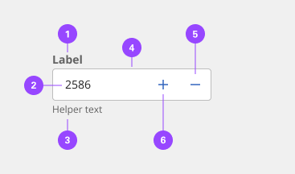
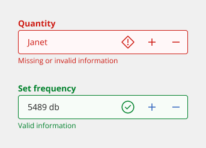
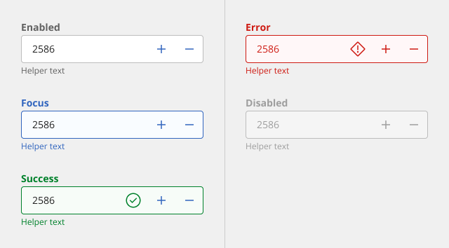
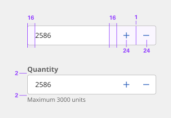
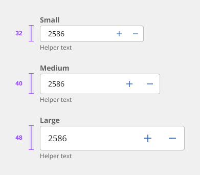
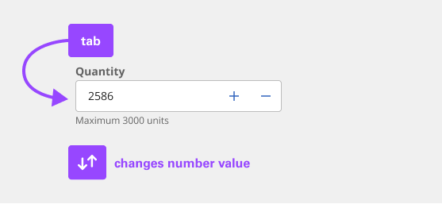

# Stepper

Steppers are like text inputs but are used to specify only a numeric value. The component incrementally increases or decreases the value with a two-segment control. The reduces input efforts for adjusting small values.

## Usage

### When to use

- The user needs to input a numeric value.
- Adjusting small values when increasing or decreasing them requires only a few clicks.
- When users may not know exact values and only want to change the values that are relative to its current state.

### When not to use

- It is best practice not to use the Stepper if large value changes are expected. For example, when the value sets from 1 to 30, the Stepper is not a great option because it requires many clicks to reach 30. In this case, use slider when numeric values are large or when there is a wide range of numeric options.
- It is also best to avoid the Stepper for continuous variables such as prices, distances, lengths, or human heights. When the exact value is important to specify within a wide range, use text input instead.

### Anatomy

1. **Label** - Text that informs the user about the content they need to enter in the field. It is required unless you get an approved accessibility exemption.
2. **Numeric value** - The value changes when user enters a value into the field or uses the subtract or add controls.
3. **Helper text** - Assistive text that can provide additional aid or context to the user. Often used to explain the correct data format.
4. **Field** - The container in which a user enters data.
5. **Decrease icon** - This icon triggers decremental values.
6. **Increase icon** - This icon triggers incremental values.

### Variants

| Variant  | Appearance | Purpose |
|:-------- | :--------- | :------ |
| Default  | A traditional style where the label is positioned outside and above the input field. | Use when white space is needed between input components or in productive moments where space is at a premium, and smaller components are needed. |
| Fluid    | An alternative style where the label is placed inside of the input field and is stacked in line with the user input text. | Use in expressive moments, fluid forms, contained spaces, or attached to complex components, like a toolbar. |

### Sizing

The Stepper has three sizes default input heights: small, medium, and large. The width varies in size based on content, layout, and design.

| Size   | Height | Purpose |
|:------ | :----- | :------ |
| Small  | 32px   | Use when space is constricted or when placing the Stepper in a form that is long and complex. |
| Medium | 40px   | This is the default size and the most used size. When in doubt, use the medium size. |
| Large  | 48px   | Use when there is a lot of space to work with. The large size is typically used in simple forms or when a Stepper is placed by itself on a page. |

### Content

#### Label

- Always include a label so that users know how to complete the field.
- Keep the label short and concise.
- Use sentence-style capitalization for the label.

#### Helper text

- Indicates the input value if it has a maximum or minimum
- Helper text is optional but if present will be replaced by warning and error messages when needed.

#### Overflow content

Label, numeric value, and helper text should be short and not exceed two lines.

### Universal behaviors

#### States

The Stepper has a series of states for both field and controls elements: enabled, hover, focus, error, warning, disabled, and read-only.
 
| State    | When to use |
|:-------- | :---------- |
| Enabled  | When the Stepper is live, but a user is not directly interacting with it. This is commonly referred to as the default or normal state of the component. An enabled Stepper field should contain a default value. |
| Hover    | When a user’s mouse cursor is hovering over the field or the button controls. |
| Focus    | When a user tabs to or clicks on the Stepper, the field or controls become focused, indicating the user has successfully navigated to the component. |
| Disabled | When the user cannot interact with a component and all interactive functions have been removed. Unlike read-only states, disabled states are not focusable, are not read by screen readers, and do not need to pass visual contrast, making them inaccessible if they need to be interpreted. |
| Error    | When the required Stepper has not been filled in. It can also be triggered due to a system error. This state requires a user response before data can be submitted or saved. |
| Error    | When the required Stepper has been filled in correctly and the validation is needed for the experience.  |

#### Mouse

Users can click on the input field and change the value by typing inside the input field. Users can also increase or decrease the values by pressing on the add or subtract icon controls.

#### Keyboard

Users can navigate to the Stepper field by pressing Tab. Users can then increase the value by pressing Up arrow or decrease the value by pressing Down arrow.

### Validation

An error state is triggered if the data is invalid, or a required field is left empty. Error states have three visual indicators to signify invalid content: a red border, an error icon indicator, and an error message.

### Default values

Stepper should always have a default. The default will usually be ‘1’. Sometimes, you will have input value defaulted to ‘0’. For example, when booking a hotel room, it may set the default number of adults as ‘1’ and the default number of children as ‘0’.

- Do set a clear default that most users are likely to select
- Do not leave value input blank

### References

Yuxuan (Tammy) Zhou, [Design Guidelines for Input Steppers](https://www.nngroup.com/articles/input-steppers/) (Nielsen Norman Group, 2018)

## Style

Below is the token architecture color build of the components. The token can be changed or defined through the token mapping script that has been placed in the application repository.

### Color

| State                      | Element                    | Property                   | Token name                 |
| :------------------------- | :------------------------- | :------------------------- | :------------------------- |
| Enabled                    | Container                  | Background Color           | `$field_1`                 |
|                            |                            | Border Color               | `$border_strong_1`         | 
|                            |                            | Box Shadow                 |                            | 
|                            | Label                      | Text Color                 | `$text_secondary`          |
|                            | Value                      | Text Color                 | `$text_primary`            |
|                            | Placeholder                | Text Color                 | `$text_placeholder`        |
|                            | Help Text                  | Text Color                 | `$text_secondary`          |
|                            | Icon                       | SVG Color                  | `$icon_secondary`          |
|                            | Controls                   | Background Color           |                            |
|                            |                            | SVG Color                  | `$icon_secondary`          |
|                            |                            | Border Color               | `$border_strong_1`         |
| Focus                      | Container                  | Background Color           | `$focus_highlight`         |
|                            |                            | Border Color               | `$focus`                   |  
|                            |                            | Box Shadow                 | `$shadow_1`                | 
|                            | Label                      | Text Color                 | `$text_secondary`          |
|                            | Value                      | Text Color                 | `$text_primary`            |
|                            | Placeholder                | Text Color                 | `$text_placeholder`        |
|                            | Help Text                  | Text Color                 | `$text_secondary`          |
|                            | Icon                       | SVG Color                  | `$icon_secondary`          |
|                            | Controls                   | Background Color           | `$focus_highlight`         |
|                            |                            | SVG Color                  | `$icon_primary`            |
|                            |                            | Border Color               | `$focus`                   |
| Disabled                   | Container                  | Background Color           | `$field_disabled_1`        |
|                            |                            | Border Color               | `$border_disabled_1`       |  
|                            |                            | Box Shadow                 |                            | 
|                            | Label                      | Text Color                 | `$text_disabled`           |
|                            | Value                      | Text Color                 | `$text_disabled`           |
|                            | Placeholder                | Text Color                 | `$text_placeholder`        |
|                            | Help Text                  | Text Color                 | `$text_disabled`           |
|                            | Icon                       | SVG Color                  | `$icon_disabled`           |
|                            | Controls                   | Background Color           |                            |
|                            |                            | SVG Color                  | `$icon_disabled`           |
|                            |                            | Border Color               | `$border_strong_1`         |
| Error                      | Container                  | Background Color           | `$support_bg_error`        |
|                            |                            | Border Color               | `$support_error`           |  
|                            |                            | Box Shadow                 |                            | 
|                            | Label                      | Text Color                 | `$support_error`           |
|                            | Value                      | Text Color                 | `$support_error`           |
|                            | Placeholder                | Text Color                 | `$support_error`           |
|                            | Help Text                  | Text Color                 | `$support_error`           |
|                            | Icon                       | SVG Color                  | `$support_error`           |
|                            | Controls                   | Background Color           |                            |
|                            |                            | SVG Color                  | `$support_error`           |
|                            |                            | Border Color               | `$support_error`           |
| Success                    | Container                  | Background Color           | `$support_bg_success`      |
|                            |                            | Border Color               | `$support_success`         |  
|                            |                            | Box Shadow                 |                            | 
|                            | Label                      | Text Color                 | `$support_success`         |
|                            | Value                      | Text Color                 | `$support_success`         |
|                            | Placeholder                | Text Color                 | `$support_success`         |
|                            | Help Text                  | Text Color                 | `$support_success`         |
|                            | Icon                       | SVG Color                  | `$support_success`         |
|                            | Controls                   | Background Color           |                            |
|                            |                            | SVG Color                  | `$support_success`         |
|                            |                            | Border Color               | `$support_success`         |

### Typography

Stepper labels should use sentence case, with only the first word in a phrase and any proper nouns capitalized.

| State      | Element         | Font size | Font weight | Token name                |
| ---------- | --------------- | --------- | ----------- | ------------------------- | 
| Small      | Label           | 14px      | 700 bold    | `$label_1_bold`           |
|            | Helper Text     | 12px      | 400 regular | `$helper_text_1_regular`  |
|            | Value           | 14px      | 400 regular | `$body_1_compact_regular` |
|            | Placeholder     | 14px      | 400 regular | `$body_1_compact_regular` |
|            | Contextual Menu | 14px      | 400 regular | `$body_1_compact_regular` |
| Medium     | Label           | 14px      | 700 bold    | `$label_1_bold`           |
|            | Helper Text     | 12px      | 400 regular | `$helper_text_1_regular`  |
|            | Value           | 14px      | 400 regular | `$body_1_compact_regular` |
|            | Placeholder     | 14px      | 400 regular | `$body_1_compact_regular` |
|            | Contextual Menu | 14px      | 400 regular | `$body_1_compact_regular` |
| Large      | Label           | 14px      | 700 bold    | `$label_1_bold`           |
|            | Helper Text     | 12px      | 400 regular | `$helper_text_1_regular`  |
|            | Value           | 16px      | 400 regular | `$body_2_compact_regular` |
|            | Placeholder     | 16px      | 400 regular | `$body_2_compact_regular` |
|            | Contextual Menu | 16px      | 400 regular | `$body_2_compact_regular` |

### Token Architecture

| Token name                  | Description                                            |
| :-------------------------- | :----------------------------------------------------- |
| `$stepper_small`            | Defines height for the **small** variant.              |
| `$stepper_medium`           | Defines height for the **medium** variant.             |
| `$stepper_large`            | Defines height for the **large** variant.              |
| `$stepper_padding`          | Defines **padding** for the component.                 |
| `$stepper_margin`           | Defines **margin** for the component.                  |
| `$stepper_border`           | Defines **border** weight for the accordion component. |
| `$stepper_border_radius`    | Defines **border radius** for the component.           |

### Structure

| Element               | Property                | Size      | Token name                  |
| :-------------------- | :---------------------- | :-------- | :-------------------------- |
| Input                 | Padding Right x Left    | 16px      | `$stepper_padding`          |
|                       | Border                  | 1px       | `$stepper_border`           |
|                       | Border Radius           | 4px       | `$stepper_border_radius`    |
| Label                 | Margin Bottom           | 2px       | `$spacing_2`                |
| Helper Text           | Margin Top              | 2px       | `$spacing_2`                |
| Content Switcher      | Margin Left             | 8px       | `$stepper_margin`           |

### Size

The height varies for each size variant and the width varies based on content, layout, and design

| Size    | Element               |  Size     | Token name                 |
| :------ | :-------------------- | :-------- | :------------------------- |
| Small   | Input                 | 32px      | `$stepper_small`           |
|         | Content Switcher      | 32px      | `$content_switcher_small`  |
| Medium  | Input                 | 40px      | `$stepper_medium`          |
|         | Content Switcher      | 40px      | `$content_switcher_medium` |
| Large   | Input                 | 48px      | `$stepper_large`           |
|         | Content Switcher      | 48px      | `$content_switcher_large`  |

## Accessibility

The component bakes keyboard operation into its components, improving the experience of blind users and others who operate via the keyboard. The design system incorporates many other accessibility considerations, some of which are described below.

### Keyboard interaction

The Stepper replicates the behavior of the stock HTML component. The Steppers takes a single tab stop. The + and - buttons, operable by pointer, are not in the tab order. When the input has focus, the arrow keys give keyboard users the same ability to incrementally adjust the values. As well, users can directly type numeric values in the input. Only numerals are allowed to be entered.

The Stepper is reachable by Tab and changed with the arrow keys or by directly entering a number.

### Error handling

The component provides errors and warning messages to assistive technology. This is an improvement on the stock HTML Stepper, which simply prevents the typing of alphabetic characters without explanation. The component also adds an error or warning icon and puts error messages in red as a further visual cue.

Messages are surfaced to assistive technologies, and color alone is not used to visually signal errors.

### Design recommendations

The component offers the ability for the author to set minimum and maximum values for the input. When setting limits on number entry, designers should warn the user in advance, instead of users discovering limits through an error message. This is particularly the case if designers alter the step value, which determines the increment change when activating the +/- buttons or arrow keys. If a user directly enters a value that does not match the step increment, it will be disallowed for no apparent reason, so advanced warnings are crucial. Notify users of allowable input ranges through helper text.

### Development considerations

Keep this in mind if you’re modifying the component or creating a custom component.

- The component uses aria-describedby to associate the helper text and error messages with the input.
- The red error SVG icons have aria-hidden="true" set, since the helper text provides the same information.

